# Section 2 Preparation work

> In terms of environment configuration, this section mainly recommends two browser-based integrated development environments. Whether it is a mobile phone, tablet or computer, you can log in and run the code at any time. Although the experience on mobile phones and tablets may not be good, it is better to use it.

## 1. Large model API configuration

### 1.1 AIHubmix API application

AIHubmix is ​​an American platform. The company is registered in Delaware, USA. It aggregates the world's mainstream AI models in one stop. The latest models are usually supported no more than 1 week after the day of release. Cloud vendors that are fully connected to related models (OpenAI is connected to Azure cloud, Gemini is connected to Google official, Claude is connected to AWS, and other open source and other models are connected to major well-known cloud vendors or inference companies). AIHubmix's servers are deployed in clusters on Google Cloud in the United States. At the same time, because they are fully connected to cloud vendors, the stability is very good. It has a multi-endpoint routing mechanism that can achieve a more stable effect than directly connecting to the official server.

> The free models provided by AIHubmix are enough for us to complete the project.

1. **Access AIHubmix Platform**

Open your browser and visit [AIHubmix](https://aihubmix.com/?aff=anNj).

    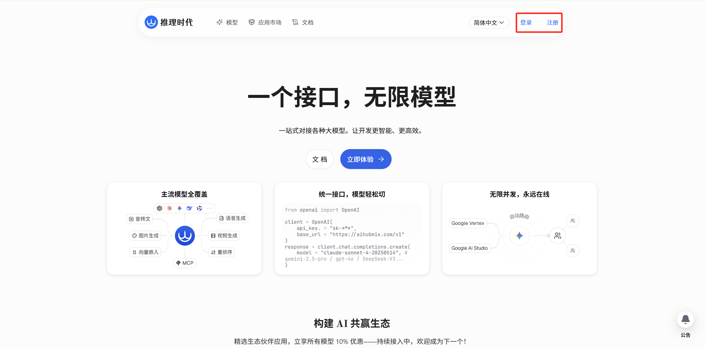

2. **Log in or register an account**

If you already have an account, you can log in directly. If not, please click the registration button in the upper right corner of the page and use your email or mobile phone number to complete the registration.

3. **Model Screening**

After the registration is completed, go to the [Model Page](https://aihubmix.com/models). Select `免费` for the tag, and you can see that the official provides a certain number of free models. Moreover, AIHubmix also provides many domestic and foreign model selections for embedding and reordering, which are commonly used in the RAG field.

    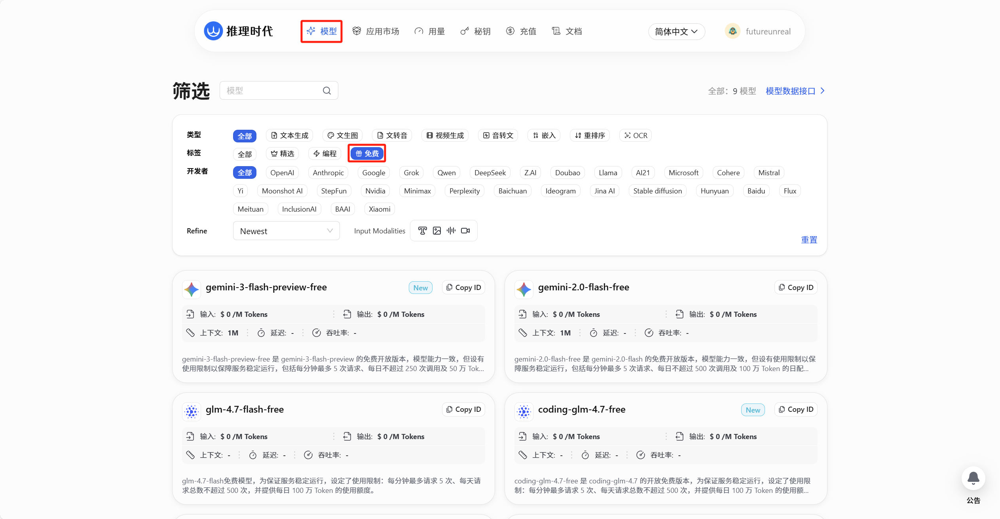

4. **Manage API Keys**

Then enter the [Key Management Page] (https://console.aihubmix.com/token), as shown in the figure below. By default, there is already a key that can be copied and used directly. Of course, you can also click `创建 Key` to fill in the name and create a new one.

    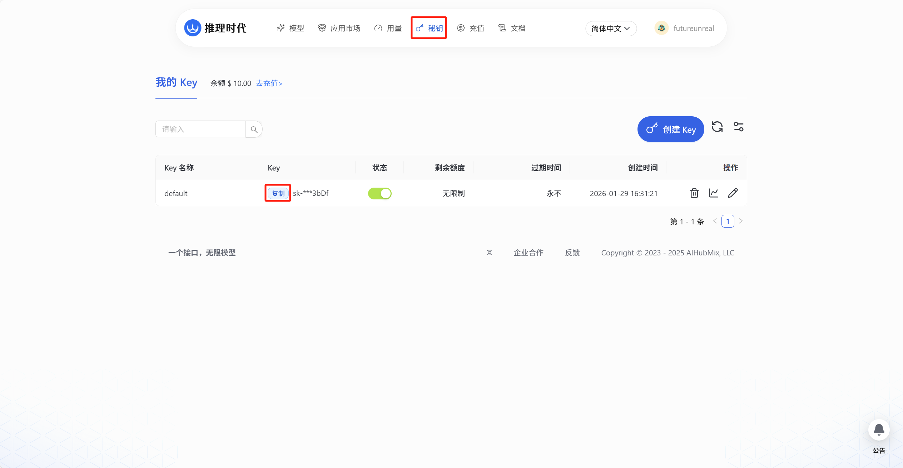

### 1.2 DeepSeek API application

To use the large language model service provided by Deepseek, you first need an API Key. Here are the application steps:

1. **Access Deepseek Open Platform**

Open the browser and visit [Deepseek Open Platform](https://platform.deepseek.com/).

    

2. **Log in or register an account**

If you already have an account, please log in directly. If not, please click the registration button on the page and use your email or mobile phone number to complete the registration.

3. **Create new API key**

After successfully logging in, find and click `API Keys` in the navigation bar on the left side of the page. On the API management page, click the `创建 API key` button. Enter a name that is not the same as other API keys and click Create.

    

4. **Save API Key**

A new API key will be generated for you. Please **copy now** and save it in a safe place.

> Note: For security reasons, this key will only be displayed in full once, and you will no longer be able to see it after closing the pop-up window.

    

## 2. GitHub Codespaces environment configuration (recommended)

> First make sure you have a network environment that can smoothly access GitHub. If you cannot access it smoothly, please use the following Cloud Studio

GitHub Codespaces is a service provided by GitHub that allows developers to create, edit, and run code in the cloud. It provides a preconfigured development environment, including a code editor, terminal, debugging tools, etc., that can be used directly in the browser.

### 2.1 Create Codespaces

1. **Visit project address**

Open your browser and visit [all-in-rag](https://github.com/datawhalechina/all-in-rag)

2. **Create a new branch**
In the upper right corner of the project page, click the `Fork` button to create a new branch. It will take a moment to create successfully.

    

    

3. **Create Codespaces**
In the upper right corner of the project page, click the `Code` button and select the `Codespaces` tab. Click the `New codespace` button and wait for the new Codespaces environment to be created successfully.

    

4. **Enter Codespaces again**
After the web page is closed, find the newly created repository and click the red box to select the content to re-enter the codespace environment.

    

5. **Quota setting**
Find the codespace settings in GitHub's account settings. It is recommended to adjust the suspension time according to your own situation (too long a time will waste the quota, and the free account provides a single-core quota of 120 hours)

    

### 2.2 python environment configuration

After entering the IDE, select the terminal below


1. **Update system software packages**

Enter the following command in the terminal:

    ```bash
    sudo apt update
    sudo apt upgrade -y
    ```

2. **Install Miniconda**

    ```bash
    wget https://repo.anaconda.com/miniconda/Miniconda3-latest-Linux-x86_64.sh -O ~/miniconda.sh
    bash ~/miniconda.sh
    ```

- Press Enter to read the license agreement
- Enter `yes` to agree to the agreement
- Press Enter directly when prompted for the installation path (use the default path /home/ubuntu/miniconda3)
- Whether to initialize Miniconda: enter `yes` to add Miniconda to your PATH environment variable.

    ```bash
    source ~/.bashrc
    conda --version
    ```

If the version number is displayed, the installation is successful.

### 2.3 API configuration

1. Open your shell configuration file using the `vim` editor.

    ```bash
    vim ~/.bashrc
    ```

2. Enter `i` to enter edit mode and add the following line at the end of the file, replacing `[你的大模型 API 密钥]` with your own key:

    ```bash
    export DEEPSEEK_API_KEY=[你的大模型 API 密钥]
    ```

If you choose the `AIHubmix` platform, you can also use it to increase recognition:

    ```bash
    export AIHUBMIX_API_KEY=[你的大模型 API 密钥]
    ```

> Do not bring `[]`

3. Save and exit In vim, press Esc to enter command mode, then enter `:wq` and press Enter to save the file and exit.

4. Make the configuration take effect. Execute the following command to immediately load the updated configuration and make the environment variables take effect:

    ```bash
    source ~/.bashrc
    ```

### 2.4 Create and activate virtual environment

1. **Create a virtual environment**

    ```bash
    conda create --name all-in-rag python=3.12.7
    ```

Just press Enter when the option appears.

2. **Activate virtual environment**

Activate the virtual environment using the following command:

    ```bash
    conda activate all-in-rag
    ```

3. **Depends on installation**
If you strictly install the above process, you should currently go to the project root directory and enter the code directory to install the dependent libraries.

    ```bash
    cd code
    pip install -r requirements.txt
    ```

> If there is a version error about grpcio, don’t worry.

## 3. Cloud Studio environment configuration (recommended for domestic environments)

Cloud Studio is a browser-based integrated development environment (IDE) launched by Tencent Cloud. Supports access to CPU and GPU.

> I heard that there is a free quota of 50 hours a month🤔

### 3.1 Application creation

1. **Access Cloud Studio**
Open the browser and visit [Cloud Studio](https://cloudstudio.net/).

2. **Log in or register an account**
Click the `注册登录` button in the upper right corner of the page and complete the login using WeChat or other methods.

3. **Create Application**
Find and click `创建应用` in the navigation bar at the top of the page. Select `从 Git 仓库导入`, enter `https://github.com/datawhalechina/all-in-rag.git` in the project address bar and press Enter, the title and description will be automatically created for you.

    

> Be careful not to include the URL in the description

4. **Enter again**
Later, find the previously created application on the [Application Management Page] (https://cloudstudio.net/my-app), click it and select the upper right corner to write code to enter again.

    

### 3.2 python environment configuration

After entering the IDE, select the terminal on the right


1. **Update system software packages**

Enter the following command in the terminal:

    ```bash
    sudo apt update
    sudo apt upgrade -y
    ```

2. **Switch to normal user**

    ```bash
    su ubuntu
    ```

3. **Install Miniconda**

    ```bash
    wget https://repo.anaconda.com/miniconda/Miniconda3-latest-Linux-x86_64.sh -O ~/miniconda.sh
    bash ~/miniconda.sh
    ```

- Press Enter to read the license agreement
- Enter `yes` to agree to the agreement
- Press Enter directly when prompted for the installation path (use the default path /home/ubuntu/miniconda3)
- Whether to initialize Miniconda: enter `yes` to add Miniconda to your PATH environment variable.

    ```bash
    source ~/.bashrc
    conda --version
    ```

If the version number is displayed, the installation is successful.

### 3.3 API configuration

1. Open your shell configuration file using the `vim` editor.

    ```bash
    vim ~/.bashrc
    ```

2. Enter `i` to enter edit mode and add the following line at the end of the file, replacing `[你的大模型 API 密钥]` with your own key:

    ```bash
    export DEEPSEEK_API_KEY=[你的大模型 API 密钥]
    ```

If you choose the `AIHubmix` platform, you can also use it to increase recognition:

    ```bash
    export AIHUBMIX_API_KEY=[你的大模型 API 密钥]
    ```

> Do not bring `[]`

3. Save and exit In vim, press Esc to enter command mode, then enter `:wq` and press Enter to save the file and exit.

4. Make the configuration take effect. Execute the following command to immediately load the updated configuration and make the environment variables take effect:

    ```bash
    source ~/.bashrc
    ```

### 3.4 Create and activate virtual environment

1. **Create a virtual environment**

    ```bash
    conda create --name all-in-rag python=3.12.7
    ```

Just press Enter when the option appears.

2. **Configuration file permissions**

    ```bash
    sudo chown -R ubuntu:ubuntu code models
    ```

3. **Activate virtual environment**

Activate the virtual environment using the following command:

    ```bash
    conda activate all-in-rag
    ```

4. **Depends on installation**
If you strictly install the above process, you should currently go to the project root directory and enter the code directory to install the dependent libraries.

    ```bash
    cd code
    pip install -r requirements.txt
    ```

> If there is a version error about grpcio, don’t worry.

## 4. Windows environment configuration (you can skip this step if you use Cloud Studio or Codespaces)

### 4.1 API configuration

1. Right-click Computer or This PC, and then click Properties.

2. In the left menu, click "Advanced system settings."

3. In the "System Properties" dialog box, click the "Advanced" tab, and then click the "Environment Variables" button below.

    

4. In the Environment Variables dialog box, click New (under the User Variables section) and enter the following information:
- Variable name: DEEPSEEK_API_KEY
- Variable value: [your Deepseek API key]

    

### 4.2 Install Miniconda

1. **Download the installer**

It is first recommended to visit [Tsinghua University Open Source Software Mirror Station] (https://mirrors.tuna.tsinghua.edu.cn/anaconda/miniconda/) to obtain faster download speeds. Select the latest `.exe` version to download according to your system.

    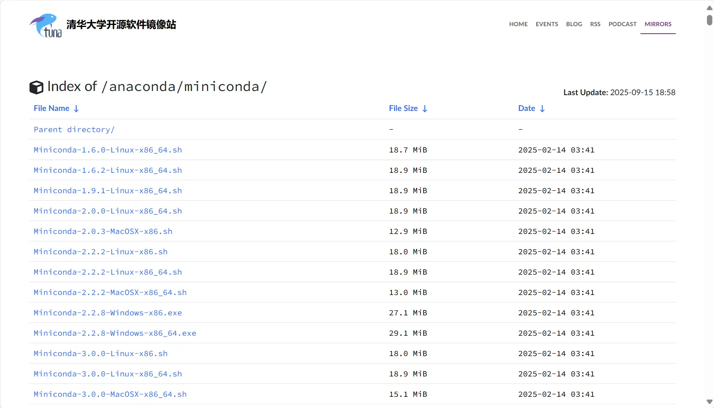

You can also download from [Miniconda official website](https://docs.conda.io/en/latest/miniconda.html).

2. **Run the installation wizard**

Once the download is complete, double-click the `.exe` file to start the installation. Follow the wizard prompts:

* **Welcome**: Click on `Next`.

        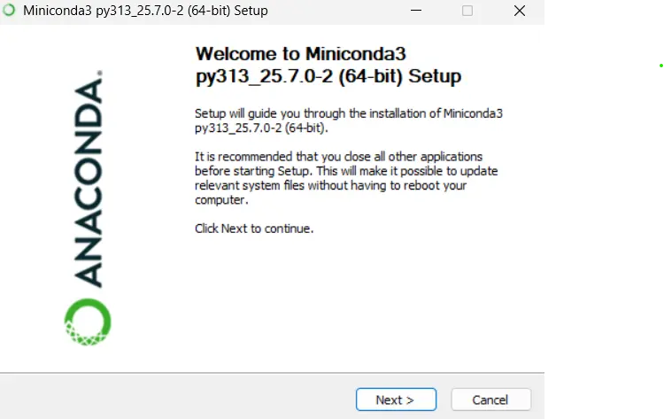

* **License Agreement**: Click on `I Agree`.

        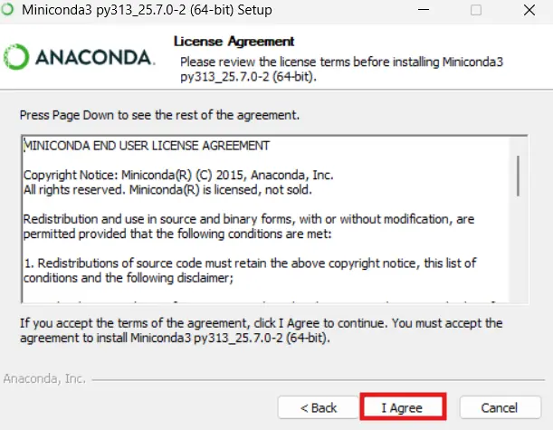

* **Installation Type**: Select `Just Me`, click `Next`.

        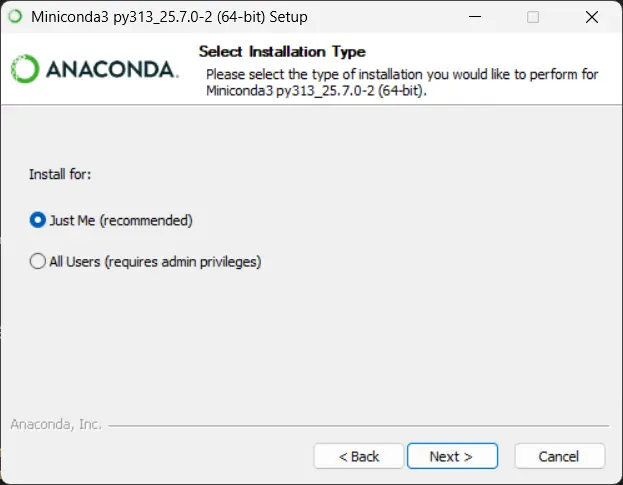

* **Choose Install Location**: It is recommended to keep the default path, or choose a path that does not contain Chinese characters and spaces. Click on `Next`.

        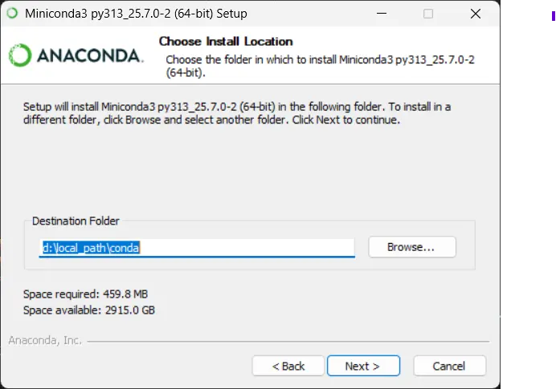

* **Advanced Installation Options**: **Please do not check** "Add Miniconda3 to my PATH environment variable". We will manually configure the environment variables later. Click on `Install`.

        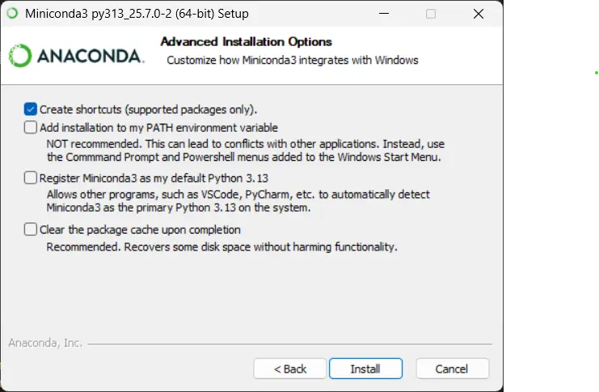

* **Installation Complete**: After the installation is complete, click `Next`, then uncheck "Learn more" and click `Finish` to complete the installation.

3. **Manually configure environment variables**

In order to use the `conda` command in any terminal window, you need to manually configure the environment variables.

* Search for "Edit system environment variables" in the Windows search bar and open it.

        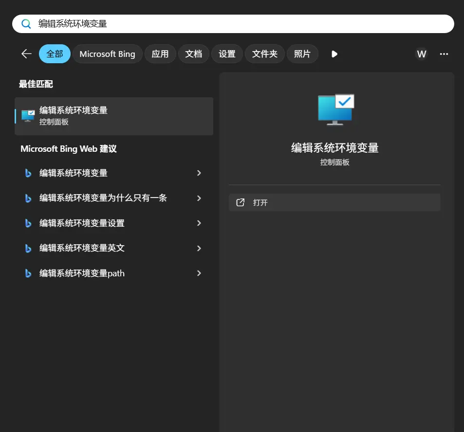

* In the "System Properties" window, click "Environment Variables".

        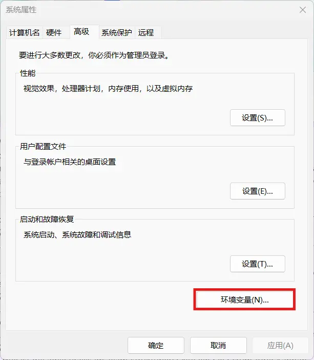

* In the "Environment Variables" window, find the `Path` variable under "System Variables", select it and click "Edit".

        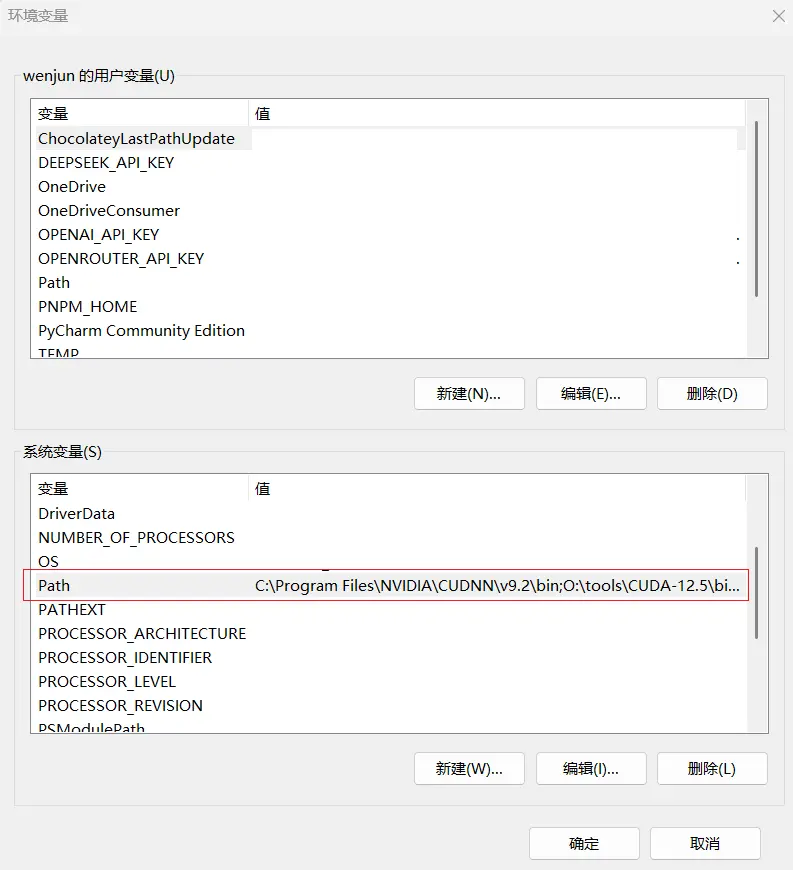

* In the "Edit Environment Variables" window, create three new paths and point them to the corresponding folders in your Miniconda installation directory. If your installation path is `D:\Miniconda3`, you need to add:
        ```
        D:\Miniconda3
        D:\Miniconda3\Scripts
        D:\Miniconda3\Library\bin
        ```
        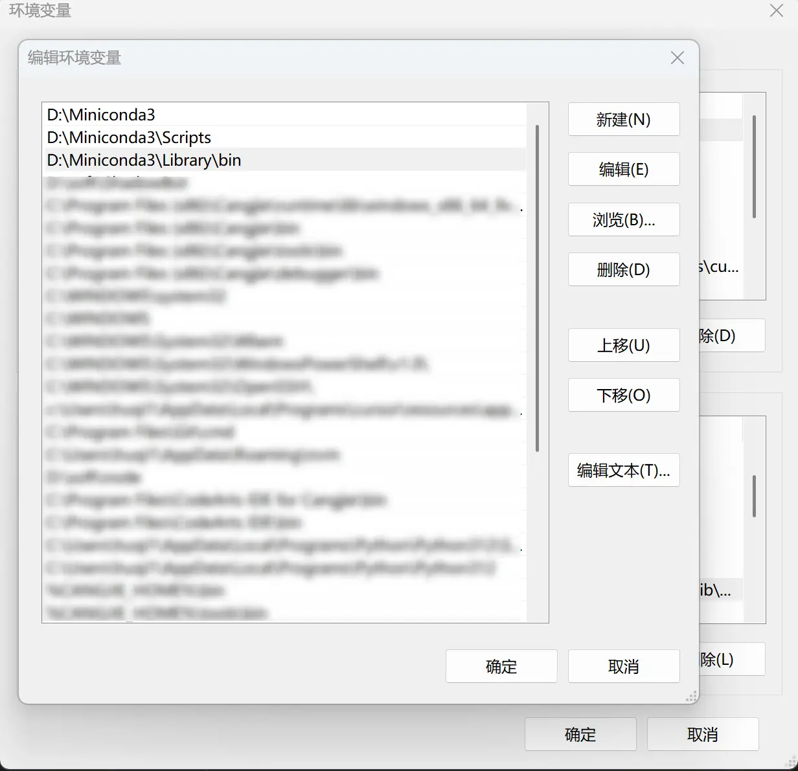
        
* When finished, click OK all the way to save your changes.

### 4.3 Configure Conda mirror source

In order to speed up subsequent use of the `conda` installation package, it is strongly recommended to configure a domestic mirror source. Open a new terminal or Anaconda Prompt and run the following command:

```bash
conda config --add channels https://mirrors.tuna.tsinghua.edu.cn/anaconda/pkgs/main/
conda config --add channels https://mirrors.tuna.tsinghua.edu.cn/anaconda/pkgs/free/
conda config --set show_channel_urls yes
```

After the configuration is completed, you can view the added sources through the `conda config --show channels` command.

## 5. Project code pull (you can skip this step if you use Cloud Studio or Codespaces)

### 5.1 Install Git

If you don't have Git installed yet, follow these steps to install it.

* **Windows system**: Visit [Git official website](https://git-scm.com/download/win), download and run the installation program, and complete the installation according to the default settings.
* **macOS system**: Open the terminal and enter the following command to install Git:

  ```bash
  brew install git
  ```
* **Linux system (taking Ubuntu as an example)**: Open the terminal and enter the following command to install Git:

  ```bash
  sudo apt-get update
  sudo apt-get install git
  ```

After the installation is complete, verify whether Git is installed successfully and enter the following command:

```bash
git --version
```

If successful, the Git version number will be displayed.

### 5.2 Clone project code

1. **Select the directory to store the project**
Open a terminal (or Git Bash in Windows) and navigate to the directory where you want to put your project:

   ```bash
   cd [你希望存放项目的路径]
   ```

2. **Clone repository**
Use the following command to pull the `all-in-rag` repository:

   ```bash
   git clone https://github.com/datawhalechina/all-in-rag.git
   ```

Wait for the download to complete, and the project code will be stored in the `all-in-rag` folder in the current directory.

3. **Enter the project directory**
After pulling the code, enter the project directory:

   ```bash
   cd all-in-rag
   ```

### 5.3 Create and activate virtual environment

In the project directory, it is recommended to use Miniconda configured previously to create a Python virtual environment.

1. **Create a virtual environment**

   ```bash
   conda create --name all-in-rag python=3.12.7
   ```

2. **Activate virtual environment**

All systems use the following command to activate the virtual environment:

   ```bash
   conda activate all-in-rag
   ```

3. **Depends on installation**
If you strictly install the above process, you should currently go to the project root directory and enter the code directory to install the dependent libraries.

    ```bash
    cd code
    pip install -r requirements.txt
    ```
