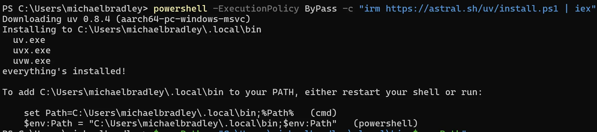
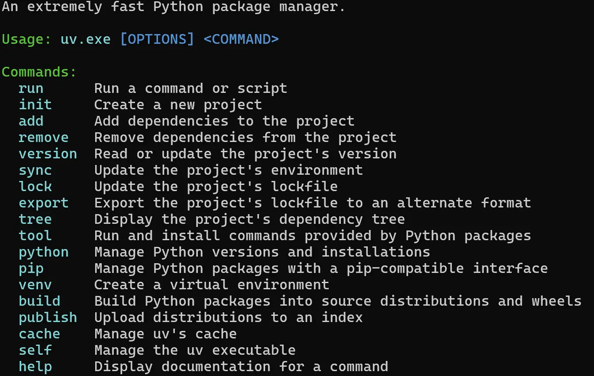
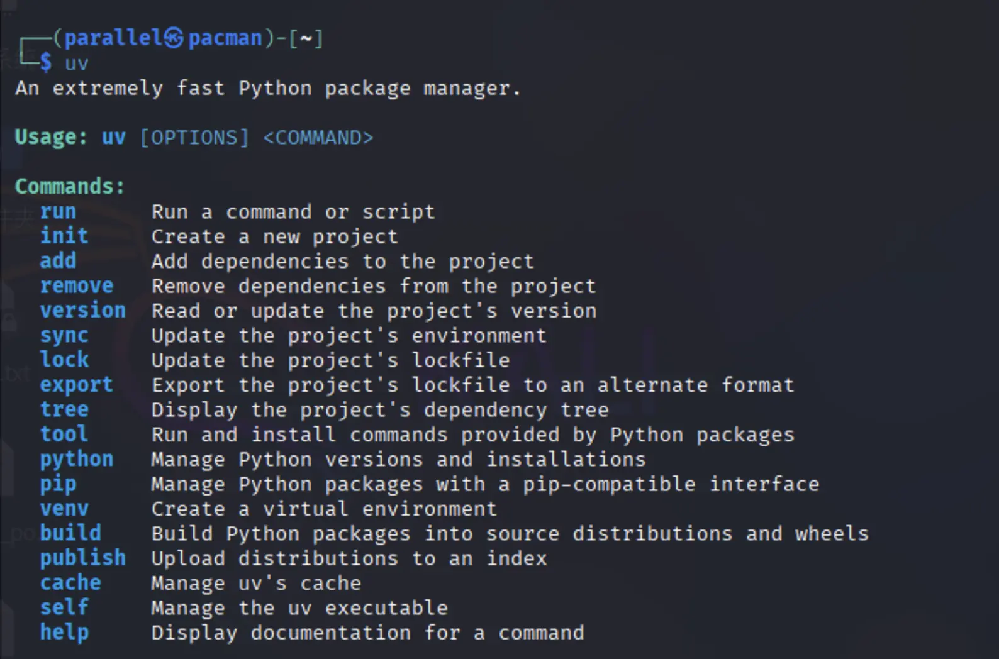

# Attachment: Python virtual environment deployment solution supplement

Because this project involves too many packages, and the dependency problem has always been a long-standing problem in Python, this has resulted in a very fragmented ecosystem in Python engineering.

For this kind of problem, uv provides a unified virtual environment management entrance and absorbs the advanced package management experience of the Rust language. Using it can reduce the time we spend on Python projects. Below we use uv to install the virtual environment of the project.

## 1.1 uv environment management

### 1.1.1 Windows system

**Use powershell to install uv**

```bash
powershell -ExecutionPolicy ByPass -c "irm https://astral.sh/uv/install.ps1 | iex"
```

**After successful installation, follow the prompts and enter the following command to add environment variables**. Note here that **different people have different installation paths**, please follow the prompts to copy and paste the command yourself.


```bash
$env:Path = "C:\Users\michaelbradley\.local\bin;$env:Path" 
```




**Enter the uv command. If the following prompt appears, the installation is successful**



### 1.1.2 Linux / MacOS system

**Install uv using curl**

```bash
curl -LsSf https://astral.sh/uv/install.sh | sh
```

If you cannot use the curl command, **use the wget command** to install uv

```bash
wget -qO- https://astral.sh/uv/install.sh | sh
```

**Enter the uv command. If the following prompt appears, the installation is successful**




## 1.2 Create and activate virtual environment

### 1.2.1 **Create virtual environment**

```bash
uv venv rag --python 3.12.7
```

The name of the virtual environment created by the code is rag and the Python version used is 3.12.7

After the Windows system is successfully created, the following information is displayed:

```bash
PS C:\Users\parallel> uv venv rag --python 3.12.7
Using CPython 3.12.7
Creating virtual environment at: rag
Activate with: rag\Scripts\activate
```

After the Linux / MacOS system is successfully created, the following information is displayed:

```bash
┌──(parallel㉿pacman)-[~/桌面]
└─$ uv venv rag -p 3.12.7
Using CPython 3.12.7
Creating virtual environment at: rag
Activate with: source rag/bin/activate
```

### 1.2.2 **Activate virtual environment**

The command to activate the virtual environment on Windows system is:

```bash
rag\Scripts\activate
```

The command to activate the virtual environment on Linux / MacOS system is:

```bash
source rag/bin/activate
```