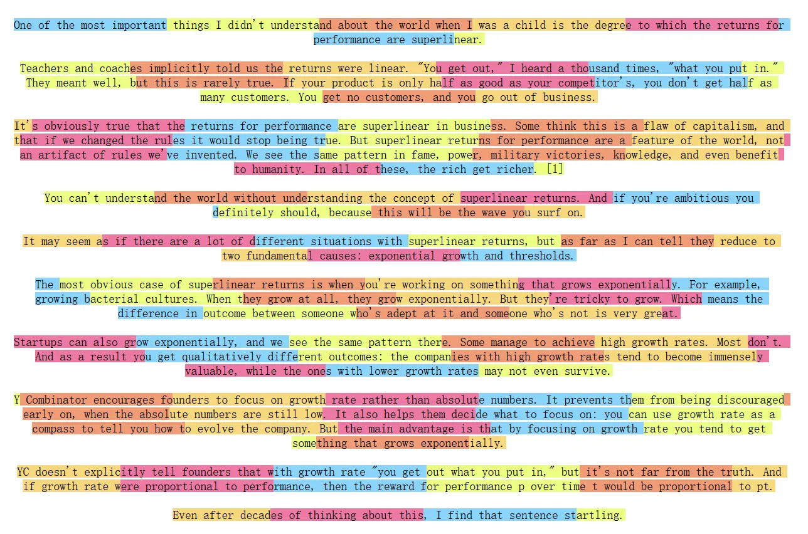

# Section 2 Text Chunking

## 1. Understanding text chunking

Text Chunking is a key step in building a RAG process. Its principle is to divide the loaded long document into smaller and easier-to-process units. These segmented text blocks are the basic units for subsequent vector retrieval and model processing.



## 2. Importance of text chunking

### 2.1 Satisfy model context restrictions

The primary reason for chunking text is to accommodate the hard constraints of two core components in the RAG system:

- **Embedding Model**: Responsible for converting text blocks into vectors. This type of model has a strict upper limit on input length. For example, many commonly used embedding models (such as`bge-base-zh-v1.5`) have a context window of 512 tokens. Any text block that exceeds this limit will be truncated when input, resulting in information loss, and the generated vector will not fully represent the semantics of the original text. Therefore, the size of the text block must be less than or equal to the context window of the embedded model.

- **Large Language Model (LLM)**: Responsible for generating answers based on retrieved context. LLMs also have context window constraints (although typically much larger than embedding models, ranging from a few thousand to millions of tokens). All retrieved blocks of text, along with user questions and prompt words, must fit into this window. If a single block is too large, it may only accommodate a few related blocks, limiting the breadth of information that LLM can refer to when answering questions.

Therefore, chunking is the basis for ensuring that text can be processed completely and effectively by both models.

### 2.2 Why bigger is not better for “blocks”

Assuming that the embedding model can handle up to 8192 tokens, should the chunks be cut as large as possible (e.g. 8000 tokens)? The answer is no. **The bigger the block size, the better**. Excessively large blocks will seriously affect the performance of the RAG system.

#### 2.2.1 Information loss during embedding process

Most embedding models are based on Transformer encoders. The workflow is roughly as follows:

- **Tokenization**: Decompose the input text block into tokens.
- **Vectorization**: Transformer generates a high-dimensional vector representation for **each token**.
- **Pooling**: Through a certain method (such as taking a`[CLS]`-bit vector, averaging`mean pooling`across all token vectors, etc.), **compress** all token vectors into a **single vector**, which represents the semantics of the entire text block.

>`[CLS]`is a special mark added at the beginning of the input text by Transformer models such as BERT. It dynamically aggregates the context information of the entire sequence through a self-attention mechanism, and its final vector is trained as an embedding representing global semantics.

In this`压缩`process, information loss is inevitable. A 768-dimensional vector needs to summarize all the information of the entire text block. **The longer the text block and the more semantic points it contains, the more the information carried by this single vector is diluted**, causing its representation to become general and key details to be blurred, thus reducing the accuracy of retrieval.

#### 2.2.2 “Lost in the Middle” of the generation process

Even if multiple retrieved large blocks of text are stuffed into the long context window of LLM, there will still be a problem of key information being "drowned" in a large amount of irrelevant content. Research has shown [^1] that when LLM processes a very long context filled with a large amount of information, it tends to remember the information at the beginning and end better, while ignoring the content in the middle.

If the context block provided to LLM is large, complex, and full of noise irrelevant to the question, it will be difficult for the model to extract the most critical information from it to form an answer, resulting in a decrease in answer quality or hallucinations.

#### 2.2.3 Retrieval failure due to topic dilution

A good text block should focus on a clear, single topic. If a block contains too many irrelevant topics, its semantics will be diluted and it will not be accurately matched during retrieval.

**Give me a chestnut🌰:**

Suppose there is a strategy document about the hero Luban No. 7 of "Glory of Kings".

- **Bad chunking strategy**: Put content on three completely different topics: "Skill Introduction", "Recommended Outfits" and "Backstory" into one huge text block.
- When players query "How to equip Luban No. 7?", although this large block contains outfit information, due to being severely diluted by irrelevant topics such as skill descriptions and hero stories, its overall retrieval relevance score may be very low, resulting in the inability to be recalled.

- **Excellent chunking strategy**: Divide "skills", "outfits" and "story" into three independent, thematically focused chunks.
- When the player queries again, the "Recommended Outfits" block will receive a very high score because it is highly relevant to the query, and will be accurately retrieved.

Through reasonable blocking, the signal-to-noise ratio of retrieval can be effectively improved, ensuring that the subsequent generation process can obtain the highest quality and most relevant context.

## 3. Basic Blocking Strategy

LangChain provides rich and easy-to-use text splitters (Text Splitters). Several core strategies will be introduced below.

### 3.1 Fixed size chunking

This is the simplest and most straightforward method of chunking. According to the LangChain source code, this method works in two main stages:

(1) **Split by paragraph**:`CharacterTextSplitter`uses the default delimiter`"\n\n"`, uses regular expressions to split the text into paragraphs, and processes it through the`_split_text_with_regex`function.

(2) **Smart Merge**: Call the`_merge_splits`method inherited from the parent class to merge the divided paragraphs in sequence. This method monitors the cumulative length, forms new blocks when`chunk_size`is exceeded, and maintains context continuity through an overlapping mechanism (`chunk_overlap`) while issuing warnings for overlong blocks when necessary.

It should be noted that`CharacterTextSplitter`does not actually implement strict fixed-size blocking. According to the`_merge_splits`source code logic, this method will:

- **Prefer paragraph integrity**: Only end the current block if adding a new paragraph would cause the total length to exceed`chunk_size`
- **Handling extremely long paragraphs**: If a single paragraph exceeds`chunk_size`, the system issues a warning but still retains it as a complete block
- **Apply Overlap Mechanism**: Maintain content overlap between blocks via the`chunk_overlap`parameter to ensure context continuity

Therefore, LangChain's implementation should more accurately be called "paragraph-aware adaptive chunking", where the chunk size is dynamically adjusted based on paragraph boundaries.

The following code shows how to configure a fixed-size chunker:

```python
from langchain.text_splitter import CharacterTextSplitter
from langchain_community.document_loaders import TextLoader

loader = TextLoader("../../data/C2/txt/蜂医.txt")
docs = loader.load()

text_splitter = CharacterTextSplitter(
    chunk_size=200,    # 每个块的目标大小为100个字符
    chunk_overlap=10   # 每个块之间重叠10个字符，以缓解语义割裂
)

chunks = text_splitter.split_documents(docs)

print(f"文本被切分为 {len(chunks)} 个块。\n")
print("--- 前5个块内容示例 ---")
for i, chunk in enumerate(chunks[:5]):
    print("=" * 60)
    # chunk 是一个 Document 对象，需要访问它的 .page_content 属性来获取文本
    print(f'块 {i+1} (长度: {len(chunk.page_content)}): "{chunk.page_content}"')
```

The main advantages of this approach are simple implementation, fast processing and low computational overhead. The disadvantage is that the text may be cut off at semantic boundaries, affecting the integrity and coherence of the content. Actual fixed-size chunking implementations (such as LangChain's`CharacterTextSplitter`) usually combine delimiters to reduce this problem, preferentially splitting at paragraph boundaries, and only force cutting by size when necessary. Therefore, this method still has application value in scenarios such as log analysis and data preprocessing.

### 3.2 Recursive character chunking

In the previous chapter, you have tried to use the default configuration of`RecursiveCharacterTextSplitter`to handle document chunking. Now let’s dive into the implementation of`RecursiveCharacterTextSplitter`. This chunker improves the processing of very long text by recursively processing delimiter levels, relative to fixed-size chunks.

**Algorithm process**:
(1) **Find valid delimiters**: Traverse from front to back in the delimiter list and find the first delimiter that **exists** in the current text. If neither exists, the last delimiter is used (usually the empty string`""`).

(2) **Segmentation and Classification Processing**: Split the text using the selected delimiter, and then traverse all fragments:
- **If the fragment does not exceed the block size**: temporarily stored in`_good_splits`, ready for merging
- **If the fragment exceeds the chunk size**:
- First, merge the temporary qualified fragments into blocks through`_merge_splits`
- Then, check if there are any remaining delimiters:
- **There are remaining delimiters**: Recursively call`_split_text`to continue splitting
- **No remaining delimiters**: directly retained as over-long blocks

(3) **Final processing**: Merge the remaining temporary fragments into the final block

**Implementation details**:
- **Batch processing mechanism**: First collect all qualified fragments (`_good_splits`), and only trigger the merge operation when encountering extremely long fragments.
- **Recursive termination condition**: The key lies in the`if not new_separators`judgment. When the delimiters are exhausted (`new_separators`is empty), the recursion is stopped and the super long fragment is retained directly. Make sure the algorithm does not recur infinitely.

**Key differences from fixed-size chunking**:
- Fixed-size chunking can only issue a warning and retain it when encountering an overly long paragraph.
- Recursive chunking continues with finer-grained delimiters (sentence → word → character) until the size requirement is met.

Specific examples are as follows:

```python
from langchain.text_splitter import RecursiveCharacterTextSplitter
from langchain_community.document_loaders import TextLoader

loader = TextLoader("../../data/C2/txt/蜂医.txt")
docs = loader.load()

text_splitter = RecursiveCharacterTextSplitter(
    separators=["\n\n", "\n", "。", "，", " ", ""],  # 分隔符优先级
    chunk_size=200,
    chunk_overlap=10,
)

chunks = text_splitter.split_text(docs)
```

**Delimiter configuration**:
- **Default delimiter**:`["\n\n", "\n", " ", ""]`
- **Multi-language support**: For languages ​​without word boundaries (Chinese, Japanese, Thai), you can add:
  ```python
  separators=[
      "\n\n", "\n", " ",
      ".", ",", "\u200b",      # 零宽空格(泰文、日文)
      "\uff0c", "\u3001",      # 全角逗号、表意逗号
      "\uff0e", "\u3002",      # 全角句号、表意句号
      ""
  ]
  ```

**Programming language specialization support**:

`RecursiveCharacterTextSplitter`can use preset delimiters that are more consistent with the code structure for specific programming languages ​​(such as Python, Java, etc.). They usually contain the language's top-level syntax structures (such as classes, function definitions) and secondary structures (such as control flow statements) to achieve more logical segmentation of the code.

```python
# 针对代码文档的优化分隔符
splitter = RecursiveCharacterTextSplitter.from_language(
    language=Language.PYTHON,  # 支持Python、Java、C++等
    chunk_size=500,
    chunk_overlap=50
)
```

The principle of recursive character blocking is to use a set of hierarchical delimiters (such as paragraphs, sentences, words) for recursive segmentation, aiming to effectively balance semantic integrity and block size control. In the implementation of`RecursiveCharacterTextSplitter`, the chunker first attempts to split the text using the highest priority delimiter (such as a paragraph mark). If the split chunk is still too large, the next priority delimiter (such as a period) is applied to the chunk, and so on until the chunk meets the size limit. This hierarchical processing mechanism can effectively control the block size while maintaining the integrity of the high-level semantic structure as much as possible.

### 3.3 Semantic chunking

Semantic chunking (Semantic Chunking) is a more intelligent method that does not rely on a fixed number of characters or preset delimiters, but instead attempts to segment the text based on its semantic connotation. Its core is: **Segment where the semantic topic changes significantly**. This makes each chunk highly internally semantically consistent. LangChain provides`langchain_experimental.text_splitter.SemanticChunker`to implement this functionality.

**Implementation Principle**

The workflow of`SemanticChunker`can be summarized into the following steps:

(1) **Sentence Splitting**: First, use standard sentence segmentation rules (for example, based on periods, question marks, exclamation points) to split the input text into a list of sentences.

(2) **Context-Aware Embedding**: This is a key design of`SemanticChunker`. Rather than embedding each sentence independently, this chunker captures contextual information via the`buffer_size`parameter (default is 1). For each sentence in the list, this method combines it with`buffer_size`sentences before and after it, and then embeds this temporary, longer combined text. In this way, the final embedding vector for each sentence incorporates the semantics of its context.

(3) **Calculate Semantic Distance (Distance Calculation)**: Calculate the cosine distance between the embedding vectors of each pair of **adjacent** sentences. This distance value quantifies the semantic difference between two sentences - the greater the distance, the weaker the semantic connection and the more obvious the jump.

(4) **Breakpoint Identification**:`SemanticChunker`will analyze all calculated distance values ​​and determine a dynamic threshold based on a statistical method (default is`percentile`). For example, it might use the 95th percentile value among all distances as the segmentation threshold. All points whose distance is greater than this threshold are identified as semantic "breakpoints".

(5) **Merging into Chunks**: Finally, the original sentence sequence is segmented according to all identified breakpoint positions, and all sentences within each segmented part are merged to form a final, semantically coherent text block.

**Breakpoint identification method (`breakpoint_threshold_type`)**

How to define "significant semantic jump" is the key to semantic chunking.`SemanticChunker`provides several statistics-based methods to identify breakpoints:

-`percentile`(Percentile method - **Default method**):
- **Logic**: Calculate the semantic difference values ​​​​of all adjacent sentences and sort these difference values. When a difference value exceeds a certain percentile threshold, the difference value is considered a breakpoint.
- **Parameter**:`breakpoint_threshold_amount`(default is`95`), which means using the 95th percentile as the threshold. This means that only the most significant 5% of semantic difference points will be selected as segmentation points.

-`standard_deviation`(standard deviation method):
- **Logical**: Calculate the mean and standard deviation of all difference values. When a difference value exceeds "mean + N * standard deviation", it is considered an abnormally high jump, that is, a breakpoint.
- **Parameter**:`breakpoint_threshold_amount`(default is`3`), which means using 3 times the standard deviation as the threshold.

-`interquartile`(interquartile range method):
- **Logical**: Use the interquartile range (IQR) in statistics to identify outliers. When a difference value exceeds`Q3 + N * IQR`, it is considered a breakpoint.
- **Parameter**:`breakpoint_threshold_amount`(default is`1.5`), which means using 1.5 times the IQR.

-`gradient`(gradient method):
- **Logic**: This is a more complex approach. It first calculates the rate of change (gradient) of the difference value and then applies the percentile method to the gradient. It is particularly effective for texts with close semantic connections between sentences and generally low difference values ​​(such as legal and medical documents), because this method can better capture the "inflection point" of semantic changes.
- **Parameter**:`breakpoint_threshold_amount`(default is`95`).

**Specific examples are as follows**

```python
import os
## os.environ["HF_ENDPOINT"] = "https://hf-mirror.com"
from langchain_experimental.text_splitter import SemanticChunker
from langchain_community.embeddings import HuggingFaceEmbeddings
from langchain_community.document_loaders import TextLoader

embeddings = HuggingFaceEmbeddings(
    model_name="BAAI/bge-small-zh-v1.5",
    model_kwargs={'device': 'cpu'},
    encode_kwargs={'normalize_embeddings': True}
)

# 初始化 SemanticChunker
text_splitter = SemanticChunker(
    embeddings,
    breakpoint_threshold_type="percentile" # 断点识别方法
)

loader = TextLoader("../../data/C2/txt/蜂医.txt")
documents = loader.load()

docs = text_splitter.split_documents(documents)
```

### 3.4 Chunking based on document structure

For document formats with clear structural tags (such as Markdown, HTML, LaTex), these tags can be used to achieve smarter and more logical segmentation.

#### Take Markdown structure block as an example

For a clearly structured Markdown document, using its heading hierarchy for chunking is an efficient method that retains rich semantics. LangChain provides`MarkdownHeaderTextSplitter`for processing.

- **Implementation Principle**: The main logic of this chunker is "first group by title, and then subdivide as needed".
1. **Define segmentation rules**: The user first needs to provide a title-level mapping relationship, such as`[ ("#", "Header 1"), ("##", "Header 2") ]`, to tell the chunker that`#`is a first-level title and`##`is a second-level title.
2. **Content aggregation**: The chunker will traverse the entire document and aggregate all the content under each heading (until the next heading of the same or higher level appears). Each aggregated piece of content is given a metadata containing its full title path.

- **Advantages of Metadata Injection**: This is the main feature of this method. For example, for an article about machine learning, a certain paragraph might be in "Section 3.2: Evaluation Metrics" under "Chapter 3: Model Evaluation". After splitting, the metadata of the text block formed by this paragraph will be`{"Header 1": "第三章：模型评估", "Header 2": "3.2节：评估指标"}`. This metadata provides a precise “address” for each chunk, greatly enhancing contextual accuracy and allowing large models to better understand the origin and context of pieces of information.

- **Limitations and combined use**: Splitting simply by title may cause a problem: the content under a certain chapter may be very long, far exceeding the context window that the model can handle. To solve this problem,`MarkdownHeaderTextSplitter`can be combined with other chunkers such as`RecursiveCharacterTextSplitter`. The specific process is:
- In the first step, use`MarkdownHeaderTextSplitter`to split the document into several large logical blocks with metadata by title.
- In the second step, apply`RecursiveCharacterTextSplitter`to these logical blocks and further divide them into small blocks that meet the requirements of`chunk_size`. Since this process happens after the first step, all final generated chunks will inherit the title metadata from the first step.

- **RAG Application Advantages**: This two-stage chunking method not only retains the macro logical structure of the document (through metadata), but also ensures that each chunk is of moderate size. It is an ideal solution for processing structured documents for RAG.

## 4. Blocking strategies in other open source frameworks

### 4.1 Unstructured: Intelligent blocking based on document elements

`Unstructured`is a powerful document processing tool that also provides practical [blocking function] (https://docs.unstructured.io/open-source/core-functionality/chunking).

(1) **Partitioning**: This is an important function, responsible for parsing original documents (such as PDF, HTML) into a series of structured "Elements". Each element has a semantic tag such as`Title`(title),`NarrativeText`(narrative text),`ListItem`(list item), etc. This process itself accomplishes a deep understanding and structuring of the document.

(2) **Chunking**: This function is based on the results of **Partition**. The chunking function does not operate on plain text, but takes the list of "elements" generated by partitioning as input for intelligent combination. Unstructured provides two main methods of chunking:
- **`basic`**: This is the default method. This method continuously combines document elements (such as paragraphs, list items) until the`max_characters`limit is reached, filling each block as much as possible. If a single element exceeds the upper limit, it will be text-split.
- **`by_title`**: Based on the`basic`method, this method adds the awareness of "chapters". This method treats the`Title`element as the start of a new chapter and forces a new block to start there, ensuring that the same block does not contain content from different chapters. This is very useful when processing structured documents such as reports and books. The effect is similar to LangChain's`MarkdownHeaderTextSplitter`, but has a wider range of applications.

Unstructured allows chunking to be done in a single call as a parameter to partitioning, or as a separate step after partitioning. This "understand first, segment later" strategy allows Unstructured to retain the original semantic structure of the document to the greatest extent, especially when processing documents with complex layouts. The advantage is particularly obvious.

### 4.2 LlamaIndex: Node-oriented parsing and conversion

[LlamaIndex](https://docs.llamaindex.ai/en/stable/module_guides/loading/node_parsers/modules/) abstracts the data processing process into operations on "**Node**". After the document is loaded, it will first be parsed into a series of "nodes", and chunking is only a part of the node transformation (Transformation).

LlamaIndex's blocking system has the following characteristics:

(1) **Rich node parser (Node Parser)**: LlamaIndex provides a large number of node parsers for specific data formats and methods, which can be roughly divided into several categories:
- **Structure-aware**: Such as`MarkdownNodeParser`,`JSONNodeParser`,`CodeSplitter`, etc., which can understand and segment the source file according to its structure (such as Markdown title, code function).
- **Semantic Aware**:
-`SemanticSplitterNodeParser`: Similar to LangChain's`SemanticChunker`, this parser uses an embedding model to detect semantic "breakpoints" between sentences, cutting where semantic continuity is significantly weakened, so as to make each chunk as internally coherent as possible.
-`SentenceWindowNodeParser`: This is a clever approach. This method divides the document into individual sentences, but in the metadata of each sentence node (Node), N adjacent sentences (i.e., "window") are stored. This makes it possible to first use the embedding of a single sentence for exact matching during retrieval, and then send the complete text containing the context "window" to the LLM, which greatly improves the quality of the context.
- **Conventional type**: Such as`TokenTextSplitter`,`SentenceSplitter`, etc., which provide conventional segmentation methods based on the number of Tokens or sentence boundaries.

(2) **Flexible conversion pipeline**: Users can build a flexible pipeline, for example, first use`MarkdownNodeParser`to segment the document by chapters, and then apply`SentenceSplitter`to each chapter node for more fine-grained sentence-level segmentation. Each node carries rich metadata, recording its origin and context.

(3) **Good interoperability**: LlamaIndex provides`LangchainNodeParser`, which can easily encapsulate any LangChain's`TextSplitter`into LlamaIndex's node parser and seamlessly integrate it into its processing flow.

### 4.3 ChunkViz: Simple visual chunking tool

The chunked graph shown at the beginning of this article was generated with [**ChunkViz**](https://chunkviz.up.railway.app/). You can use your documents and chunking configuration as input, and use different color blocks to display the boundaries and overlapping parts of each chunk, making it easy to quickly understand the chunking logic.

## References

[^1]: [Nelson F. Liu, et al. (2023). *Lost in the Middle: How Language Models Use Long Contexts*](https://arxiv.org/abs/2307.03172).
