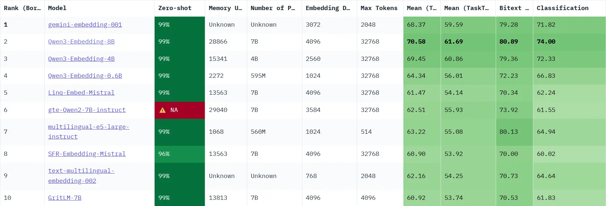
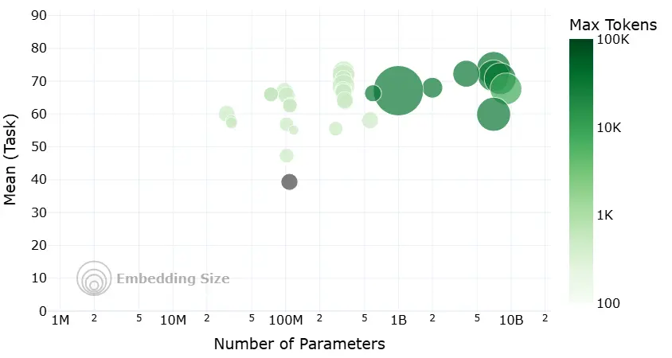

# Section 1 Vector Embedding

## 1. Basics of vector embedding

### 1.1 Basic concepts

#### 1.1.1 What is Embedding

Vector embedding (Embedding) is a technology that converts complex, high-dimensional data objects in the real world (such as text, images, audio, videos, etc.) into mathematically easy-to-process, low-dimensional, dense, continuous numerical vectors.

Imagine that we place every word, every paragraph, and every picture in a huge multi-dimensional space and give it a unique coordinate. This coordinate is a vector that "embeds" all the key information of the original data. This process is Embedding.

- **Data Object**: Any information, such as the text "Hello World", or a picture of a cat.
- **Embedding Model**: A deep learning model responsible for receiving data objects and transforming them.
- **Output Vector**: A fixed-length one-dimensional array, such as`[0.16, 0.29, -0.88, ...]`. The dimensions (length) of this vector typically range from a few hundred to a few thousand.

 

#### 1.1.2 Semantic representation of vector space

The real meaning of Embedding is that the vector it generates is not a pile of random values, but a mathematical encoding of the **semantics** of the data.

- **Core Principle**: In the vector space constructed by Embedding, the corresponding vectors of semantically similar objects will be closer in the space; while the vectors of semantically unrelated objects will be further apart.
- **Key Metric**: We usually use the following mathematical method to measure the "distance" or "similarity" between vectors:
- **Cosine Similarity**: Calculate the cosine value of the angle between two vectors. The closer the value is to 1, the more consistent the directions and the more similar the semantics. This is the most commonly used measurement.
- **Dot Product**: Calculates the sum of the products of two vectors. After vector normalization, the dot product is equivalent to cosine similarity.
- **Euclidean Distance**: Calculate the straight-line distance between two vectors in space. The smaller the distance, the more similar the semantics are.

### 1.2 The role of Embedding in RAG

In the RAG process, Embedding plays an irreplaceable and important role.

#### 1.2.1 Basics of semantic retrieval

The "retrieval" link of RAG usually centers on semantic search based on Embedding. The general process is as follows:
(1) **Offline index construction**: After segmenting the documents in the knowledge base, use the Embedding model to convert each document chunk (Chunk) into a vector and store it in a special vector database.

(2) **Online query retrieval**: When the user asks a question, the user's question is also converted into a vector using the **same** Embedding model.

(3) **Similarity calculation**: In the vector database, calculate the similarity between the "question vector" and all "document block vectors".

(4) **Context recall**: Select the Top-K document blocks with the highest similarity as supplementary context information, and send them to the large language model (LLM) together with the original question to generate the final answer.

#### 1.2.2 The key to determining retrieval quality

The quality of Embedding directly determines the accuracy and relevance of RAG retrieval and recall content. An excellent embedding model can accurately capture the deep semantic connection between the question and the document, even if the user's question is not completely consistent with the original text. Conversely, a poor embedding model may “contaminate” the context provided to the LLM by recalling irrelevant or erroneous information due to its inability to understand the semantics, resulting in low-quality answers that are ultimately generated.

## 2. Embedding technology development

The development of Embedding technology is closely linked to the progress of Natural Language Processing (NLP), especially after the emergence of the RAG framework, which has put forward new requirements for embedding technology. Its evolution path can be roughly divided into the following key stages.

### 2.1 Static word embeddings: context-free representation

- **Representative models**: Word2Vec (2013), GloVe (2014)
- **Main Principle**: Generate a fixed, context-free vector for each word in the vocabulary. For example,`Word2Vec`uses the Skip-gram and CBOW architecture to learn word vectors using local context windows, and verifies the semantic capabilities of vector operations (such as`国王 - 男人 + 女人 ≈ 王后`).`GloVe`integrates the statistical information of the global word-word co-occurrence matrix.
- **Limitations**: Unable to handle polysemy. In "Apple released a new mobile phone" and "I ate an apple", the word vectors of "apple" are exactly the same, which limits its semantic expression ability in complex contexts.

### 2.2 Dynamic context embedding

In 2017, the birth of the`Transformer`architecture brought the self-attention mechanism (Self-Attention), which allows the model to dynamically consider the influence of all other words in the sentence when generating a word vector. Based on this, the 2018`BERT`model utilizes the encoder of`Transformer`and is pre-trained through self-supervised tasks such as masked language models (MLM) to generate deep context-related embeddings. The same word will generate different vectors in different contexts, which effectively solves the polysemy problem of static embedding.

### 2.3 RAG’s new requirements for embedded technology

We mentioned at the beginning that the RAG framework was proposed [^1] to solve the problems of **knowledge solidification** (internal knowledge is difficult to update) and **illusion** (the generated content may not be consistent with the facts and cannot be traced back to the source) of large language models. It dynamically injects external knowledge into LLM through the “retrieval-generation” paradigm. At the heart of this process is **semantic retrieval**, which relies heavily on high-quality vector embeddings.

The subsequent rise of RAG has put forward higher and more specific requirements for embedding technology:

- **Domain Adaptability**: General embedding models often perform poorly in professional fields (such as law, medical), which requires the embedding model to have domain adaptation capabilities and be able to adapt to the terminology and semantics of specific fields through fine-tuning or using instructions (such as the INSTRUCTOR model).
- **Multi-granularity and multi-modality support**: RAG systems need to process not just short sentences, but may also include long documents, code, and even images and tables. This requires the embedding model to be able to handle different lengths and types of input data.
- **Retrieval efficiency and hybrid retrieval**: The dimensions and model size of the embedding vector directly affect the storage cost and retrieval speed. At the same time, in order to combine the advantages of semantic similarity (dense retrieval) and keyword matching (sparse retrieval), embedding models that support hybrid retrieval (such as BGE-M3) emerged as the times require, becoming the key to improving recall in some tasks.

## 3. Embedding model training principle

After understanding the development of embedding models, let's briefly explore how the current mainstream embedding models (usually based on variants of`BERT`) obtain powerful semantic understanding capabilities through training.

The core of modern embedding models is usually the encoder part of Transformer, of which`BERT`is a typical representative. It builds a deep bidirectional representation learning network by stacking multiple`Transformer Encoder`layers.

### 3.1 Main training tasks

BERT's success is largely due to the **self-supervised learning** strategy, which allows the model to learn knowledge from massive, unlabeled text data.

#### Task 1: Masked Language Model (MLM)

- **process**:
- Randomly replace 15% of the tokens in the input sentence with a special`[MASK]`token.
- Let the model predict what these obscured original tokens are.
- **Goal**: Through this task, the model is forced to learn the relationship between each token and its context, thereby mastering deep contextual semantics.

#### Task 2: Next Sentence Prediction (NSP)

- **process**:
- Construct training samples, each sample contains two sentences A and B.
- In 50% of the samples, B is the real next sentence of A (IsNext); in the other 50% of the samples, B is a sentence randomly selected from the corpus (NotNext).
- Let the model determine whether B is the next sentence of A.
- **Goal**: This task allows the model to learn the logical relationship, coherence, and topic relevance between sentences.
- **Important note**: Subsequent studies (such as RoBERTa) found [^2] that the NSP task may be too simple and even harm model performance. Therefore, many modern pre-trained models (e.g. RoBERTa, SBERT) remove NSP in the pre-training stage.

> For more details, please see [BERT Architecture and Application](https://github.com/datawhalechina/base-nlp/blob/main/docs/chapter5/13_Bert.md)

### 3.2 Effect enhancement strategy

Although MLM and NSP endow the model with strong basic semantic understanding capabilities, in order to perform better in retrieval tasks, modern embedding models usually introduce more targeted training strategies.

- **Metric Learning**:
- **Idea**: Directly use "similarity" as the optimization goal.
- **Method**: Collect a large number of relevant text pairs (for example, (question, answer), (news title, text)). The goal of training is to optimize the **relative distance** in vector space: let the vector representation of "positive example pairs" be "pushed closer" in space, while the vector representation of "negative example pairs" be "pushed away". The key is to optimize the ranking relationship rather than pursuing absolute similarity values ​​(such as 1 or 0), because excessive pursuit of extreme values ​​may lead to model overfitting.

- **Contrastive Learning**:
- **Idea**: In vector space, similar samples are "pushed closer" and dissimilar samples are "pushed away".
- **Method**: Construct a triplet (Anchor, Positive, Negative). Among them, Anchor and Positive are related (for example, two different ways of asking the same question), and Anchor and Negative are unrelated. The goal of training is to make`distance(Anchor, Positive)`as small as possible while making`distance(Anchor, Negative)`as large as possible.

## 4. Embedded model selection guide

Now that you understand the theory, how do you choose the embedding model that best suits your project?

### 4.1 Start with MTEB rankings

[**MTEB (Massive Text Embedding Benchmark)**](https://huggingface.co/spaces/mteb/leaderboard) is a comprehensive text embedding model evaluation benchmark maintained by Hugging Face. It covers a variety of tasks such as classification, clustering, retrieval, and sorting, and provides a public ranking list, which provides an important reference for evaluating and selecting embedding models.

The image below is a model evaluation image from the website, which visually demonstrates the four core dimensions to weigh when choosing an open source embedding model:

- **Horizontal axis - Number of Parameters**: represents the size of the model. Generally, a model with a larger number of parameters (further to the right) has stronger potential capabilities, but also has higher requirements on computing resources.
- **Vertical axis - Mean Task Score**: represents the overall performance of the model. This score is the average performance of the model on a series of standard NLP tasks such as classification, clustering, retrieval, etc. The higher the score (the higher it is), the stronger the model’s general semantic understanding ability is.
- **Bubble Size - Embedding Dimension (Embedding Size)**: Represents the dimension of the model output vector. The larger the bubble, the higher the dimension, which can theoretically encode richer semantic details, but it will also take up more storage and computing resources.
- **Bubble Color - Maximum Processing Length (Max Tokens)**: Represents the upper limit of text length that the model can process. The darker the color, the more tokens the model can handle and the better its adaptability to long text.

The MTEB list can help us quickly filter out a large number of inappropriate models. However, it should be noted that the scores on the list are evaluated on a general data set and may not fully reflect the performance of the model in your specific business scenario.

### 4.2 Key evaluation dimensions

When looking at the list, in addition to scores, you also need to pay attention to the following key dimensions:

- **Task**: For RAG applications, you need to focus on the ranking of the model under the`Retrieval`(retrieval) task.
- **Language**: Does the model support the language used by your business data? For Chinese RAGs, choose a model that explicitly supports Chinese or multiple languages.
- **Model Size (Size)**: The larger the model, the better the performance is usually, but the requirements for hardware (video memory) are also higher, and the inference speed is slower. This needs to be weighed based on your deployment environment and performance requirements.
- **Dimensions**: The higher the vector dimension, the richer the information that can be encoded, but it will also take up more storage space and computing resources.
- **Max Tokens**: This determines the upper limit of text length that the model can handle. This parameter is an important basis that you must consider when designing a text chunking (Chunking) strategy. The chunk size should not exceed this limit.
- **Score & Publisher**: Preliminary screening based on the model's score ranking and the reputation of its publishing institution. Models released by well-known institutions are usually of better quality.
- **Cost**: If it is a model that uses API services, its calling cost needs to be considered; if it is a self-deployed open source model, its consumption of hardware resources (such as video memory, memory) and the resulting operation and maintenance costs need to be evaluated.

### 4.3 Iterative testing and optimization

> Don’t rely solely on public lists to make your final decision.

(1) **Determine Baseline**: Based on the above dimensions, select several models that meet the requirements as your initial baseline model.

(2) **Build a private evaluation set**: Based on real business data, manually create a batch of high-quality evaluation samples. Each sample contains a typical user question and its corresponding standard answer (or the most relevant document block).

(3) **Iterative optimization**:
- Run the baseline model on your private evaluation set to evaluate the accuracy and relevance of its recall.
- If the effect is not satisfactory, you can try to change the model, or adjust other aspects of the RAG process (such as text chunking strategy).
- Through several rounds of comparative testing and iterative optimization, finally select the "favorite" model that performs best in your specific scenario.

## References

[^1]: [Lewis et al. (2020). *Retrieval-Augmented Generation for Knowledge-Intensive NLP Tasks*](https://arxiv.org/abs/2005.11401)

[^2]: [*RoBERTa: A Modified BERT Model for NLP*](https://www.comet.com/site/blog/roberta-a-modified-bert-model-for-nlp/)
