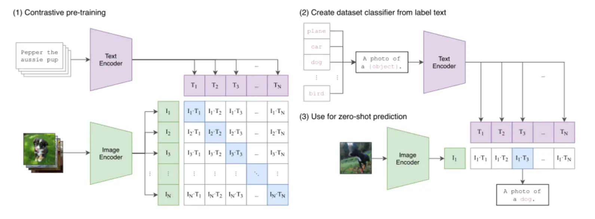

# Section 2 Multimodal Embedding

An important breakthrough in modern AI is the development of simple word vectors into complex systems that can uniformly understand images, text, audio and video. This development builds on key technologies such as attention mechanisms, Transformer architecture and contrastive learning, which solve the core challenge of aligning different data modalities in a shared vector space. Their developments are closely linked: Word2Vec paves the way for BERT's contextual understanding, and BERT lays the foundation for the cross-modal capabilities of models such as CLIP.

## 1. Why is multi-modal embedding needed?

The previous section showed how to create vector embeddings for text. However, a world with only texts is incomplete. Real-world information is multi-modal, including images, audio, video, etc. Traditional text embedding cannot understand queries such as "that picture with the red car" because the text vector and the image vector are in mutually isolated spaces, and there is a "modal wall".

The goal of **Multimodal Embedding** is exactly to break this wall. Its purpose is to map different types of data (such as images and text) into the same shared vector space. In this unified space, the vector of a piece of text describing "a running dog" will be very close to the vector of a picture of a real puppy running.

The key to achieving this goal is to solve the challenge of **Cross-modal Alignment**. Breakthroughs represented by technologies such as contrastive learning and visual Transformer (ViT) allow models to learn semantic associations between different modal data, ultimately giving rise to models like CLIP.

## 2. Brief analysis of CLIP model

In the field of multi-modal graphics and text, OpenAI's CLIP (Contrastive Language-Image Pre-training) is a very influential model, which defines an effective paradigm for multi-modal embedding.

CLIP's architecture is clear and concise. It uses **Dual-Encoder Architecture**, which contains an image encoder and a text encoder to map images and text into the same shared vector space.


*Figure: CLIP workflow. (1) Train dual encoders through contrastive learning to align image and text vector spaces. (2) and (3) show how to use this space to achieve zero-sample prediction through image-text similarity matching. *

In order for the two encoders to learn to "align" the semantics of different modalities, CLIP uses a Contrastive Learning strategy during training. When processing a batch of image and text data, the goal of the model is to maximize the vector similarity of correct image and text pairs while minimizing the similarity of all incorrect pairs. Through this method of "bringing positive examples closer and pushing negative examples further", the model learns from massive data to bring semantically related images and texts closer in vector space.

This large-scale contrastive learning gives CLIP effective zero-shot recognition capabilities. It can transform a traditional classification task into a "image and text retrieval" problem - for example, to determine whether a picture is a cat, you only need to calculate the similarity between the image vector and the text vector of "a photo of a cat". This allows CLIP to achieve generalized understanding of visual concepts without having to be fine-tuned for specific tasks.

## 3. Commonly used multi-modal embedding models (take bge-visualized-m3 as an example)

Although CLIP provides an important foundation for image and text pre-training, research in the multi-modal field has developed rapidly, and many models optimized for different goals and scenarios have emerged. For example, the BLIP series focuses on improving fine-grained image and text understanding and generation capabilities, while ALIGN has proven the effectiveness of utilizing massive noisy data for large-scale training.

Among many excellent models, **bge-visualized-m3 (M3 version of Visualized-BGE)** developed by Beijing Zhiyuan Artificial Intelligence Institute (BAAI) is a very representative modern multi-modal embedding model. It introduces image capabilities on the basis of **BGE-M3** (text embedded base), which reflects the current trend of technology development towards "more unified and comprehensive".

The core features of bge-visualized-m3 can also be summarized as "M3" (mainly inherited from its text base BGE-M3):
- **Multi-Linguality**: Supports text representation in more than 100 languages ​​and can be used for cross-language image and text retrieval (text side).
- **Multi-Functionality**: In text retrieval scenarios, different paradigms such as Dense Retrieval and Multi-Vector Retrieval can be used as needed.
- **Multi-Granularity**: The text side can handle documents ranging from short sentences to 8192 tokens long, covering a wider range of application requirements.

In terms of technical architecture, bge-visualized-m3 will first use a visual encoder to extract the **patch token** of the image, then map it to an "image token" of the same dimension as the text, and send it to BGE's Transformer encoder together with the text token for joint modeling, and finally obtain a unified vector representation that can be used for image and text retrieval.

## 4. Code examples

### 4.1 Environment preparation

**Step 1: Install visual_bge module**

```bash
# 进入 visual_bge 目录
cd code/C3/visual_bge

# 安装 visual_bge 模块及其依赖
pip install -e .

# 返回上级目录
cd ..
```

**Step 2: Download model weights**

```bash
# 运行模型下载脚本
python download_model.py
```

The model download script will automatically check whether the model file exists in the`../../models/bge/`directory. If it does not exist, it will download it from the Hugging Face mirror site.

### 4.2 Basic Example

```python
import os
os.environ["HF_ENDPOINT"] = "https://hf-mirror.com"
import torch
from visual_bge.visual_bge.modeling import Visualized_BGE

model = Visualized_BGE(model_name_bge="BAAI/bge-base-en-v1.5",
                      model_weight="../../models/bge/Visualized_base_en_v1.5.pth")
model.eval()

with torch.no_grad():
    text_emb = model.encode(text="datawhale开源组织的logo")
    img_emb_1 = model.encode(image="../../data/C3/imgs/datawhale01.png")
    multi_emb_1 = model.encode(image="../../data/C3/imgs/datawhale01.png", text="datawhale开源组织的logo")
    img_emb_2 = model.encode(image="../../data/C3/imgs/datawhale02.png")
    multi_emb_2 = model.encode(image="../../data/C3/imgs/datawhale02.png", text="datawhale开源组织的logo")

# 计算相似度
sim_1 = img_emb_1 @ img_emb_2.T
sim_2 = img_emb_1 @ multi_emb_1.T
sim_3 = text_emb @ multi_emb_1.T
sim_4 = multi_emb_1 @ multi_emb_2.T

print("=== 相似度计算结果 ===")
print(f"纯图像 vs 纯图像: {sim_1}")
print(f"图文结合1 vs 纯图像: {sim_2}")
print(f"图文结合1 vs 纯文本: {sim_3}")
print(f"图文结合1 vs 图文结合2: {sim_4}")
```

**Code Interpretation:**

- **Model Architecture**:`Visualized_BGE`is a general multi-modal embedding model built by integrating image token embedding into the BGE text embedding framework, which has the flexibility to handle multi-modal data beyond plain text.
- **Model Parameters**:
-`model_name_bge`: Specifies the underlying BGE text embedding model and inherits its powerful text representation capabilities.
-`model_weight`: Pre-trained weight file for Visual BGE, containing visual encoder parameters.
- **Multi-modal encoding capabilities**: Visual BGE provides the diversity of encoding multi-modal data, supporting the formats of plain text, pure images or a combination of graphics and text:
- **Plain text encoding**: Maintain the powerful text embedding capabilities of the original BGE model.
- **Pure image encoding**: Process images using an EVA-CLIP based visual encoder.
- **Joint Image and Text Coding**: Fusion of image and text features into a unified vector space.
- **Application Scenario**: Mainly used for mixed-modal retrieval tasks, including multi-modal knowledge retrieval, combined image retrieval, multi-modal query knowledge retrieval, etc.
- **Similarity calculation**: Use matrix multiplication to calculate cosine similarity, and all embedding vectors are normalized to unit length to ensure that the similarity value is within a reasonable range.

**Run results:**

```bash
=== 相似度计算结果 ===
纯图像 vs 纯图像: tensor([[0.8318]])
图文结合1 vs 纯图像: tensor([[0.8291]])
图文结合1 vs 纯文本: tensor([[0.7627]])
图文结合1 vs 图文结合2: tensor([[0.9058]])
```

> [Full Code](https://github.com/datawhalechina/all-in-rag/blob/main/code/C3/01_bge_visualized.py)

## practise

Try replacing some text in the code, for example, replace`datawhale开源组织的logo`with`blue whale`and see what the difference is.