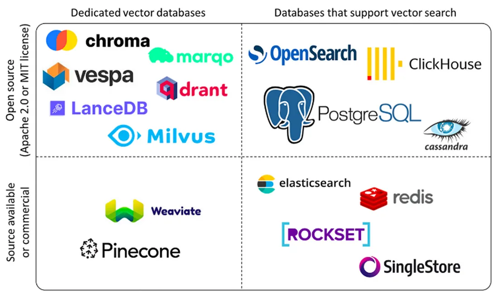

# Section 3 Vector Database

## 1. The role of vector database

Earlier we learned how to use embedding models to convert unstructured data such as text and images into high-dimensional vectors. These vectors are the basis for semantic understanding by the RAG system. However, when the number of vectors increases from hundreds to millions or even billions, a core question arises: **How ​​to quickly and accurately find the ones most similar to the user query from the massive vectors? **

### 1.1 Main functions of vector database

The core value of a vector database lies in its ability to efficiently process massive high-dimensional vectors. Its main functions can be summarized as follows:

- **Efficient Similarity Search**: This is the most important function of vector database. It uses specialized indexing technology (such as HNSW, IVF) to implement millisecond-level approximate nearest neighbor (ANN) queries in billions of vectors to quickly find the data most similar to a given query.

- **High-dimensional data storage and management**: Specially optimized for storing high-dimensional vectors (usually hundreds or thousands of dimensions), supporting basic operations such as adding, deleting, modifying, and querying vector data.

- **Rich query capabilities**: In addition to basic similarity search, it also supports filtering queries by scalar fields (for example, specifying`年份 > 2023`while searching for similar pictures), range queries, and cluster analysis to meet complex business needs.

- **Scalable and High Availability**: Modern vector databases usually adopt distributed architecture and have good horizontal scalability and fault tolerance. They can cope with the growth of data volume by adding nodes and ensure the stability and reliability of services.

- **Data and model ecological integration**: Seamlessly integrated with mainstream AI frameworks (such as LangChain, LlamaIndex) and machine learning workflows, simplifying the application development process from model training to vector retrieval.

### 1.2 Vector database vs traditional database

Traditional databases such as MySQL are good at handling exact match queries on structured data (e.g.,`WHERE age = 25`), but they are not designed to handle similarity searches on high-dimensional vectors. The computational cost and time delay of performing violent and linear similarity calculations on a huge set of vectors are unacceptable. **Vector Database** solves this problem very well. It is a database system specially designed for efficient storage, management and query of high-dimensional vectors. In the RAG process, it plays the role of "knowledge base" and is the key bridge connecting data and large language models.

The main differences between vector databases and traditional databases are as follows:

| **Dimensions** | **Vector Database** | **Traditional Database (RDBMS)** |
| :--- | :--- | :--- |
| **Core Data Types** | High-dimensional vectors (Embeddings) | Structured data (text, numbers, dates) |
| **query method** | **similarity search** (ANN) | **exact match** |
| **Index mechanism** | HNSW, IVF, LSH and other ANN indexes | B-Tree, Hash Index |
| **Main application scenarios** | AI applications, RAG, recommendation systems, image/speech recognition | Business systems (ERP, CRM), financial transactions, data reports |
| **Data Scale** | Easily handle hundreds of billions of vectors | Usually tens to billions of rows of data, larger scale requires complex database and table divisions |
| **Performance Features** | High-dimensional data retrieval performance is extremely high and computationally intensive | Structured data query is fast, but high-dimensional data query performance drops exponentially |
| **Consistency** | Usually eventual consistency | Strong consistency (ACID transactions) |

Vector databases and traditional databases are not substitutes for each other, but complementary. When building modern AI applications, it's common to use a combination of the two: traditional databases are used to store business metadata and structured information, while vector databases are specialized in processing and retrieving the massive amounts of vector data produced by AI models.

## 2. Working principle

The core of the vector database is to efficiently handle similarity searches of high-dimensional vectors. A vector is an ordered set of numerical values ​​that can represent the characteristics or attributes of complex data such as text, images, and audio. In the RAG system, vectors are generally converted into high-dimensional vector representations through embedding models, such as the graphic example in the previous section. Vector databases usually adopt a four-layer architecture and realize efficient similarity search through the collaborative work of storage layer, index layer, query layer and service layer. The storage layer is responsible for storing vector data and metadata, optimizing storage efficiency and supporting distributed storage; the index layer maintains index algorithms (HNSW, LSH, PQ, etc.), is responsible for index creation and optimization, and supports index adjustment; the query layer processes query requests, supports hybrid queries and realizes query optimization; the service layer manages client connections, provides monitoring and logging capabilities, and implements security management.

The main technical means include:
- **Tree-based method**: such as the random projection tree used by Annoy, which achieves logarithmic complexity search through the tree structure
- **Hash-based methods**: such as LSH (locality sensitive hashing), which maps similar vectors to the same "bucket" through a hash function
- **Graph-based methods**: such as HNSW (Hierarchical Navigable Small World Graph), which achieves fast search through a multi-layer proximity graph structure
- **Quantization-based methods**: such as Faiss's IVF and PQ, which compress vectors through clustering and quantization

## 3. Introduction to mainstream vector databases



Current mainstream vector database products include:

[ **Pinecone** ](https://www.pinecone.io/) is a fully managed vector database service designed with Serverless architecture. It provides enterprise-level features such as storage and computing separation, automatic expansion and load balancing, and guarantees an SLA of 99.95%. Pinecone supports multiple language SDKs, provides extremely high availability and low latency search (<100ms), and is particularly suitable for enterprise-level production environments, high concurrency scenarios and large-scale deployment.

[ **Milvus** ](https://github.com/milvus-io/milvus) is an open source distributed vector database that adopts distributed architecture design and supports GPU acceleration and multiple indexing algorithms. It can handle billions of vector searches, provides high-performance GPU acceleration and a complete ecosystem. Milvus is particularly suitable for large-scale deployment, high-performance scenarios, and open source projects that require custom development.

[ **Qdrant** ](https://github.com/qdrant/qdrant) is a high-performance open source vector database developed using Rust and supports binary quantization technology. It provides multiple indexing strategies and vector hybrid search capabilities, enabling extremely high performance (RPS>4000) and low-latency searches. Qdrant is particularly suitable for performance-sensitive applications, high-concurrency scenarios, and small and medium-scale deployments.

[ **Weaviate** ](https://github.com/weaviate/weaviate) is an AI integrated vector database that supports GraphQL, providing 20+ AI modules and multi-modal support. It is designed with GraphQL API and supports RAG optimization, which is especially suitable for AI development, multi-modal processing and rapid development scenarios. Weaviate features active community support and easy integration.

[ **Chroma** ](https://github.com/chroma-core/chroma) is a lightweight open source vector database with local-first design and no dependencies. It provides zero-configuration installation, local operation and low resource consumption, and is particularly suitable for prototype development, education and training, and small-scale applications. Chroma is simple to deploy and suitable for rapid prototyping.

**Selection Suggestions**:
- **Getting Started/Small Projects**: Starting with`ChromaDB`or`FAISS`is the best option. They are tightly integrated with LangChain/LlamaIndex, can be run with just a few lines of code, and can meet basic storage and retrieval needs.
- **Production environment/large-scale application**: When the amount of data exceeds millions, or when high concurrency, real-time updates, and complex metadata filtering are required, more professional solutions such as`Milvus`,`Weaviate`or cloud service`Pinecone`should be considered.

## 4. Local vector storage: taking FAISS as an example

FAISS (Facebook AI Similarity Search) is a high-performance library developed by Facebook AI Research specifically for efficient similarity search and dense vector clustering. When combined with LangChain, it serves as a powerful local vector storage solution, ideal for rapid prototyping and small to medium-sized applications.

Unlike databases such as ChromaDB, FAISS is essentially an algorithm library that saves the index directly as a local file (a`.faiss`index file and a`.pkl`mapping file) instead of running a database service. This method is lightweight and efficient.

### 4.1 Environment preparation

Before starting, make sure you have all required libraries installed:

> The`faiss-cpu`currently installed in requirements.txt is the CPU version. If your machine has a GPU, you can install`faiss-gpu`for better performance.

### 4.2 Basic Example (FAISS)

The following code demonstrates using LangChain and FAISS to complete a complete "Create -> Save -> Load -> Query" process.

```python
from langchain_community.vectorstores import FAISS
from langchain_community.embeddings import HuggingFaceEmbeddings
from langchain_core.documents import Document

# 1. 示例文本和嵌入模型
texts = [
    "张三是法外狂徒",
    "FAISS是一个用于高效相似性搜索和密集向量聚类的库。",
    "LangChain是一个用于开发由语言模型驱动的应用程序的框架。"
]
docs = [Document(page_content=t) for t in texts]
embeddings = HuggingFaceEmbeddings(model_name="BAAI/bge-small-zh-v1.5")

# 2. 创建向量存储并保存到本地
vectorstore = FAISS.from_documents(docs, embeddings)

local_faiss_path = "./faiss_index_store"
vectorstore.save_local(local_faiss_path)

print(f"FAISS index has been saved to {local_faiss_path}")

# 3. 加载索引并执行查询
# 加载时需指定相同的嵌入模型，并允许反序列化
loaded_vectorstore = FAISS.load_local(
    local_faiss_path,
    embeddings,
    allow_dangerous_deserialization=True
)

# 相似性搜索
query = "FAISS是做什么的？"
results = loaded_vectorstore.similarity_search(query, k=1)

print(f"\n查询: '{query}'")
print("相似度最高的文档:")
for doc in results:
    print(f"- {doc.page_content}")
```
**Operating results and interpretation**:

When you run the above script, you will see output similar to the following:
```bash
FAISS index has been saved to ./faiss_index_store

查询: 'FAISS是做什么的？'
相似度最高的文档:
- FAISS是一个用于高效相似性搜索和密集向量聚类的库。
```

**Index creation implementation details**:
By delving into the LangChain source code, we can find that index creation is a layered and decoupled process, which mainly involves nested calls of the following methods:

1. **`from_documents`(encapsulation layer)**:
* This is the method we call directly. Its responsibility is simple: extract the plain text content (`page_content`) and metadata (`metadata`) from the input list of`Document`objects.
* It then passes this extracted information to the core`from_texts`method.

2. **`from_texts`(vectorization entry)**:
* This method is the user-facing entrance. It receives a list of text and performs a crucial first step: calling`embedding.embed_documents(texts)`to batch convert all text into vectors.
* After vectorization is complete, it does not handle index building directly, but passes the resulting vector and all other information (text, metadata, etc.) to an internal helper method`__from`.

3. **`__from`(Build Index Framework)**:
* An internal method responsible for building the "empty frame" for FAISS vector storage.
* It initializes an empty FAISS index structure (such as`faiss.IndexFlatL2`) according to the specified distance strategy (default is L2 Euclidean distance).
* At the same time, it also prepares the`docstore`used to store the original text of the document and the`index_to_docstore_id`mapping used to connect the FAISS index and the document.
* Finally, it calls another internal method`__add`to complete the filling of data.

4. **`__add`(fill data)**:
* The core that actually performs data adding operations. After it receives vectors, text, and metadata, it performs the following key operations:
* **Add vectors**: Convert the list of vectors into the`numpy`array required by FAISS, and call`self.index.add(vector)`to batch add them to the FAISS index.
* **Storage document**: Pack text and metadata into`Document`objects and store them in`docstore`.
* **Establish mapping**: Update the`index_to_docstore_id`dictionary and establish a mapping relationship between FAISS's internal integer IDs (such as 0, 1, 2...) and our document's unique ID.


## practise

1. LlamaIndex will store data in transparent and readable JSON format by default. Run the [03_llamaindex_vector.py](https://github.com/datawhalechina/all-in-rag/blob/main/code/C3/03_llamaindex_vector.py) file to view the contents of the saved json file.
2. Create a new code file to load and similarity search the data stored in LlamaIndex.