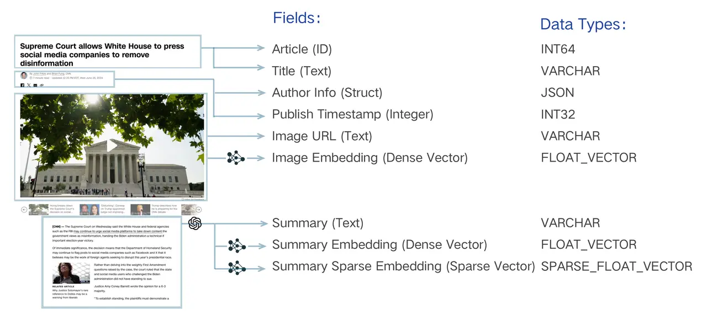
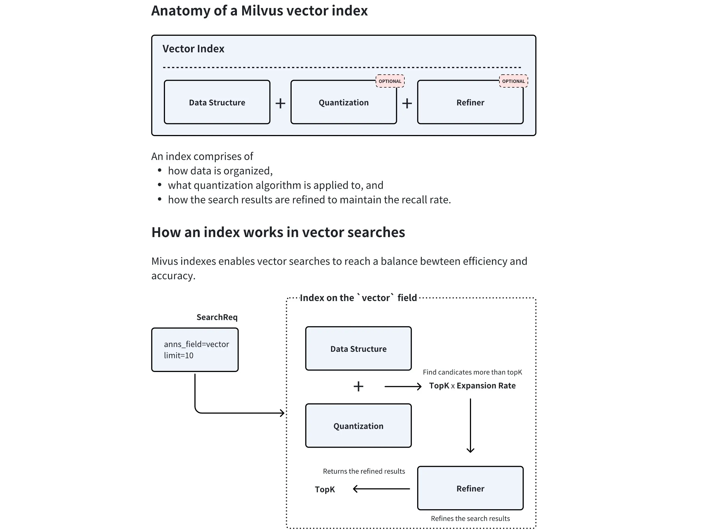
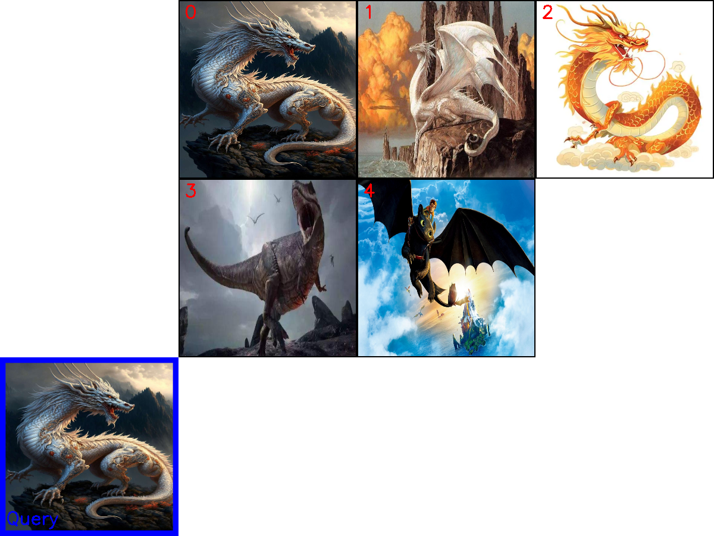

# Section 4 Introduction to Milvus and multi-modal retrieval practice

## 1. Introduction

Milvus is an open source vector database designed for large-scale vector similarity search and analysis. It was born from Zilliz Company and has become a top-level project of the LF AI & Data Foundation, with a wide range of applications in the field of AI.

Unlike lightweight local storage solutions such as FAISS and ChromaDB, Milvus was designed for the production environment from the beginning. It adopts a cloud-native architecture, has high availability, high performance, and easy scalability, and can handle billions, tens of billions or even larger-scale vector data.

**Official website address**: [https://milvus.io/](https://milvus.io/)

**GitHub**: [https://github.com/milvus-io/milvus](https://github.com/milvus-io/milvus)

## 2. Deployment and installation

Milvus provides a variety of deployment methods. Here we take **Milvus Standalone (stand-alone version)** as an example.

### 1. Environment preparation

- **Install Docker and Docker Compose**: Make sure Docker and Docker Compose are installed and running on your system. If you are not familiar with Docker, you can refer to this detailed tutorial: [Docker 10,000-word Tutorial: From Getting Started to Mastering] (https://mp.weixin.qq.com/s/u2es87JU5FNlGo3qDLY_ng).

> The codespace environment comes with Docker Compose and does not need to be installed.

### 2. Download and start Milvus

In the working directory you selected, open the Terminal or the command line tool (PowerShell) and perform the following steps:

**Step 1: Download the configuration file**

Use the following command to download the official `docker-compose.yml` file. This file defines Milvus Standalone and its two core dependency services required to run: `etcd` for metadata storage and `MinIO` for object storage (for more architectural details, please refer to [Official Documentation](https://milvus.io/docs/architecture_overview.md)).

```bash
# macOS / Linux (使用 wget)
wget https://github.com/milvus-io/milvus/releases/download/v2.5.14/milvus-standalone-docker-compose.yml -O docker-compose.yml
```

```powershell
# Windows (使用 PowerShell)
Invoke-WebRequest -Uri "https://github.com/milvus-io/milvus/releases/download/v2.5.14/milvus-standalone-docker-compose.yml" -OutFile "docker-compose.yml"
```

**Step 2: Start the Milvus service**

In the directory where the `docker-compose.yml` file is located, run the following command to start Milvus in background mode:

```bash
docker compose up -d
```

Docker will automatically pull the required images and start three containers: `milvus-standalone`, `milvus-minio`, and `milvus-etcd`. This process may take a few minutes, depending on your network conditions.

### 3. Verify installation

You can verify that Milvus started successfully by:

- **View Docker containers**: Open the Docker Desktop dashboard (Windows/macOS) or run the `docker ps` command (Linux) in the terminal to confirm that the three Milvus-related containers (`milvus-standalone`, `milvus-minio`, `milvus-etcd`) are in `running` or `up` status.
- **Check service port**: Milvus Standalone provides services through the `19530` port by default, which is the address that needs to be used when subsequent code connects.

### 4. Common management commands

- **Stop service**:
  ```bash
  docker compose down
  ```
This command stops and removes the container but retains the stored data volume.

- **Complete Clean (Stop and Delete Data)**:
If you want to completely delete all data (including vectors, metadata, etc.), you can execute the following command:
  ```bash
  docker compose down -v
  ```

## 3. Core components

### 3.1 Collection

Collection can be understood using a library metaphor:

- **Collection**: equivalent to a **library**, which is the top-level container for all data. A Collection can contain multiple Partitions, and each Partition can contain multiple Entities.
- **Partition**: equivalent to **different areas** in the library (such as "Novel Area", "Technology Area"), which physically isolates data to make retrieval more efficient.
- **Schema**: Equivalent to the library's **book card rules**, it defines what information (fields) must be registered for each book (data).
- **Entity**: equivalent to **a specific book**, the data itself.
- **Alias ​​(alias)**: It is equivalent to a **dynamic recommended book list** (such as "This Week's Selection"). It can point to a specific Collection to facilitate application layer calls and achieve seamless switching when data is updated.

**Collection** is the most basic data organization unit in Milvus, similar to a **Table (Table)** in a relational database. It is the container where we store, manage and query vectors and related metadata. All data operations, such as insertion, deletion, query, etc., revolve around Collection.

A Collection is defined by its **Schema** and contains the following important sub-concepts and properties:

#### 3.1.1 Schema

Before creating a Collection, its **Schema** must be defined. `Schema` specifies the data structure of the Collection and defines all the fields and attributes contained in it. A well-designed Schema can ensure data consistency and improve query performance.

Schema usually contains the following types of fields:

- **Primary Key Field**: Each Collection must have one and only one primary key field, which is used to uniquely identify each piece of data (entity). Its value must be unique and is usually of type integer or string.
- **Vector Field**: Used to store core vector data. A Collection can have one or more vector fields to meet the needs of complex scenarios such as multimodality.
- **Scalar Field**: Used to store metadata other than vectors, such as strings, numbers, Boolean values, JSON, etc. These fields can be used to filter queries for more precise retrieval.



The above figure takes a news article as an example, showing a typical multi-modal, mixed vector Schema design. It decomposes an article into: unique `Article (ID)`, text metadata (such as `Title`, `Author Info`), image information (`Image URL`), and generates dense vectors (`Image Embedding`, `Summary Embedding`) and sparse vectors (`Summary Sparse Embedding`) for image and abstract content respectively.

#### 3.1.2 Partition

**Partition** is a logical division within Collection. Each Collection will have a default partition named `_default` when it is created. We can create more partitions according to business needs and store data in different partitions according to specific rules (such as category, date, etc.).

**Why use partitioning? **

- **Improve query performance**: When querying, you can specify to search only in one or several partitions, thereby greatly reducing the amount of data that needs to be scanned and significantly improving the retrieval speed.
- **Data Management**: Facilitates batch operations on part of the data, such as loading/unloading specific partitions to memory, or deleting the data of the entire partition.

A Collection can have up to 1024 partitions. Proper use of partitions is one of the important means for optimizing Milvus performance.

#### 3.1.3 Alias ​​(alias)

**Alias** (alias) is a "nickname" provided for the Collection. By setting an alias for a Collection, we can use this alias to perform all operations in the application instead of using the real Collection name directly.

**Why use aliases? **

- **Update data securely**: Imagine that you need to perform a large-scale data update or re-index on a collection of online services. Operating directly on the original Collection is very risky. The correct approach is:
1. Create a new Collection (`collection_v2`) and import and index all new data.
2. Atomically switch aliases (such as `my_app_collection`) pointing to the old Collection (`collection_v1`) to the new Collection (`collection_v2`).
- **Code Decoupling**: The entire switching process is completely transparent to the upper-layer application, without modifying any code or restarting the service, achieving a smooth and seamless upgrade of data.

### 3.2 Index (Index)

If Collection is the skeleton of Milvus, then Index is its nervous system that accelerates retrieval. From a macro perspective, the index itself is a complex data structure designed to speed up queries. After indexing vector data, Milvus can greatly improve the speed of vector similarity searches at the expense of additional storage and memory resources.



The above figure clearly shows the internal components of Milvus vector indexing and its workflow:
- **Data Structure**: This is the skeleton of the index and defines how the vectors are organized (like the graph structure in HNSW).
- **Quantization** (optional): Data compression technology, which reduces memory usage and accelerates calculations by reducing vector precision.
- **Result Refinement** (optional): After finding the preliminary candidate set, perform more precise calculations to optimize the final result.

Milvus supports creating separate indexes for scalar fields and vector fields.

- **Scalar field index**: Mainly used to speed up metadata filtering, commonly used ones are `INVERTED`, `BITMAP`, etc. Usually the recommended index type will suffice.
- **Vector Field Index**: This is the core of Milvus. Choosing an appropriate vector index is the art of making tradeoffs between query performance, recall, and memory footprint.

#### 3.2.1 Main vector index types

Milvus provides a variety of vector indexing algorithms to adapt to different application scenarios. The following are the most core types:

- **FLAT (fine search)**
- **Principle**: Brute-force Search. It calculates the actual distance between the query vector and all vectors in the collection, returning the most accurate results.
- **Advantages**: 100% recall rate, most accurate results.
- **Disadvantages**: slow speed, large memory usage, not suitable for massive data.
- **Applicable scenarios**: Scenarios with extremely high accuracy requirements and small data scale (within millions).

- **IVF Series (Inverted File Index)**
- **Principle**: Similar to the table of contents of a book. It first divides all vectors into multiple "buckets" (`nlist`) through clustering. When querying, it first finds the most similar "buckets" and then performs precise searches only within these few buckets. `IVF_FLAT`, `IVF_SQ8`, `IVF_PQ` are its different variants. The main difference is whether the vectors in the bucket are compressed (quantized).
- **Advantages**: By narrowing the search scope, the retrieval speed is greatly improved, which is a good balance between performance and effect.
- **Disadvantage**: The recall rate is not 100% because the relevant vectors may be divided into buckets that have not been searched.
- **Applicable Scenarios**: General scenarios, especially suitable for large-scale data sets that require high throughput.

- **HNSW (graph-based indexing)**
- **Principle**: Construct a multi-layered proximity graph. When querying, start from the uppermost sparse graph, quickly locate the target area, and then conduct an accurate search in the lower dense graph.
- **Advantages**: The retrieval speed is extremely fast, the recall rate is high, and it is especially good at processing high-dimensional data and low-latency queries.
- **Disadvantages**: The memory usage is very large, and it takes a long time to build the index.
- **Applicable scenarios**: Scenarios that have strict requirements on query delay (such as real-time recommendations, online search).

- **DiskANN (disk-based index)**
- **Principle**: A graph index optimized to run on high-speed disks such as SSDs.
- **Advantages**: Supports massive data sets that far exceed memory capacity (billions or more) while maintaining low query latency.
- **Disadvantages**: Slightly higher latency than pure memory indexing.
- **Applicable scenarios**: Scenarios where the data scale is huge and cannot be loaded into memory.

#### 3.2.2 How to choose an index?

There is no single "best answer" to selecting an index, and it requires a trade-off between data size, memory limitations, query performance, and recall based on business scenarios.

| Scenario | Recommended Index | Remarks |
| :--- | :--- | :--- |
| The data can be completely loaded into the memory, pursuing low latency | **HNSW** | The memory usage is large, but the query performance and recall rate are excellent. |
| Data can be fully loaded into memory to pursue high throughput | **IVF_FLAT / IVF_SQ8** | The right balance between performance and resource consumption. |
| The amount of data is huge and cannot be loaded into the memory | **DiskANN** | Excellent performance on SSD, specially designed for massive data. |
| Pursue 100% accuracy, small amount of data | **FLAT** | Violent search to ensure the most accurate results. |

In practical applications, it is usually necessary to find the index type and its parameters that are most suitable for your own data and query patterns through testing.

### 3.3 Retrieval

#### 3.3.1 Basic vector search (ANN Search)

After having a data container (Collection) and a retrieval engine (Index), the last step is to efficiently retrieve information from massive data. This is one of the core functions of Milvus, **Approximate Nearest Neighbor (ANN) retrieval**. Unlike brute-force search, which requires calculation of all data, ANN search uses pre-built indexes to quickly find the Top-K results most similar to the query vector from massive data. This is a strategy that strikes the ultimate balance between speed and accuracy.

- **Main Parameters**:
- `anns_field`: Specifies which vector field to search on.
- `data`: Pass in one or more query vectors.
- `limit` (or `top_k`): Specifies the number of most similar results that need to be returned.
- `search_params`: Specify parameters used during retrieval, such as distance calculation method (`metric_type`) and index-related query parameters.

#### 3.3.2 Enhanced retrieval

On top of basic ANN retrieval, Milvus provides a variety of enhanced retrieval functions to meet more complex business needs.

**Filtered Search**

In practical applications, we rarely only perform simple vector retrieval. A more common requirement is to "find the most similar results among vectors that meet specific conditions", which is filter retrieval. It combines vector similarity retrieval with scalar field filtering.

- **How ​​it works**: First filter out eligible entities based on the provided filter expression (`filter`), and then perform ANN retrieval only within this subset. This greatly improves query accuracy.
- **Application Example**:
- **E-commerce**: "Search for products most similar to this red dress, but only look at products with a price less than 500 yuan and in stock."
- **Knowledge Base**: "Find documents related to 'Artificial Intelligence', but only from articles under the 'Technology' category and published after 2023."

**Range Search**

Sometimes what we care about is not the most similar Top-K results, but "all results whose similarity to the query vector is within a specific range."

- **How ​​it works**: Range retrieval allows defining a threshold range of distance (or similarity). Milvus will return all entities whose distance from the query vector falls within this range.
- **Application Example**:
- **Face Recognition**: "Find all faces that are more than 0.9 similar to the target face", used for identity verification.
- **Anomaly Detection**: "Find all data points that are too far away from the normal sample vector", used to find anomalies.

**Multiple vector hybrid search (Hybrid Search)**

This is an extremely powerful advanced retrieval mode provided by Milvus, which allows multiple vector fields to be retrieved simultaneously in a single request, with the results intelligently fused together.

- **How ​​it works**:
1. **Parallel retrieval**: The application initiates ANN retrieval requests separately for different vector fields (such as a dense vector for text semantics, a sparse vector for keyword matching, and a multi-modal vector for image content).
2. **Result Fusion (Rerank)**: Milvus uses a reranking strategy (Reranker) to merge results from different retrieval streams into a unified, higher-quality ranked list. Commonly used strategies are `RRFRanker` (balances results between parties) and `WeightedRanker` (can weight results for specific fields).

- **Application Example**:
- **Multi-modal product retrieval**: The user enters the text "Quiet and comfortable white headphones", and the system can simultaneously retrieve the **text description vector** and **image content vector** of the product and return the most matching product.
- **Enhanced RAG**: Combines **dense vectors** (capturing semantics) and **sparse vectors** (exactly matching keywords) to achieve a more accurate document retrieval effect than a single vector.

**Grouping Search**

Grouped search solves a common pain point: insufficient diversity of search results. Imagine that you search for "machine learning" and the first 10 articles returned are all from different chapters of the same textbook. This is obviously not an ideal result.

- **How ​​it works**: Grouped retrieval allows you to specify a field (such as `document_id`) to group the results. Milvus will ensure that each group (each `document_id`) appears only once (or a specified number of times) in the returned results after retrieval, and the entity in the group that is most similar to the query is returned.
- **Application Example**:
- **Video retrieval**: Search for "cute cats" and ensure that the returned videos are from different bloggers.
- **Document Search**: Search the "Database Index" to ensure that the results returned are from different books or sources.

Through these flexible retrieval function combinations, developers can build vector retrieval applications that meet various complex business needs.

## 4. Milvus multi-modal practice

In this section, we will use a complete example to demonstrate how to use Milvus and the Visualized-BGE model to build an end-to-end image and text multi-modal retrieval engine.

### 4.1 Initialization and tool definition

First import all necessary libraries and define constants such as model paths and data directories. For code tidiness and reuse, the loading and encoding logic of the Visualized-BGE model is encapsulated in a `Encoder` class, and a `visualize_results` function is defined for subsequent result visualization.

```python
import os
from tqdm import tqdm
from glob import glob
import torch
from visual_bge.visual_bge.modeling import Visualized_BGE
from pymilvus import MilvusClient, FieldSchema, CollectionSchema, DataType
import numpy as np
import cv2
from PIL import Image

# 1. 初始化设置
MODEL_NAME = "BAAI/bge-base-en-v1.5"
MODEL_PATH = "../../models/bge/Visualized_base_en_v1.5.pth"
DATA_DIR = "../../data/C3"
COLLECTION_NAME = "multimodal_demo"
MILVUS_URI = "http://localhost:19530"

# 2. 定义工具 (编码器和可视化函数)
class Encoder:
    """编码器类，用于将图像和文本编码为向量。"""
    def __init__(self, model_name: str, model_path: str):
        self.model = Visualized_BGE(model_name_bge=model_name, model_weight=model_path)
        self.model.eval()

    def encode_query(self, image_path: str, text: str) -> list[float]:
        with torch.no_grad():
            query_emb = self.model.encode(image=image_path, text=text)
        return query_emb.tolist()[0]

    def encode_image(self, image_path: str) -> list[float]:
        with torch.no_grad():
            query_emb = self.model.encode(image=image_path)
        return query_emb.tolist()[0]

def visualize_results(query_image_path: str, retrieved_images: list, img_height: int = 300, img_width: int = 300, row_count: int = 3) -> np.ndarray:
    """从检索到的图像列表创建一个全景图用于可视化。"""
    panoramic_width = img_width * row_count
    panoramic_height = img_height * row_count
    panoramic_image = np.full((panoramic_height, panoramic_width, 3), 255, dtype=np.uint8)
    query_display_area = np.full((panoramic_height, img_width, 3), 255, dtype=np.uint8)

    # 处理查询图像
    query_pil = Image.open(query_image_path).convert("RGB")
    query_cv = np.array(query_pil)[:, :, ::-1]
    resized_query = cv2.resize(query_cv, (img_width, img_height))
    bordered_query = cv2.copyMakeBorder(resized_query, 10, 10, 10, 10, cv2.BORDER_CONSTANT, value=(255, 0, 0))
    query_display_area[img_height * (row_count - 1):, :] = cv2.resize(bordered_query, (img_width, img_height))
    cv2.putText(query_display_area, "Query", (10, panoramic_height - 20), cv2.FONT_HERSHEY_SIMPLEX, 1, (255, 0, 0), 2)

    # 处理检索到的图像
    for i, img_path in enumerate(retrieved_images):
        row, col = i // row_count, i % row_count
        start_row, start_col = row * img_height, col * img_width
        
        retrieved_pil = Image.open(img_path).convert("RGB")
        retrieved_cv = np.array(retrieved_pil)[:, :, ::-1]
        resized_retrieved = cv2.resize(retrieved_cv, (img_width - 4, img_height - 4))
        bordered_retrieved = cv2.copyMakeBorder(resized_retrieved, 2, 2, 2, 2, cv2.BORDER_CONSTANT, value=(0, 0, 0))
        panoramic_image[start_row:start_row + img_height, start_col:start_col + img_width] = bordered_retrieved
        
        # 添加索引号
        cv2.putText(panoramic_image, str(i), (start_col + 10, start_row + 30), cv2.FONT_HERSHEY_SIMPLEX, 1, (0, 0, 255), 2)

    return np.hstack([query_display_area, panoramic_image])
```

### 4.2 Create Collection

This is the beginning of interaction with Milvus. First initialize the Milvus client, and then define the Schema of the Collection, which specifies the data structure of the collection.

```python
# 3. 初始化客户端
print("--> 正在初始化编码器和Milvus客户端...")
encoder = Encoder(MODEL_NAME, MODEL_PATH)
milvus_client = MilvusClient(uri=MILVUS_URI)

# 4. 创建 Milvus Collection
print(f"\n--> 正在创建 Collection '{COLLECTION_NAME}'")
if milvus_client.has_collection(COLLECTION_NAME):
    milvus_client.drop_collection(COLLECTION_NAME)
    print(f"已删除已存在的 Collection: '{COLLECTION_NAME}'")

image_list = glob(os.path.join(DATA_DIR, "dragon", "*.png"))
if not image_list:
    raise FileNotFoundError(f"在 {DATA_DIR}/dragon/ 中未找到任何 .png 图像。")
dim = len(encoder.encode_image(image_list[0]))

fields = [
    FieldSchema(name="id", dtype=DataType.INT64, is_primary=True, auto_id=True),
    FieldSchema(name="vector", dtype=DataType.FLOAT_VECTOR, dim=dim),
    FieldSchema(name="image_path", dtype=DataType.VARCHAR, max_length=512),
]

# 创建集合 Schema
schema = CollectionSchema(fields, description="多模态图文检索")
print("Schema 结构:")
print(schema)

# 创建集合
milvus_client.create_collection(collection_name=COLLECTION_NAME, schema=schema)
print(f"成功创建 Collection: '{COLLECTION_NAME}'")
print("Collection 结构:")
print(milvus_client.describe_collection(collection_name=COLLECTION_NAME))
```

**Output result:**
```bash
--> 正在创建 Collection 'multimodal_demo'

Schema 结构:
{
    'auto_id': True, 
    'description': '多模态图文检索', 
    'fields': [
        {'name': 'id', 'description': '', 'type': <DataType.INT64: 5>, 'is_primary': True, 'auto_id': True}, 
        {'name': 'vector', 'description': '', 'type': <DataType.FLOAT_VECTOR: 101>, 'params': {'dim': 768}}, 
        {'name': 'image_path', 'description': '', 'type': <DataType.VARCHAR: 21>, 'params': {'max_length': 512}}
    ], 
    'enable_dynamic_field': False
}

成功创建 Collection: 'multimodal_demo'

Collection 结构:
{
    'collection_name': 'multimodal_demo', 
    'auto_id': True, 
    'num_shards': 1, 
    'description': '多模态图文检索', 
    'fields': [
        {'field_id': 100, 'name': 'id', 'description': '', 'type': <DataType.INT64: 5>, 'params': {}, 'auto_id': True, 'is_primary': True}, 
        {'field_id': 101, 'name': 'vector', 'description': '', 'type': <DataType.FLOAT_VECTOR: 101>, 'params': {'dim': 768}}, 
        {'field_id': 102, 'name': 'image_path', 'description': '', 'type': <DataType.VARCHAR: 21>, 'params': {'max_length': 512}}
    ], 
    'functions': [], 
    'aliases': [], 
    'collection_id': 459243798405253751, 
    'consistency_level': 2, 
    'properties': {}, 
    'num_partitions': 1, 
    'enable_dynamic_field': False, 
    'created_timestamp': 459249546649403396, 
    'update_timestamp': 459249546649403396
}
```

The output above details the complete structure of the `multimodal_demo` Collection just created. Its **Schema** contains three core fields (**Field**): an auto-incremented `id` as the **primary key**, a 768-dimensional `vector` **vector field** used to store image embeddings, and a `image_path` **scalar field** to record the original image path.

### 4.3 Prepare and insert data

After creating the Collection, you need to fill it with data. By traversing all the pictures in the specified directory, encoding them into vectors one by one, and then organizing them together with the picture paths into a format that conforms to the Schema structure, and finally inserting them into the Collection in batches.

```python
# 5. 准备并插入数据
print(f"\n--> 正在向 '{COLLECTION_NAME}' 插入数据")
data_to_insert = []
for image_path in tqdm(image_list, desc="生成图像嵌入"):
    vector = encoder.encode_image(image_path)
    data_to_insert.append({"vector": vector, "image_path": image_path})

if data_to_insert:
    result = milvus_client.insert(collection_name=COLLECTION_NAME, data=data_to_insert)
    print(f"成功插入 {result['insert_count']} 条数据。")
```

### 4.4 Create index

In order to achieve fast retrieval, you need to create an index for the vector field. The `HNSW` index is chosen here, which has a good balance between recall and query performance. After the index is created, `load_collection` must be called to load the collection into memory before it can be searched.

```python
# 6. 创建索引
print(f"\n--> 正在为 '{COLLECTION_NAME}' 创建索引")
index_params = milvus_client.prepare_index_params()
index_params.add_index(
    field_name="vector",
    index_type="HNSW",
    metric_type="COSINE",
    params={"M": 16, "efConstruction": 256}
)
milvus_client.create_index(collection_name=COLLECTION_NAME, index_params=index_params)
print("成功为向量字段创建 HNSW 索引。")
print("索引详情:")
print(milvus_client.describe_index(collection_name=COLLECTION_NAME, index_name="vector"))
milvus_client.load_collection(collection_name=COLLECTION_NAME)
print("已加载 Collection 到内存中。")
```

**Output result:**
```bash
--> 正在为 'multimodal_demo' 创建索引
成功为向量字段创建 HNSW 索引。
索引详情:
{'M': '16', 'efConstruction': '256', 'metric_type': 'COSINE', 'index_type': 'HNSW', 'field_name': 'vector', 'index_name': 'vector', 'total_rows': 0, 'indexed_rows': 0, 'pending_index_rows': 0, 'state': 'Finished'}
已加载 Collection 到内存中。
```

As can be seen, the index creation is successful, the `HNSW` index is successfully created on the `vector` field, and `COSINE` is used as the distance measure. `M: '16'` and `efConstruction: '256'` are two key parameters of the HNSW index, which respectively control the maximum number of connections for each node in the graph and the search range during index construction. These parameters directly affect the performance and accuracy of retrieval. The `state: 'Finished'` status indicates that the index was successfully built.

### 4.5 Perform multimodal retrieval

This is done by defining a combined query containing images and text, encoding it into a query vector, and then calling the `search` method to perform an approximate nearest neighbor search in Milvus.

```python
# 7. 执行多模态检索
print(f"\n--> 正在 '{COLLECTION_NAME}' 中执行检索")
query_image_path = os.path.join(DATA_DIR, "dragon", "query.png")
query_text = "一条龙"
query_vector = encoder.encode_query(image_path=query_image_path, text=query_text)

search_results = milvus_client.search(
    collection_name=COLLECTION_NAME,
    data=[query_vector],
    output_fields=["image_path"],
    limit=5,
    search_params={"metric_type": "COSINE", "params": {"ef": 128}}
)[0]

retrieved_images = []
print("检索结果:")
for i, hit in enumerate(search_results):
    print(f"  Top {i+1}: ID={hit['id']}, 距离={hit['distance']:.4f}, 路径='{hit['entity']['image_path']}'")
    retrieved_images.append(hit['entity']['image_path'])
```

**Output result:**

```bash
--> 正在 'multimodal_demo' 中执行检索
检索结果:
  Top 1: ID=459243798403756667, 距离=0.9411, 路径='../../data/C3\dragon\dragon01.png'
  Top 2: ID=459243798403756668, 距离=0.5818, 路径='../../data/C3\dragon\dragon02.png'
  Top 3: ID=459243798403756671, 距离=0.5731, 路径='../../data/C3\dragon\dragon05.png'
  Top 4: ID=459243798403756670, 距离=0.4894, 路径='../../data/C3\dragon\dragon04.png'
  Top 5: ID=459243798403756669, 距离=0.4100, 路径='../../data/C3\dragon\dragon03.png'
```

This output shows the five entities that are most similar to the combined image and text query. The `distance` field represents **cosine similarity**, and the closer the value is to 1, the more similar it is. It can be seen that the `Top 1` result is exactly the query image itself, with the highest similarity score (0.9411), which illustrates the effectiveness of the retrieval. The rest of the results are also pictures of dragons, accurately arranged from high to low similarity.

### 4.6 Visualization and Cleaning

Finally, the retrieved image paths are used for visualization to generate an intuitive result comparison chart. Resources in Milvus should be released after all operations, including unloading the Collection from memory and deleting the entire Collection.

```python
# 8. 可视化与清理
print(f"\n--> 正在可视化结果并清理资源")
if not retrieved_images:
    print("没有检索到任何图像。")
else:
    panoramic_image = visualize_results(query_image_path, retrieved_images)
    combined_image_path = os.path.join(DATA_DIR, "search_result.png")
    cv2.imwrite(combined_image_path, panoramic_image)
    print(f"结果图像已保存到: {combined_image_path}")
    Image.open(combined_image_path).show()

milvus_client.release_collection(collection_name=COLLECTION_NAME)
print(f"已从内存中释放 Collection: '{COLLECTION_NAME}'")
milvus_client.drop_collection(COLLECTION_NAME)
print(f"已删除 Collection: '{COLLECTION_NAME}'")
```



As can be seen from the above figure, this multi-modal retrieval engine successfully understood the intention of the "one-stop" image and text combination query, and found and sorted the most relevant pictures from the gallery.

> [Complete code of this section](https://github.com/datawhalechina/all-in-rag/blob/main/code/C3/04_multi_milvus.py)
