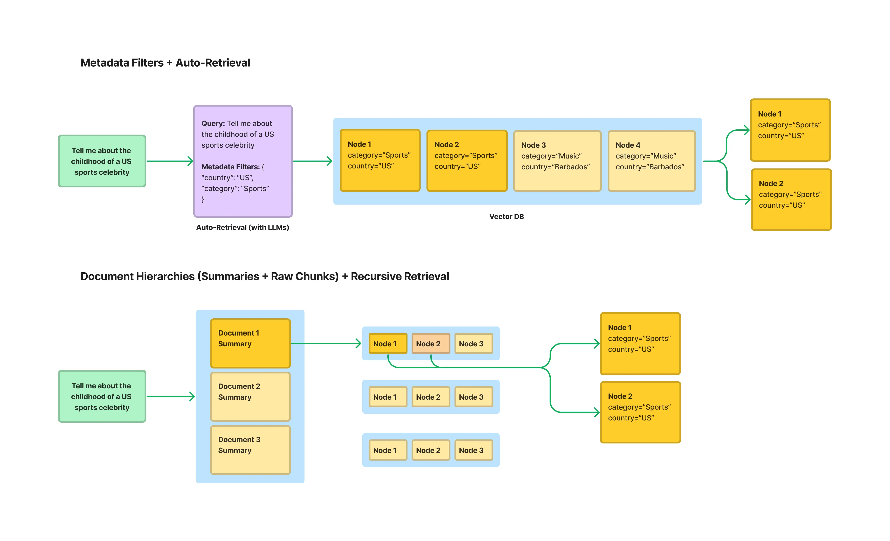

# Section 5 Index Optimization

In the text chunking section of the previous chapter, some index optimization strategies have been briefly introduced. This section will conduct a more in-depth discussion of index optimization based on LlamaIndex's high-performance production-level RAG construction solution [^1].

## 1. Context expansion

In RAG systems, we often face a trade-off problem: using small blocks of text for retrieval can achieve higher accuracy, but small blocks of text lack sufficient context, which may cause the large language model (LLM) to be unable to generate high-quality answers; while using large blocks of text, although rich in context, can easily introduce noise and reduce the relevance of retrieval. In order to resolve this contradiction, LlamaIndex proposed a practical indexing strategy - **Sentence Window Retrieval**[^2]. This technology cleverly combines the advantages of both methods: it focuses on a highly precise single sentence during retrieval, and intelligently expands the context back to a wider "window" before sending it to LLM to generate answers, thus ensuring both the accuracy of retrieval and the quality of generation.

### 1.1 Main ideas

The idea of ​​sentence window retrieval can be summarized as: index small chunks for retrieval accuracy and retrieve large chunks for contextual richness.

The workflow is as follows:

(1) **Indexing phase**: When building the index, the document is split into **individual sentences**. Each sentence is stored in the vector database as an independent "Node". At the same time, each sentence node stores its context window in metadata, that is, the first N and last N sentences in the original text of the sentence. The text within this window is not indexed and is simply stored as metadata.

(2) **Retrieval phase**: When the user initiates a query, the system will perform a similarity search on all **single sentence nodes**. Because a sentence is the smallest unit that expresses complete semantics, this method can very accurately locate the core information most relevant to the user's problem.

(3) **Post-processing stage**: After retrieving the most relevant sentence nodes, the system will use a post-processing module named `MetadataReplacementPostProcessor`. This module reads the metadata of the retrieved sentence node and replaces the original single sentence content in the node with the full context window stored in the metadata.

(4) **Generation phase**: Finally, these nodes with replaced content and rich context are passed to LLM for generating the final answer.

### 1.2 Code implementation

The following uses an example from the LlamaIndex official website to demonstrate how to implement sentence window retrieval and compare it with conventional retrieval methods. This example will load an IPCC climate report in PDF format and ask questions about professional issues in it.

The core code is as follows:

```python
# 假设 Settings.llm 和 Settings.embed_model 已经预先配置好

# 1. 加载文档
documents = SimpleDirectoryReader(
    input_files=["../../data/C3/pdf/IPCC_AR6_WGII_Chapter03.pdf"]
).load_data()

# 2. 创建节点与构建索引
# 2.1 句子窗口索引
node_parser = SentenceWindowNodeParser.from_defaults(
    window_size=3,
    window_metadata_key="window",
    original_text_metadata_key="original_text",
)
sentence_nodes = node_parser.get_nodes_from_documents(documents)
sentence_index = VectorStoreIndex(sentence_nodes)
```

According to the underlying source code of LlamaIndex, the core logic of `SentenceWindowNodeParser` is located in the `build_window_nodes_from_documents` method. Its implementation process can be broken down into the following key steps:

(1) **Sentence Segmentation (`sentence_splitter`)**: The parser first receives a document (`Document`), and then calls the `self.sentence_splitter(doc.text)` method. This `sentence_splitter` is a configurable function, defaulting to `split_by_sentence_tokenizer`, which is responsible for accurately splitting the entire text of the document into a list of sentences (`text_splits`).

(2) **Create basic node (`build_nodes_from_splits`)**: The segmented `text_splits` list is passed to the `build_nodes_from_splits` utility function. This function will create a separate `TextNode` for each sentence in the list. At this time, the `text` attribute of each `TextNode` is the content of this sentence.

(3) **Build window and populate metadata (main loop)**: Next, the parser will iterate through all newly created `TextNode`. For the node at position `i`, it does the following:

* **Positioning window**: Use list slice `nodes[max(0, i - self.window_size) : min(i + self.window_size + 1, len(nodes))]` to obtain a list (`window_nodes`) containing the central sentence and its `window_size` (default is 3) neighboring nodes before and after it. This slicing operation neatly handles edge cases at the beginning and end of the document.
* **Combined window text**: Splice the `text` of all nodes in the `window_nodes` list (that is, all sentences in the window) into a long string with spaces.
* **Fill metadata**: Store the long string (complete context window) generated in the previous step into the metadata of the current node (`i` node), with the key `self.window_metadata_key` (default is `"window"`). At the same time, the node's own text (original sentence) will also be stored in the metadata, with the key `self.original_text_metadata_key` (default is `"original_text"`).

4. **Set Metadata Exclusions**: This is a very critical detail. After the metadata is populated, the code executes `node.excluded_embed_metadata_keys.extend(...)` and `node.excluded_llm_metadata_keys.extend(...)`. The function of this line of code is to tell the subsequent embedding model and LLM that the two metadata fields `"window"` and `"original_text"` should be ignored when processing this node. This ensures that only the pure text of a single sentence is used to generate vector embeddings, thus ensuring high retrieval accuracy. The `"window"` field is only used by subsequent `MetadataReplacementPostProcessor`.

Through the above steps, `SentenceWindowNodeParser` finally returns a `TextNode` list. Each node in the list represents an independent sentence, and its `text` properties are used for precise retrieval, while its `metadata` "hide" the rich context window used to generate the answer.

```python
# 2.2 常规分块索引 (基准)
base_parser = SentenceSplitter(chunk_size=512)
base_nodes = base_parser.get_nodes_from_documents(documents)
base_index = VectorStoreIndex(base_nodes)

# 3. 构建查询引擎
sentence_query_engine = sentence_index.as_query_engine(
    similarity_top_k=2,
    node_postprocessors=[
        MetadataReplacementPostProcessor(target_metadata_key="window")
    ],
)
base_query_engine = base_index.as_query_engine(similarity_top_k=2)

# 4. 执行查询并对比结果
query = "What are the concerns surrounding the AMOC?"
print(f"查询: {query}\n")

print("--- 句子窗口检索结果 ---")
window_response = sentence_query_engine.query(query)
print(f"回答: {window_response}\n")

print("--- 常规检索结果 ---")
base_response = base_query_engine.query(query)
print(f"回答: {base_response}\n")
```

(1) **Build sentence window index**: This step uses `SentenceWindowNodeParser`. It parses the document into `Node` in units of individual sentences, while storing a "window" of text containing context (defaults to 3 sentences before and after) in the metadata of each `Node`. This step is key to the idea of ​​"indexing small chunks for retrieval accuracy".

(2) **Building query engine and post-processing**: The construction of query engine is the key to achieving "expanding context for generation quality".

* When creating `sentence_query_engine`, an important post-processor `MetadataReplacementPostProcessor` was added to the configuration.
* Its function is: when the retriever finds the most relevant node (that is, a single sentence) based on the user query, this post-processor will intervene immediately.
* It will read the pre-stored complete "window" text from the node's metadata and use it to replace the original single sentence content in the node.
* In this way, what is ultimately passed to the large language model is no longer an isolated sentence, but a complete text paragraph containing rich context, thus ensuring the quality and coherence of the generated answer.

The question we asked both engines was: "What are the concerns surrounding the AMOC?"

**The code output is as follows:**
```bash
查询: What are the concerns surrounding the AMOC?

--- 句子窗口检索结果 ---
回答: The Atlantic Meridional Overturning Circulation (AMOC) is projected to decline over the 21st century with high confidence, though there is low confidence in quantitative projections of this decline. Observational records since the mid-2000s are too short to determine the relative contributions of internal variability, natural forcing, and anthropogenic forcing to AMOC changes. Additionally, there is low confidence in reconstructed and modeled AMOC changes for the 20th century due to limited agreement in quantitative trends. While an abrupt collapse before 2100 is not expected, the decline could have significant implications for global climate patterns.

--- 常规检索结果 ---
回答: The concerns surrounding the Atlantic Meridional Overturning Circulation (AMOC) primarily involve its projected decline over the 21st century across all Shared Socioeconomic Pathway (SSP) scenarios. While an abrupt collapse before 2100 is not expected, there is high confidence in this decline, though quantitative projections remain uncertain. Observational records since the mid-2000s are too short to clearly distinguish the contributions of internal variability, natural forcing, and anthropogenic forcing to these changes. This uncertainty highlights the need for further research to better understand and predict AMOC behavior and its broader climate impacts.
```

It can be observed from the output:

* **Both answers get to the core**: Both engines correctly identify that the main concern about the AMOC is its projected decline in the 21st century.
* **Answers from sentence window retrieval are more detailed and more coherent**: The answers from sentence window retrieval not only point out the trend of decline, but also add details on multiple dimensions such as "low confidence in quantitative predictions", "too short an observation record", "low confidence in changes in reconstructions and simulations of the 20th century". This makes the answer more informative, more complete in context, and more like a review.
* **The answers to conventional searches are relatively broad**: Although the answers to conventional searches are correct, the content is relatively general and ends with a more general conclusion such as "further research is needed".

This difference is exactly the embodiment of the advantage of sentence window retrieval strategy. It provides large language models with highly relevant and informative context by "accurately retrieving small text chunks (single sentences) and then expanding the context (sentence window)", thereby generating higher quality answers.

> [Full Code](https://github.com/datawhalechina/all-in-rag/blob/main/code/C3/05_sentence_window_retrieval.py)

## 2. Structured index

As the size of the knowledge base continues to expand (e.g., containing hundreds of PDF files), the traditional RAG method (i.e., top-k similarity search over all text blocks) will encounter bottlenecks. When a query may only be relevant to one or two of the documents, conducting an undifferentiated vector search in the entire document library is not only inefficient, but also easily interfered by irrelevant text blocks, resulting in inaccurate retrieval results.

In order to solve this problem, an effective method is to utilize **structured index**. The principle is to append structured metadata to text blocks while indexing them. These metadata can be any tags that help filter and locate information, such as:

*   file name
* Document creation date
*Chapter title
*   author
* Any custom classification tags



In fact, the **document structure-based chunking** method introduced in Chapter 2 "Text Chunking" is a prerequisite step for implementing structured indexing. For example, when using `MarkdownHeaderTextSplitter`, the chunker will automatically extract the various levels of titles of the Markdown document (such as `Header 1`, `Header 2`, etc.) and store them in the metadata of each text block. This header information is very valuable structured data and can be directly used for subsequent metadata filtering.

In this way, the combination of "metadata filtering" and "vector search" can be achieved during retrieval. For example, when a user queries "Please summarize the discussion on AI in the second quarter financial report of 2023", the system can:

(1) **Metadata pre-filtering**: First filter through metadata and search only in the document subset of `document_type == '财报'`, `year == 2023` and `quarter == 'Q2'`.

(2) **Vector Search**: Then, perform a vector similarity search for the query "discourse about AI" in the filtered, smaller set of text blocks.

This "filter first, then search" strategy can greatly narrow the search scope and significantly improve the search efficiency and accuracy of RAG applications in large-scale knowledge base scenarios. LlamaIndex provides a variety of tools, including Auto-Retrieval, to support this structured retrieval paradigm.

### 2.1 Code implementation: recursive retrieval based on multiple tables

In more complex scenarios, structured data may be distributed across multiple sources, such as an Excel file containing multiple sheets, each representing an independent table. In this case, a more powerful strategy is needed: **recursive retrieval**[^3]. It enables "routing" by directing queries to the correct knowledge source (the correct table) and then executing the precise query within that source.

The following uses a movie data Excel file (`movie.xlsx`) containing multiple worksheets to demonstrate, in which each worksheet (such as `年份_1994`, `年份_2002`, etc.) stores the movie information of the corresponding year.

```python
# 1. 为每个工作表创建查询引擎和摘要节点
excel_file = '../../data/C3/excel/movie.xlsx'
xls = pd.ExcelFile(excel_file)

df_query_engines = {}
all_nodes = []

for sheet_name in xls.sheet_names:
    df = pd.read_excel(xls, sheet_name=sheet_name)
    # 为当前工作表创建一个 PandasQueryEngine
    query_engine = PandasQueryEngine(df=df, llm=Settings.llm, verbose=True)
    # 为当前工作表创建一个摘要节点（IndexNode）
    year = sheet_name.replace('年份_', '')
    summary = f"这个表格包含了年份为 {year} 的电影信息，可以用来回答关于这一年电影的具体问题。"
    node = IndexNode(text=summary, index_id=sheet_name)
    all_nodes.append(node)
    # 存储工作表名称到其查询引擎的映射
    df_query_engines[sheet_name] = query_engine

# 2. 创建顶层索引（只包含摘要节点）
vector_index = VectorStoreIndex(all_nodes)

# 3. 创建递归检索器
vector_retriever = vector_index.as_retriever(similarity_top_k=1)
recursive_retriever = RecursiveRetriever(
    "vector",
    retriever_dict={"vector": vector_retriever},
    query_engine_dict=df_query_engines,
    verbose=True,
)

# 4. 创建查询引擎
query_engine = RetrieverQueryEngine.from_args(recursive_retriever)

# 5. 执行查询
query = "1994年评分人数最多的电影是哪一部？"
print(f"查询: {query}")
response = query_engine.query(query)
print(f"回答: {response}")
```

1. **Create PandasQueryEngine**: Traverse each worksheet in Excel and instantiate a `PandasQueryEngine` for each worksheet (that is, an independent DataFrame). Its power lies in its ability to convert natural language questions about tables (such as "Which has the most ratings") into actual Pandas code (such as `df.sort_values('评分人数').iloc[-1]`) for execution.
2. **Create summary node (`IndexNode`)**: For each worksheet, create a `IndexNode`, whose content is a summary text about this table. This node will serve as the "pointer" to the top-level search.
3. **Build top-level index**: Build a `VectorStoreIndex` using all created `IndexNode`. This index does not contain detailed data for any table, only "pointer" information to each table.
4. **Create `RecursiveRetriever`**: This is the core of implementing recursive retrieval. Configure it as:
* `retriever_dict`: Specifies the top-level retriever, which is `vector_retriever` that searches in the summary node.
* `query_engine_dict`: Provides a mapping from node IDs (i.e. worksheet names) to their corresponding query engines. When the top-level crawler matches a summary node, the recursive crawler knows which `PandasQueryEngine` to call to handle subsequent queries.

**Run results:**

```bash
查询: 1994年评分人数最少的电影是哪一部？
> Retrieving with query id None: 1994年评分人数最少的电影是哪一部？
> Retrieved node with id, entering: 年份_1994
> Retrieving with query id 年份_1994: 1994年评分人数最少的电影是哪一部？
> Pandas Instructions:
```
df[df['Year'] == 1994].nsmallest(1, 'Number of reviewers')['Movie Name'].iloc[0]
```
> Pandas Output: 燃情岁月
回答: 燃情岁月
```

The complete process of recursive retrieval can be clearly seen from the output:

(1) **Top routing**: `Retrieving with query id None`. The system first searches in the top-level summary index and matches the summary node `年份_1994` based on the question "1994...".

(2) **Enter sub-layer**: `Retrieved node with id, entering: 年份_1994`, the system decides to enter the query engine associated with the "Year_1994" worksheet.

(3) **Sub-layer query**: `Retrieving with query id 年份_1994`, `PandasQueryEngine` takes over the query and sends the question to LLM to let it generate Pandas code.

(4) **Code generation and execution**: LLM generated `df[df['年份'] == 1994].nsmallest(1, '评分人数')['电影名称'].iloc[0]`, and after the engine is executed, the output `燃情岁月` is obtained.

> [Full Code](https://github.com/datawhalechina/all-in-rag/blob/main/code/C3/06_recursive_retrieval.py)

> ⚠️ **Important Security Warning**: In fact, it is mentioned on the official website of LlamaIndex that `PandasQueryEngine` is an experimental function and has potential security risks. It works by having LLM generate Python code and then execute it locally using the `eval()` function. This means that in an environment without strict sandbox isolation, it is theoretically possible to execute arbitrary code. **Therefore, the use of this tool in a production environment is strongly discouraged**.

### 2.2 Another implementation method

In view of the security risks of `PandasQueryEngine`, a safer way can be used to implement similar multi-table queries. The idea is to completely separate routing and retrieval.

The specific steps of this improvement method are as follows:

(1) **Create two independent vector indexes**:

* **Summary Index (for routing)**: Create a very short summary `Document` for each Excel sheet (e.g. "1994 Movie Data"), e.g.: "This document contains movie information for the year 1994". Then, a lightweight vector index is built with all these summary documents. The only purpose of this index is to act as a "router".
* **Content indexing (for Q&A)**: Convert the actual data of each worksheet (e.g., the entire table) into a large text `Document` and attach a key metadata tag to it, such as `{"sheet_name": "年份_1994"}`. Then, build a vector index with all these documents containing real content.

(2) **Perform two-step query**:

* **Step 1: Routing**. When a user asks a question (for example, "What was the movie with the fewest ratings in 1994?"), it is first searched in the "Abstract Index". Since the "year 1994" in the question is highly related to the summary "This document contains movie information from 1994", the retriever will quickly return its corresponding metadata, telling the system that the target is the worksheet `年份_1994`.
* **Step 2: Retrieval**. After getting the target `年份_1994`, the system will search in the "Content Index", but this time a **metadata filter** (`MetadataFilter`) will be attached, forcing the search to only be done in documents of `sheet_name == "年份_1994"`. In this way, LLM can find the answer to the question within the correct, filtered range of data.

Through this method of "routing first, then filtering and retrieving with metadata", it not only realizes the query capability across multiple data sources, but also avoids the security risks of executing code. LlamaIndex officially also provides similar structured hierarchical search[^4] for reference.

> [Full Code](https://github.com/datawhalechina/all-in-rag/blob/main/code/C3/07_recursive_retrieval_v2.py)

## Digression: About the framework

> **Some people may wonder why this tutorial does not focus on one framework (such as LlamaIndex or LangChain), but mixes them, or even reinvents the wheel? **

The framework is a powerful tool to accelerate development and a "bridge" that helps us quickly cross the technology gap. But any bridge has its design boundaries and limitations. The goal is not to become a skilled "bridge walker" but to become an "engineer" who knows how to design and build bridges.

Therefore, the path chosen for this tutorial is:

(1) **Principle-based**: Our priority is "How does it work?" rather than "Which function should I call?". New frameworks are being born, and old frameworks are iterating (of course it’s not that I’m lazy and haven’t updated langchain🤫), but as long as we understand the underlying ideas, we will be able to master any existing or future framework faster.

(2) **Embrace flexibility**: Real-world business needs are often more complex than the scenarios preset by the framework. When the framework cannot meet the needs, or there are security risks like the `PandasQueryEngine` used in this section, if you understand the principles, you will have the ability to modify it, or like the example in this section, use lower-level modules to assemble a safer and more suitable solution.

(3) **Cultivate problem-solving skills**: Just learning to use the framework is like cooking according to a recipe. Although you can quickly reproduce the specified dishes, you may be helpless once a certain ingredient is missing or encounters an unexpected situation. And understanding the principles is like learning the essence of cooking. This allows you to not only cook a variety of delicacies easily, but also create new dishes.

If you want to go into the details of a certain framework, its official documentation is always the best and most authoritative learning material. The mission of this tutorial is to help you build a solid knowledge system about RAG, so that you can be comfortable no matter what tool you face.


## References

[^1]: [*Building Performant RAG Applications for Production*](https://docs.llamaindex.ai/en/stable/optimizing/production_rag/)

[^2]: [*LlamaIndex - Sentence Window Retrieval*](https://docs.llamaindex.ai/en/stable/examples/node_postprocessor/MetadataReplacementDemo/#metadata-replacement-node-sentence-window)

[^3]: [*Recursive Retriever + Query Engine Demo*](https://docs.llamaindex.ai/en/stable/examples/query_engine/pdf_tables/recursive_retriever)

[^4]: [*Structured Hierarchical Retrieval*](https://docs.llamaindex.ai/en/stable/examples/query_engine/multi_doc_auto_retrieval/multi_doc_auto_retrieval/)