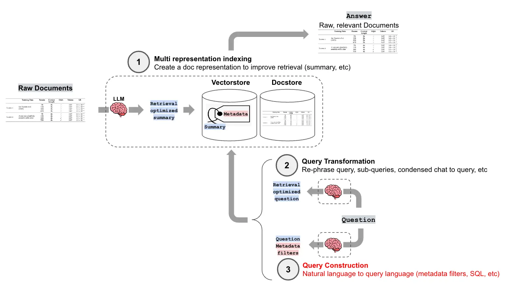

# Section 2 Query Construction

In previous chapters, we explored how to retrieve information from unstructured data through vector embedding and similarity search. However, in practical applications, we often need to process more complex and diverse data, including structured data (such as SQL databases), semi-structured data (such as documents with metadata), and graph data. The user's query may not only be a simple semantic match, but also contain complex filtering conditions, aggregation operations or relational queries.

**Query Construction**[^1] is the key technology to meet this challenge. It leverages the powerful understanding capabilities of large language models (LLMs) to "translate" users' natural language queries into structured query languages ​​or requests with filter conditions for specific data sources. This enables the RAG system to seamlessly connect and utilize various types of data, greatly expanding its application scenarios and capabilities.

The following diagram shows where query building fits into a high-level RAG process:



## 1. Text to metadata filter

When building a vector index, metadata (Metadata) is often attached to document chunks (Chunks), such as document source, publication date, author, chapter, category, etc. These metadata provide us with the possibility of precise filtering beyond semantic search.

**Self-Query Retriever** is the core component in LangChain that implements this function. Its workflow is as follows:

1. **Define metadata structure**: First, the document content and the meaning and type of each metadata field need to be clearly described to LLM.
2. **Query parsing**: When the user enters a natural language query, the self-query retriever calls LLM to decompose the query into two parts:
* **Query String**: The part used for semantic search.
* **Metadata Filter**: Structured filtering conditions extracted from the query.
3. **Execute query**: The retriever sends the parsed query string and metadata filter to the vector database, and executes a query that includes both semantic search and metadata filtering.

For example, for the query "papers about machine learning published in 2022", the self-query retriever will parse it as:
* **Query string**: "Machine learning paper"
* **Metadata Filter**:`year == 2022`

### Code Example

Next, take the B station video as an example to see how to use`SelfQueryRetriever`.

```python
import os
from langchain_deepseek import ChatDeepSeek 
from langchain_community.document_loaders import BiliBiliLoader
from langchain.chains.query_constructor.base import AttributeInfo
from langchain.retrievers.self_query.base import SelfQueryRetriever
from langchain_community.vectorstores import Chroma
from langchain_huggingface import HuggingFaceEmbeddings
import logging

logging.basicConfig(level=logging.INFO)

# 1. 初始化视频数据
video_urls = [
    "https://www.bilibili.com/video/BV1Bo4y1A7FU", 
    "https://www.bilibili.com/video/BV1ug4y157xA",
    "https://www.bilibili.com/video/BV1yh411V7ge",
]

bili = []
try:
    loader = BiliBiliLoader(video_urls=video_urls)
    docs = loader.load()
    
    for doc in docs:
        original = doc.metadata
        
        # 提取基本元数据字段
        metadata = {
            'title': original.get('title', '未知标题'),
            'author': original.get('owner', {}).get('name', '未知作者'),
            'source': original.get('bvid', '未知ID'),
            'view_count': original.get('stat', {}).get('view', 0),
            'length': original.get('duration', 0),
        }
        
        doc.metadata = metadata
        bili.append(doc)
        
except Exception as e:
    print(f"加载BiliBili视频失败: {str(e)}")

if not bili:
    print("没有成功加载任何视频，程序退出")
    exit()

# 2. 创建向量存储
embed_model = HuggingFaceEmbeddings(model_name="BAAI/bge-small-zh-v1.5")
vectorstore = Chroma.from_documents(bili, embed_model)
```

In the above code,`BiliBiliLoader`is first used to load the documents and metadata of several Bilibili videos. It should be noted that because the original metadata structure returned by`BiliBiliLoader`is relatively complex (for example, author and view count information are nested in other dictionaries), some preprocessing work was performed: traversing each document and manually extracting the required fields (such as`title`,`author`,`view_count`,`length`) and build a clean, flat new`metadata`dictionary. This process ensures that subsequent self-query retrievers can directly and reliably access these fields. Finally, the processed documents and metadata are stored in the`Chroma`vector database to prepare for the next step of query construction.

```python
# 3. 配置元数据字段信息
metadata_field_info = [
    AttributeInfo(
        name="title",
        description="视频标题（字符串）",
        type="string", 
    ),
    AttributeInfo(
        name="author",
        description="视频作者（字符串）",
        type="string",
    ),
    AttributeInfo(
        name="view_count",
        description="视频观看次数（整数）",
        type="integer",
    ),
    AttributeInfo(
        name="length",
        description="视频长度，以秒为单位的整数",
        type="integer"
    )
]

# 4. 创建自查询检索器
llm = ChatDeepSeek(
    model="deepseek-chat", 
    temperature=0, 
    api_key=os.getenv("DEEPSEEK_API_KEY")
    )

retriever = SelfQueryRetriever.from_llm(
    llm=llm,
    vectorstore=vectorstore,
    document_contents="记录视频标题、作者、观看次数等信息的视频元数据",
    metadata_field_info=metadata_field_info,
    enable_limit=True,
    verbose=True
)

# 5. 执行查询示例
queries = [
    "时间最短的视频",
    "时长大于600秒的视频"
]

for query in queries:
    print(f"\n--- 查询: '{query}' ---")
    results = retriever.invoke(query)
    if results:
        for doc in results:
            title = doc.metadata.get('title', '未知标题')
            author = doc.metadata.get('author', '未知作者')
            view_count = doc.metadata.get('view_count', '未知')
            length = doc.metadata.get('length', '未知')
            print(f"标题: {title}")
            print(f"作者: {author}")
            print(f"观看次数: {view_count}")
            print(f"时长: {length}秒")
            print("="*50)
    else:
        print("未找到匹配的视频")
```

This part of the code is the core of implementing self-query retrieval. It is mainly divided into three steps:

1. **Configure metadata fields (`metadata_field_info`)**: This is the blueprint for communicating with LLM. Define the name, type, and a clear natural language`description`for each metadata field via`AttributeInfo`. LLM will rely on this description to understand how to handle the user's query, for example it will parse filtering and sorting requests for "duration" based on the description "video length (integer)". Therefore, an accurate and unambiguous description is important.

2. **Create self-query retriever (`SelfQueryRetriever.from_llm`)**: The`from_llm`method performs two core operations under the hood:
* **Load query builder**: Create a specialized "query construction chain" using the incoming`llm`,`document_contents`and`metadata_field_info`. The core responsibility of this chain is to convert the user's natural language query (such as "video longer than 600 seconds") into a general, structured query object.
* **Get the built-in translator**: Next, check the used vector database (here`Chroma`) and match it with a built-in "translator". This translator is responsible for translating the universal query object generated in the previous step into a filtering syntax that the`Chroma`database can natively understand and execute.

3. **Execute query (`retriever.invoke`)**: Finally, make the call in natural language. The retriever will perform two steps of "construction" and "translation" in sequence, and finally initiate a compound query to`Chroma`that includes both semantic search and precise metadata filtering to return the most relevant results.

> **Tip**: You can see in the code that the`temperature`parameter is set to`0`. This value is used to control the randomness of the model output. Higher values ​​(such as 0.8) make the output more random and creative; lower values ​​make the output more deterministic and focused. Setting to`0`makes the model's output completely deterministic, i.e. it always produces exactly the same output for the same input. In scenarios such as self-query, where natural language needs to be accurately converted into structured queries, the conversion results can be ensured to be stable and reproducible.

**Output result:**

```bash
--- 查询: '时间最短的视频' ---
INFO:httpx:HTTP Request: POST https://api.deepseek.com/v1/chat/completions "HTTP/1.1 200 OK"
INFO:langchain.retrievers.self_query.base:Generated Query: query=' ' filter=None limit=1
标题: 《吴恩达 x OpenAI Prompt课程》【专业翻译，配套代码笔记】02.Prompt 的构建原则
作者: 二次元的Datawhale
观看次数: 18788
时长: 1063秒
==================================================

--- 查询: '时长大于600秒的视频' ---
INFO:httpx:HTTP Request: POST https://api.deepseek.com/v1/chat/completions "HTTP/1.1 200 OK"
INFO:langchain.retrievers.self_query.base:Generated Query: query=' ' filter=Comparison(comparator=<Comparator.GT: 'gt'>, attribute='length', value=600) limit=None
WARNING:chromadb.segment.impl.vector.local_hnsw:Number of requested results 4 is greater than number of elements in index 3, updating n_results = 3
标题: 《吴恩达 x OpenAI Prompt课程》【专业翻译，配套代码笔记】03.Prompt如何迭代优化
作者: 二次元的Datawhale
观看次数: 7090
时长: 806秒
==================================================
标题: 《吴恩达 x OpenAI Prompt课程》【专业翻译，配套代码笔记】02.Prompt 的构建原则
作者: 二次元的Datawhale
观看次数: 18788
时长: 1063秒
```

## 2. Text to Cypher

In addition to handling flat metadata, query building techniques can also be applied to more complex data structures, such as graph databases.

### 2.1 What is Cypher?

Cypher is the most commonly used query language in graph databases (such as Neo4j), and its status is similar to SQL for relational databases. It uses an intuitive way to match patterns and relationships in the graph, for example`(:Person {name:"Tomaz"})-[:LIVES_IN]->(:Country {name:"Slovenia"})`describes a person and a country and the "live in" relationship between them.

### 2.2 Principle of “Text to Cypher”

Similar to the "Text to Metadata Filter", the "Text to Cypher" technology uses a large language model (LLM) to directly translate the user's natural language question into an accurate Cypher query statement. LangChain provides corresponding tool chains (such as`GraphCypherQAChain`), and its workflow is usually:
1. Receive natural language questions from users.
2. LLM converts the problem into a Cypher query based on the pre-provided schema.
3. Execute the query on the graph database to obtain accurate structured data.
4. (Optional) Submit the query results to LLM again to generate smooth natural language answers.

Since generating efficient Cypher queries is a complex task, a powerful LLM is often used to ensure the accuracy of the transformation. In this way, users can interact with highly structured graph data in the most natural way, greatly lowering the threshold for data query.

## think

- Why is the result obtained when querying "the shortest video" in the code in this section wrong?

## References

[^1]: [*LangChain Blog: Query Construction*](https://blog.langchain.ac.cn/query-construction/)
