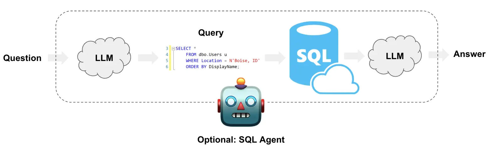
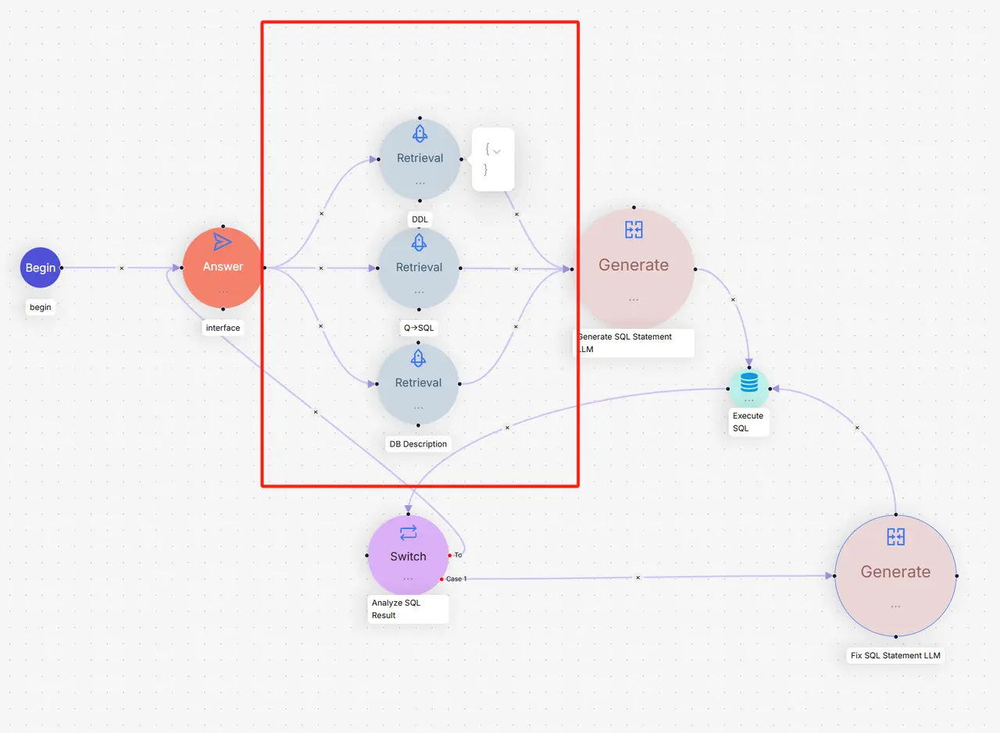

# Section 3 Text to SQL

Following the previous section's exploration of how to build queries for metadata and graph data, this section will focus on a common application in the world of structured data. In the data world, in addition to the unstructured data that vector databases can handle, relational databases (such as MySQL, PostgreSQL, SQLite) are also the focus of storing and managing structured data. **Text-to-SQL**[^1] was born to break the language barrier between people and structured data. It uses large language models (LLM) to directly translate users' natural language questions into SQL query statements that can be executed on the database.



## 1. Business challenges

- **"Illusion" problem**: LLM may "imagine" tables or fields that do not exist in the database, causing the generated SQL statements to be invalid.
- **Insufficient understanding of database structure**: LLM needs to accurately understand the structure of the table, the meaning of the fields, and the relationships between tables in order to generate the correct`JOIN`and`WHERE`clauses.
- **Handling the ambiguity of user input**: User questions may contain spelling errors or irregular expressions (for example, "Who was the sales champion last month?"), and the model needs to have certain fault tolerance and reasoning capabilities.

## 2. Optimization strategy

1. **Provide accurate database schema**: This is the most basic and critical step. We need to provide LLM with the`CREATE TABLE`statement for the relevant table in the database. This is like giving LLM a map to understand the structure of the database, including table names, column names, data types, and foreign key relationships.

2. **Provide a small number of high-quality examples**: Adding some "question-SQL" example pairs to the prompt (Prompt) can greatly improve the accuracy of LLM-generated queries. This is equivalent to giving LLM several examples to learn how to construct queries based on similar questions.

3. **Use RAG to enhance context**: This is a further strategy. We can, like RAGFlow, build a specialized "knowledge base" [^2] for the database, which not only contains the DDL (data definition language) of the table, but also contains:
* **Detailed description of tables and fields**: Use natural language to explain what each table does and what business meaning each field represents.
* **Synonyms and Business Terms**: For example, map a user's "Spend" to the`cost`field of the database.
* **Complex Query Example**: Provide some complex question and answer pairs containing`JOIN`,`GROUP BY`or subqueries.
When a user asks a question, the system first retrieves the most relevant information (such as related table structure, field description, similar Q&A) from this knowledge base, and then combines this information with the user's question into a richer prompt, which is handed over to LLM to generate the final SQL query. This approach greatly reduces the risk of "illusions" and improves query accuracy.

4. **Error Correction and Reflection**: After generating the SQL, the system will try to execute it. If the database returns an error, the error information can be fed back to LLM, allowing it to "reflect" and correct the SQL statement, and then try again. This iterative process can significantly improve the success rate of queries.

## 3. Implement a simple Text2SQL framework

This section implements a simple Text2SQL framework based on the RAGFlow solution. The framework uses the Milvus vector database as the knowledge base, the BGE-M3 model for semantic retrieval, and DeepSeek as the large language model, specifically optimized for the SQLite database.



### 3.1 Knowledge Base Module (`knowledge_base.py`)

The knowledge base module is the core of the entire framework and is responsible for storing and retrieving SQL-related knowledge information.

```python
class SimpleKnowledgeBase:
    """知识库"""
    
    def __init__(self, milvus_uri: str = "http://localhost:19530"):
        self.milvus_uri = milvus_uri
        self.client = MilvusClient(uri=milvus_uri)
        self.embedding_function = BGEM3EmbeddingFunction(use_fp16=False, device="cpu")
        self.collection_name = "text2sql_kb"
        self._setup_collection()
```

**Design thinking:**

1. **Unified knowledge management**: Unified storage of three types of knowledge such as DDL definitions, Q-SQL examples and table descriptions in a Milvus collection, distinguished by the`type`field.

2. **Semantic retrieval capability**: Using the BGE-M3 model for vectorization, it supports semantic similarity search in mixed Chinese and English.

```python
def _setup_collection(self):
    """设置集合"""
    # 定义字段
    fields = [
        FieldSchema(name="pk", dtype=DataType.VARCHAR, is_primary=True, auto_id=True, max_length=100),
        FieldSchema(name="content", dtype=DataType.VARCHAR, max_length=4096),
        FieldSchema(name="type", dtype=DataType.VARCHAR, max_length=32),  # ddl, qsql, description
        FieldSchema(name="dense_vector", dtype=DataType.FLOAT_VECTOR, dim=self.embedding_function.dim["dense"])
    ]
```

**Data loading strategy:**

```python
def load_data(self):
    """加载所有知识库数据"""
    # 加载DDL数据 - 表结构定义
    # 加载Q->SQL数据 - 问答示例
    # 加载描述数据 - 表和字段的业务描述
```

The framework supports three types of knowledge:
- **DDL knowledge**[^3]: Table structure definition, including field types, constraints, etc.
- **Q-SQL Knowledge**[^4]: Historical question and answer pairs, providing reference patterns for new questions
- **Description knowledge**[^5]: The business meaning of tables and fields to help understand data semantics

**Search mechanism:**

```python
def search(self, query: str, top_k: int = 5) -> List[Dict[str, Any]]:
    """搜索相关内容"""
    query_embeddings = self.embedding_function([query])
    
    search_results = self.client.search(
        collection_name=self.collection_name,
        data=query_embeddings["dense"],
        anns_field="dense_vector",
        search_params={"metric_type": "IP"},  # 内积相似度
        limit=top_k,
        output_fields=["content", "type"]
    )
```


### 3.2 SQL generation module (`sql_generator.py`)

The SQL generation module is responsible for converting natural language questions into SQL query statements and has error repair capabilities.

```python
class SimpleSQLGenerator:
    """简化的SQL生成器"""
    
    def __init__(self, api_key: str = None):
        self.llm = ChatDeepSeek(
            model="deepseek-chat",
            temperature=0,  # 确保结果的确定性
            api_key=api_key or os.getenv("DEEPSEEK_API_KEY")
        )
```

**SQL generation strategy:**

```python
def generate_sql(self, user_query: str, knowledge_results: List[Dict[str, Any]]) -> str:
    """生成SQL语句"""
    # 构建上下文
    context = self._build_context(knowledge_results)
    
    # 构建提示
    prompt = f"""你是一个SQL专家。请根据以下信息将用户问题转换为SQL查询语句。

数据库信息：
{context}

用户问题：{user_query}

要求：
1. 只返回SQL语句，不要包含任何解释
2. 确保SQL语法正确
3. 使用上下文中提供的表名和字段名
4. 如果需要JOIN，请根据表结构进行合理关联

SQL语句："""
```

**Key Design Principles:**

1. **Context-driven**: Build rich contextual information through knowledge base search results
2. **Structured Tips**: Clear task requirements and format constraints
3. **Deterministic output**: Set temperature=0 to ensure that the same input produces the same output

**Error fix mechanism:**

```python
def fix_sql(self, original_sql: str, error_message: str, knowledge_results: List[Dict[str, Any]]) -> str:
    """修复SQL语句"""
    context = self._build_context(knowledge_results)
    
    prompt = f"""请修复以下SQL语句的错误。

数据库信息：
{context}

原始SQL：
{original_sql}

错误信息：
{error_message}

请返回修复后的SQL语句（只返回SQL，不要解释）："""
```

**Context building strategy:**

```python
def _build_context(self, knowledge_results: List[Dict[str, Any]]) -> str:
    """构建上下文信息"""
    # 按类型分组
    ddl_info = []        # 表结构信息
    qsql_examples = []   # 查询示例
    descriptions = []    # 表描述信息
    
    # 分层次组织信息：结构 → 描述 → 示例
    if ddl_info:
        context += "=== 表结构信息 ===\n"
    if descriptions:
        context += "=== 表和字段描述 ===\n"
    if qsql_examples:
        context += "=== 查询示例 ===\n"
```


### 3.3 Agent module (`text2sql_agent.py`)

The agent module is the control center of the entire framework, coordinating the complete process of knowledge base retrieval, SQL generation and execution.

```python
class SimpleText2SQLAgent:
    """Text2SQL代理"""
    
    def __init__(self, milvus_uri: str = "http://localhost:19530", api_key: str = None):
        self.knowledge_base = SimpleKnowledgeBase(milvus_uri)
        self.sql_generator = SimpleSQLGenerator(api_key)
        
        # 配置参数
        self.max_retry_count = 3      # 最大重试次数
        self.top_k_retrieval = 5      # 检索数量
        self.max_result_rows = 100    # 结果行数限制
```

**Main query process:**

```python
def query(self, user_question: str) -> Dict[str, Any]:
    """执行Text2SQL查询"""
    # 1. 从知识库检索相关信息
    knowledge_results = self.knowledge_base.search(user_question, self.top_k_retrieval)
    
    # 2. 生成SQL语句
    sql = self.sql_generator.generate_sql(user_question, knowledge_results)
    
    # 3. 执行SQL（带重试机制）
    retry_count = 0
    while retry_count < self.max_retry_count:
        success, result = self._execute_sql(sql)
        
        if success:
            return {"success": True, "sql": sql, "results": result}
        else:
            # 尝试修复SQL
            sql = self.sql_generator.fix_sql(sql, result, knowledge_results)
            retry_count += 1
```

**Secure Execution Policy:**

```python
def _execute_sql(self, sql: str) -> Tuple[bool, Any]:
    """执行SQL语句"""
    # 添加LIMIT限制，防止大量数据返回
    if sql.strip().upper().startswith('SELECT') and 'LIMIT' not in sql.upper():
        sql = f"{sql.rstrip(';')} LIMIT {self.max_result_rows}"
    
    # 结构化结果返回
    if sql.strip().upper().startswith('SELECT'):
        columns = [desc[0] for desc in cursor.description]
        rows = cursor.fetchall()
        
        results = []
        for row in rows:
            result_row = {}
            for i, value in enumerate(row):
                result_row[columns[i]] = value
            results.append(result_row)
        
        return True, {"columns": columns, "rows": results, "count": len(results)}
```

### 3.4 Complete process simulation

Take the query "Who are the users older than 30" as an example to demonstrate the complete collaboration process of the three core modules of the framework:

#### 3.4.1 Simulated data

Assume that the users table in the database contains the following user data:

| ID | Name | Email | Age | City |
|----|------|------|------|------|
| 1 | Zhang San | zhangsan@email.com | 25 | Beijing |
| 2 | Li Si | lisi@email.com | 32 | Shanghai |
| 3 | Wang Wu | wangwu@email.com | 28 | Guangzhou |
| 4 | Zhao Liu | zhaoliu@email.com | 35 | Shenzhen |
| 5 | Chen Qi | chenqi@email.com | 29 | Hangzhou |

#### 3.4.2 Step 1: Knowledge base search

**User input**: "Who are the users older than 30?"

**Retrieval process**:
1. The BGE-M3 model converts the query text into a 768-dimensional vector
2. Milvus performs semantic similarity search in the knowledge base
3. Return the 5 most relevant pieces of knowledge, sorted by similarity

**Search results**:

**DDL knowledge** (similarity: 0.85)
- Table name: users
- Structure: Contains id, name, email, age, city fields
- Constraints: id is the primary key, email is the only one

**Q-SQL example** (similarity: 0.82)
- Question: "Query users over 25 years old"
- SQL：`SELECT * FROM users WHERE age > 25`
> This is a similar example retrieved. The final SQL will be adjusted to age > 30 based on the user's actual problem.

**Table description** (similarity: 0.78)
- age field: user age, integer type
- name field: user name, text type

#### 3.4.3 Step 2: SQL generation

**Context building**:
The system organizes the retrieved knowledge into structured contextual information:

**Table structure information**
- Table name: users
- DDL definition: complete CREATE TABLE statement
- Field constraints: primary key, uniqueness, etc.

**Table and field description**
- age field: user age, INTEGER type
- name field: user name, TEXT type

**Query example**
- Similar questions: Query users over 25 years old
- Reference SQL:`SELECT * FROM users WHERE age > 25`

**SQL generation process**:
1. DeepSeek’s intention to analyze user questions: query users who meet age conditions
2. Identify key information: age field (age), comparison operation (greater than), threshold (**30**)
3. Reference example mode: learn the mode from`WHERE age > 25`to`WHERE age > 数值`
4. Pattern application: replace 25 in the example with the user’s actual value 30
5. Generate target SQL:`SELECT * FROM users WHERE age > 30`

#### 3.4.4 Step 3: SQL execution and result processing

**Safe Handling**:
- Original SQL:`SELECT * FROM users WHERE age > 30`
- Automatically add restrictions:`SELECT * FROM users WHERE age > 30 LIMIT 100`

**Database Execution**:
The SQLite engine checks the data in the users table row by row:

| User | Age Check | Results |
|------|----------|------|
| Zhang San | 25 > 30? | ❌ Not applicable |
| John Doe | 32 > 30? | ✅ Compliant |
| Wang Wu | 28 > 30? | No |
| Zhao Liu | 35 > 30? | ✅ Compliant |
| Chen Qi | 29 > 30? | ❌ Not Conformed |

**Result processing**:
- Filter out 2 records that meet the criteria
- Convert to structured JSON format
- Contains field name and data type information

**Final output**:
```json
{
    "success": true,
    "error": null,
    "sql": "SELECT * FROM users WHERE age > 30 LIMIT 100",
    "results": {
        "columns": ["id", "name", "email", "age", "city"],
        "rows": [
            {"id": 2, "name": "李四", "email": "lisi@email.com", "age": 32, "city": "上海"},
            {"id": 4, "name": "赵六", "email": "zhaoliu@email.com", "age": 35, "city": "深圳"}
        ],
        "count": 2
    },
    "retry_count": 0
}
```

Through this complete process of **semantic understanding → structured query → data filtering → result output**, the framework successfully converts the user's natural language questions into accurate database query results.

### 3.5 Code running

If you want to test this Text2SQL framework, you can do it in the following ways:

**Quick Try**: Run the demo program
```bash
python code/C4/03_text2sql_demo.py
```
> Complete demo code: [03_text2sql_demo.py](https://github.com/datawhalechina/all-in-rag/blob/main/code/C4/03_text2sql_demo.py)

**Core code acquisition**: Complete implementation of three core modules
-`knowledge_base.py`- Knowledge base module
-`sql_generator.py`- SQL generation module
-`text2sql_agent.py`- Agent coordination module

> Source code address: [code/C4/text2sql/](https://github.com/datawhalechina/all-in-rag/tree/main/code/C4/text2sql)

**Data resources**: JSON knowledge data used by the framework
-`ddl_examples.json`- DDL structure example
-`qsql_examples.json`- Question-SQL pair example
-`db_descriptions.json`- Table and field descriptions

> Data file: [code/C4/text2sql/data/](https://github.com/datawhalechina/all-in-rag/tree/main/code/C4/text2sql/data)

### 3.6 Why not use the encapsulated framework directly?

> Because I’ve been caught in the rain, I want to hold an umbrella for you🤪

There are indeed many mature Text2SQL frameworks on the market, but these highly encapsulated tools often suffer from the **black box problem** - when the query results do not meet expectations, it is difficult to locate whether there is a problem in the retrieval link, SQL generation link or execution link. Just like the query exception encountered in the LangChain example in the previous section, it is difficult for us to go deep into the framework for precise debugging and optimization. This is also mentioned in the index optimization section.

## References

[^1]: [*LangChain Docs: Text to SQL*](https://python.langchain.com/docs/tutorials/sql_qa/)

[^2]: [*RAGFlow Blog: Implementing Text2SQL with RAGFlow*](https://ragflow.io/blog/implementing-text2sql-with-ragflow)

[^3]: DDL (Data Definition Language) is a data definition language, used to define database structures, such as CREATE TABLE statements.

[^4]: Q-SQL examples refer to "question-SQL" pairs, that is, paired examples of natural language questions and corresponding SQL queries, used for few-shot learning.

[^5]: Table description is a business semantic description of database tables and fields, helping the model understand the actual meaning and purpose of the data.
