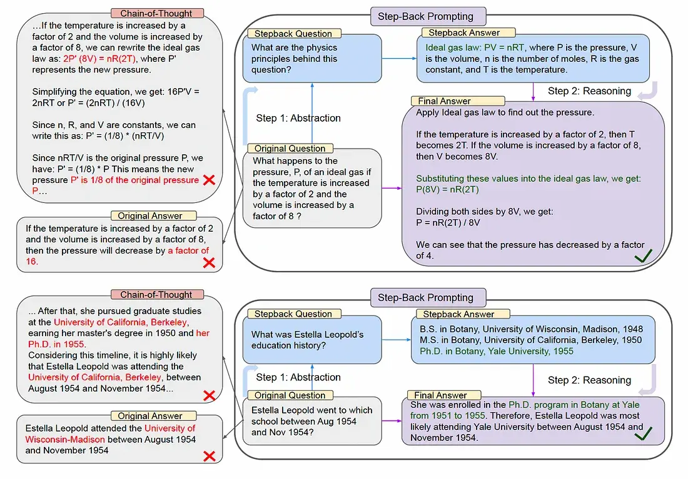
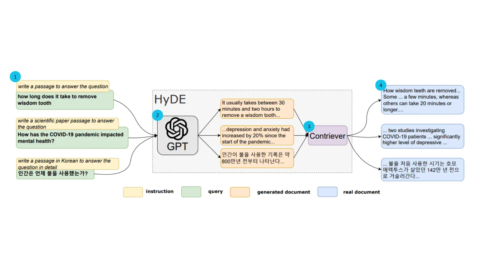
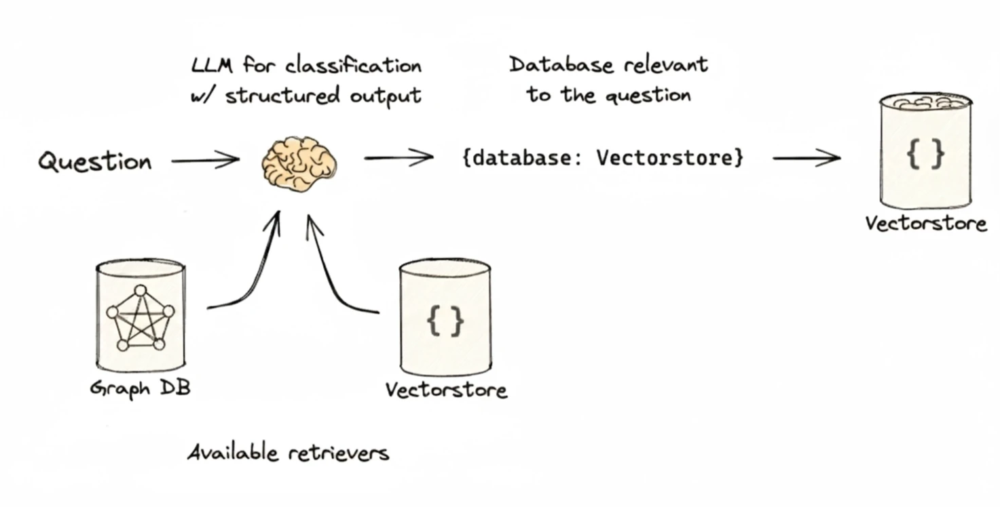
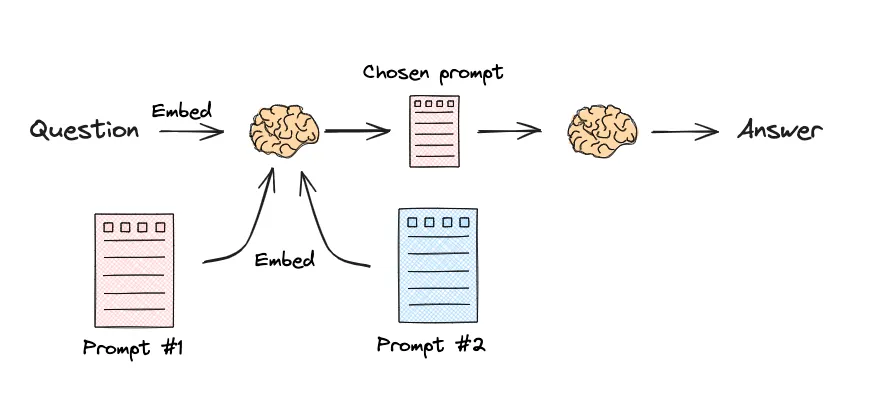

# Section 4 Query reconstruction and distribution

Previously you have learned how to build queries from different types of data sources (such as vector databases, relational databases). However, the user's original question is often not the optimal retrieval input. It may be overly complex, contain ambiguity, or deviate from the actual wording of the document. In order to solve these problems, we need to "preprocess" the user's query before retrieval. This is the query reconstruction and distribution that this section will discuss.

This stage mainly includes two key technologies:

1. **Query Translation**: Convert the user's original question into one or more forms more suitable for retrieval.
2. **Query Routing**: Intelligently distribute it to the most appropriate data source or retriever based on the nature of the question.

This section will focus on several mainstream query translation technologies and briefly discuss the concept of query routing.

## 1. Query translation

The goal of query translation is to bridge the "semantic gap" between users' natural language questions and the information stored in the document library. By rewriting, decomposing or expanding the query, we can significantly improve the accuracy of our retrieval.

### 1.1 Prompt project

This is the most straightforward method of query reconstruction. Through carefully designed prompt words (Prompt), LLM can be guided to rewrite the user's original query to be clearer and more specific, or to convert it into a narrative style that is more conducive to retrieval.

In the code example of query construction in Section 2, we found that`SelfQueryRetriever`cannot correctly handle queries such as "shortest video" that require sorting or comparison.

To solve this problem, a more advanced prompt engineering technique can be used: **let LLM directly build the query instructions**.

The idea behind this approach is to ask the LLM to directly analyze the user's intent and generate a structured (e.g., JSON format) instruction that tells our code what to do. For the question "Shortest video", we expect LLM to tell us directly: "Please sort by the 'duration' field in ascending order and return the first result."

Next, let’s take a look at how to modify the code to implement this idea. Instead of using`SelfQueryRetriever`, we interact directly with the LLM and perform the sorting logic in the code based on the instructions it returns.

The key modifications mainly include two parts:

(1) **Design a new prompt word (Prompt) to require LLM to output sorting instructions in JSON format. **

```python
# 使用大模型将自然语言转换为排序指令
prompt = f"""你是一个智能助手，请将用户的问题转换成一个用于排序视频的JSON指令。

你需要识别用户想要排序的字段和排序方向。
- 排序字段必须是 'view_count' (观看次数) 或 'length' (时长) 之一。
- 排序方向必须是 'asc' (升序) 或 'desc' (降序) 之一。

例如:
- '时间最短的视频' 或 '哪个视频时间最短' 应转换为 {{"sort_by": "length", "order": "asc"}}
- '播放量最高的视频' 或 '哪个视频最火' 应转换为 {{"sort_by": "view_count", "order": "desc"}}

请根据以下问题生成JSON指令:
原始问题: "{query}"

JSON指令:"""
```

(2) **Call LLM in the code, parse the JSON instructions it returns, and perform the corresponding sorting operation. **

```python
# ... (前略，初始化LLM客户端)

# 请求LLM生成指令，并指定返回JSON格式
response = client.chat.completions.create(
    model="deepseek-chat",
    messages=[
        {"role": "user", "content": prompt}
    ],
    temperature=0,
    response_format={"type": "json_object"}
)

# 解析指令并执行排序
try:
    import json
    instruction_str = response.choices[0].message.content
    instruction = json.loads(instruction_str)
    print(f"--- 生成的排序指令: {instruction} ---")

    sort_by = instruction.get('sort_by')
    order = instruction.get('order')

    if sort_by in ['length', 'view_count'] and order in ['asc', 'desc']:
        # 在代码中执行排序
        reverse_order = (order == 'desc')
        sorted_docs = sorted(all_documents, key=lambda doc: doc.metadata.get(sort_by, 0), reverse=reverse_order)
        # 获取排序后的第一个结果并打印
        if sorted_docs:
            doc = sorted_docs[0]
            # ... (打印结果的代码)

except (json.JSONDecodeError, KeyError) as e:
    print(f"解析或执行指令失败: {e}")
```

In this way, LLM is successfully promoted from a simple "text rewriter" to an "intelligent agent" that can understand complex intentions and generate executable plans, thereby elegantly solving the problem of "best value" queries.

> [Full Code](https://github.com/datawhalechina/all-in-rag/tree/main/code/C4/04_text_to_metadata_filter_v2.py)

### 1.2 Multi-query decomposition (Multi-query)

When a user asks a complex question, searching directly for the entire question may not be effective because it may contain multiple subtopics or intents. The core idea of ​​decomposition technology is to split this complex problem into multiple simpler and more specific sub-problems. Then, the system searches each sub-question separately, and finally merges and deduplicates all the retrieved results to form a more comprehensive context, which is then handed over to the LLM to generate the final answer.

**Example**:
- **Original question**: "In "The Wandering Earth", what is Liu Cixin's view on artificial intelligence and future social structure?"
- **Decomposed sub-problems**:
- "What are the artificial intelligence technologies described in "The Wandering Earth"?"
- "What is the future society depicted in "The Wandering Earth"?"
- "What is Liu Cixin's view on artificial intelligence?"

LangChain provides`MultiQueryRetriever`to complete this process[^1]. It internally utilizes LLM to decompose the original problem into multiple sub-problems from different perspectives, and then retrieves relevant documents for each sub-problem in parallel. Finally, it merges and deduplicates all retrieved documents to form a more comprehensive context, which is then passed to the language model to generate the final answer. Through this strategy, the search results are greatly enriched, and in some applications it can effectively improve the quality of subsequent generation links.

### 1.3 Step-Back Prompting

Regressive hints are a hint engineering technique proposed by the Google DeepMind team to improve the reasoning capabilities of large language models[^2]. When faced with a question that is too detailed or too specific, the model's direct answer (even using a thought chain) is prone to errors. Backoff hints solve this problem by guiding the model to "take a step back".

Its core process is divided into two steps:

(1) **Abstraction**: First, guide LLM to generate a higher-level and more general "Step-back Question" from the user's original specific question. This regression question seeks to explore the general principle or core concept behind the original question.

(2) **Inference**: Then, the system will first obtain the answer to the "regressive question" (for example, a physical law, a historical background, etc.), and then use this general principle as a context, combined with the original specific question, to reason and generate the final answer.



**Example**:
- **Original question**: "If the temperature of an ideal gas increases by a factor of 2 and its volume increases by a factor of 8, how will its pressure change?"
- **Backward Question**: "What is the physics behind this problem?"
- **Reasoning process**: First answer the regressed question and get the "ideal gas law PV=nRT". Then based on this law, specific numerical values ​​are substituted for calculation, and finally the pressure becomes 1/4 of the original value.

By retrieving or generating high-level knowledge first, and then performing specific reasoning, regression hints can help the model build a more solid logical foundation, thereby improving accuracy in complex question and answer scenarios.

### 1.4 Hypothetical Document Embedding (HyDE)

Hypothetical Document Embeddings (HyDE) is a query rewriting technology that can significantly improve the quality of vector retrieval without fine-tuning. It was first proposed by Luyu Gao et al. in their paper [^3]. Its core is to solve a common problem in retrieval tasks: the user's query (Query) is usually short and has limited keywords, while the documents stored in the database are detailed and rich in context. There may be a "gap" between the two in the semantic vector space, resulting in poor search results using query vectors directly. A technical blog by Zilliz[^4] also provides an in-depth explanation of the technology.



HyDE "bypasses" this problem in an ingenious way: it does not directly use the user's original query, but first uses a generative large language model (LLM) to generate a "hypothetical" document that can perfectly answer the query. HyDE then vectorizes this detailed hypothetical document and uses the generated vectors to find the most similar real document in the database. HyDE's workflow can be divided into three steps:

(1) **Generation**: When receiving a user query, first call a generative LLM (for example, GPT-3.5). Hint that the model generates a detailed, possibly ideal, answer document based on the query. This documentation does not have to be completely factual, but it must be highly semantically relevant to a good answer.

(2) **Encoding**: Input the hypothetical document generated in the previous step into a contrastive encoder (such as Contriever) to convert it into a high-dimensional vector embedding. This vector semantically represents the location of an "ideal answer".

(3) **Retrieval**: Using the vector of this hypothetical document, perform a similarity search in the vector database to find the real document closest to this "ideal answer". These retrieved documents will serve as the final context information.

In this way, HyDE transforms the difficult "query-to-document" matching problem into a relatively easy "document-to-document" matching problem, thus improving the accuracy of retrieval.

## 2. Query routing

**Query Routing** is a key technology used to optimize complex RAG systems. When the system is connected to multiple different data sources or has multiple processing capabilities, an "intelligent dispatch center" is needed to analyze the user's query and dynamically select the most appropriate processing path. Its essence is to replace hard-coded rules and distribute queries to the most matching data sources, processing components or prompt templates through semantic understanding, thereby improving the efficiency of the system and the accuracy of answers.

### 2.1 Application scenarios

The application scenarios of query routing are very wide.

1. **Data source routing**: This is the most common scenario. Depending on the query intent, it is routed to different knowledge bases. For example:
* Query "What does the latest iPhone do?" -> Route to **Product Documentation Vector Database**.
* Query "What did I order last?" -> routed to **User History SQL Database** (performing Text-to-SQL).
* Query "What is the investment relationship between Company A and Company B?" -> Route to **Enterprise Knowledge Graph Database**.

2. **Component routing**: According to the complexity of the problem, allocate it to different processing components to balance cost and effect.
* Simple FAQ → Perform vector retrieval directly, fast and low cost.
* Complex operations may require interaction with external API → call Agent to perform tasks.

3. **Prompt template routing**: Dynamically select the optimal prompt word template for different types of tasks to optimize the generation effect.
* Math problems → Use prompt templates that include step-by-step logic.
* Code generation → Choose prompt templates specifically optimized for code.

### 2.2 Implementation method

There are two main mainstream methods to implement query routing[^5]:

#### 2.2.1 Intent recognition based on LLM

This is the most flexible method. By designing a prompt word containing routing options, let the large language model (LLM) directly classify the user's query and output a label representing the routing choice.



* **Implementation process**:
1. Define clear routing options (e.g., data source name, feature classification).
2. LLM analyzes the query and outputs decision labels.
3. The code calls the corresponding retriever or tool based on the tag.

The core of this method is to build a "classification-distribution" pipeline. Here is a recipe Q&A as an example. The system needs to call different expert models according to the cuisine (Sichuan, Cantonese or other) asked by the user.

> The following code examples make extensive use of **LCEL**[^6], which is the declarative method for building chains in LangChain. At its core is the`|`(pipeline) symbol, which allows different components (such as hints, models, parsers) to be chained together to form a processing pipeline. For example,`prompt | llm | parser`clearly defines a "prompt->model->parser" calling sequence. This method not only makes the code more readable, but also LangChain will automatically perform optimizations such as parallelism, asynchronousness and streaming at the bottom level.

**Step 1: Define the classifier**

First create a`classifier_chain`, whose task is to read user questions and use LLM's understanding ability to label the questions (such as 'Sichuan cuisine', 'Cantonese cuisine', 'other').

```python
# 假设 llm 已经定义
classifier_prompt = ChatPromptTemplate.from_template(
    """根据用户问题中提到的菜品，将其分类为：['川菜', '粤菜', 或 '其他']。
    不要解释你的理由，只返回一个单词的分类结果。
    问题: {question}"""
)
classifier_chain = classifier_prompt | llm | StrOutputParser()
```

**Step 2: Define routing branches**

Next, use`RunnableBranch`to define routing rules. It acts like a`if-elif-else`statement, selecting which processing chain (`sichuan_chain`,`cantonese_chain`or`general_chain`) to execute based on the input`topic`field.
```python
# 假设 sichuan_chain, cantonese_chain, general_chain 已定义
router_branch = RunnableBranch(
    (lambda x: "川菜" in x["topic"], sichuan_chain),
    (lambda x: "粤菜" in x["topic"], cantonese_chain),
    general_chain  # 默认选项
)
```

**Step 3: Assemble the complete routing chain**

Finally, combine the classifier and routing branches. This`full_router_chain`first performs two operations in parallel: generating`topic`for the problem using`classifier_chain`, while retaining the original`question`. It then passes this dictionary containing`topic`and`question`to`router_branch`, which makes the final routing decision based on`topic`.

```python
full_router_chain = {"topic": classifier_chain, "question": lambda x: x["question"]} | router_branch

# 调用示例
# result = full_router_chain.invoke({"question": "麻婆豆腐怎么做？"})
```

> [Full Code](https://github.com/datawhalechina/all-in-rag/blob/main/code/C4/05_llm_based_routing.py)

#### 2.2.2 Embed similarity routing

This approach does not rely on LLM for classification and has lower latency. It makes decisions by calculating the vector embedding similarity between the user query and preset "routing example statements".



**Step 1: Define routing description and quantify it**

Create a detailed text description for each route and use an embedding model to convert it into a vector for subsequent similarity calculations.

```python
# 假设 embeddings 模型已经初始化
sichuan_route_prompt = "你是一位处理川菜的专家。用户的问题是关于麻辣、辛香、重口味的菜肴，例如水煮鱼、麻婆豆腐、鱼香肉丝、宫保鸡丁、花椒、海椒等。"
cantonese_route_prompt = "你是一位处理粤菜的专家。用户的问题是关于清淡、鲜美、原汁原味的菜肴，例如白切鸡、老火靓汤、虾饺、云吞面等。"

route_prompts = [sichuan_route_prompt, cantonese_route_prompt]
route_names = ["川菜", "粤菜"]
route_prompt_embeddings = embeddings.embed_documents(route_prompts)
```

**Step 2: Define the target chain**

Create the target processing chain to which the route will eventually be distributed, and use a dictionary`route_map`to map the route name to the chain.

```python
# 假设 llm 已经定义
sichuan_chain = (
    PromptTemplate.from_template("你是一位川菜大厨。请用正宗的川菜做法，回答关于「{query}」的问题。")
    | llm
    | StrOutputParser()
)
cantonese_chain = (
    PromptTemplate.from_template("你是一位粤菜大厨。请用经典的粤菜做法，回答关于「{query}」的问题。")
    | llm
    | StrOutputParser()
)

route_map = { "川菜": sichuan_chain, "粤菜": cantonese_chain }
```

**Step 3: Define routing function**

Define a`route`function to receive user questions, calculate the similarity with each route description, select the most similar route and call the corresponding processing chain.

```python
def route(info):
    # 1. 对用户查询进行嵌入
    query_embedding = embeddings.embed_query(info["query"])
    
    # 2. 计算与各路由提示的余弦相似度
    similarity_scores = cosine_similarity([query_embedding], route_prompt_embeddings)[0]
    
    # 3. 找到最相似的路由名称
    chosen_route_index = np.argmax(similarity_scores)
    chosen_route_name = route_names[chosen_route_index]
    
    # 4. 获取并调用对应的处理链，返回结果
    chosen_chain = route_map[chosen_route_name]
    return chosen_chain.invoke(info)
```

**Step 4: Combine and call**

Finally, wrap the`route`function into a`RunnableLambda`to form a complete, executable routing chain.

```python
full_chain = RunnableLambda(route)

# 调用示例
# result = full_chain.invoke({"question": "如何做一碗清淡的云吞面？"})
```

> [Full Code](https://github.com/datawhalechina/all-in-rag/blob/main/code/C4/06_embedding_based_routing.py)

### 2.3 LlamaIndex extension

Similar to LangChain, LlamaIndex also provides a powerful query routing function [^7]. The idea is to package different data sources or query strategies into "Tools", and then use a "Router" to dynamically select the most appropriate tool for user queries. The implementation method is similar to LangChain:

* **LLM-based intent recognition**: This is the main implementation of LlamaIndex. Manage a group of`QueryEngineTool`via`RouterQueryEngine`. Each`Tool`contains a query engine and a text describing its functionality. The router will utilize a`Selector`(such as`LLMSingleSelector`or the more stable`PydanticSingleSelector`) to let LLM perform semantic matching based on the tool's description text and the user's question, thereby selecting the most appropriate tool or tools to execute.

* **Embedded similarity routing**: LlamaIndex does not provide a separate routing component based directly on vector similarity calculations. Its "semantic routing" is integrated into LLM-based intent recognition - that is, letting LLM understand the *semantics* of each`Tool`description and make decisions accordingly. This approach is more flexible and can handle more complex routing logic, not just text similarity matching.

## References

[^1]: [*How to use the MultiQueryRetriever*](https://python.langchain.com/docs/how_to/MultiQueryRetriever/)

[^2]: [Zheng, H. S. et al. (2023). *Take a Step Back: Evoking Reasoning via Abstraction in Large Language Models*](https://arxiv.org/abs/2310.06117).

[^3]: [Gao, L. et al. (2022). *Precise Zero-Shot Dense Retrieval without Relevance Labels*](https://arxiv.org/abs/2212.10496).

[^4]: [*Improving information retrieval and RAG using Hypothetical Document Embedding (HyDE)*](https://zilliz.com.cn/blog/improve-rag-and-information-retrieval-with-hyde-hypothetical-document-embeddings).

[^5]: [*How to route between sub-chains*](https://python.langchain.com/docs/how_to/routing/).

[^6]: [*LangChain Expression Language*](https://python.langchain.com/docs/concepts/lcel/).

[^7]: [*LlamaIndex Routing*](https://docs.llamaindex.ai/en/stable/module_guides/querying/router/).