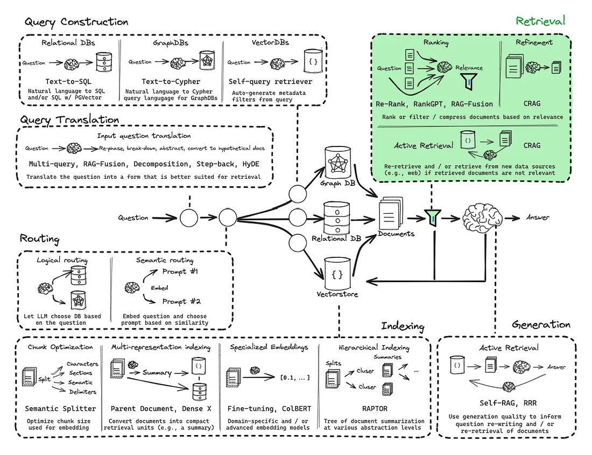
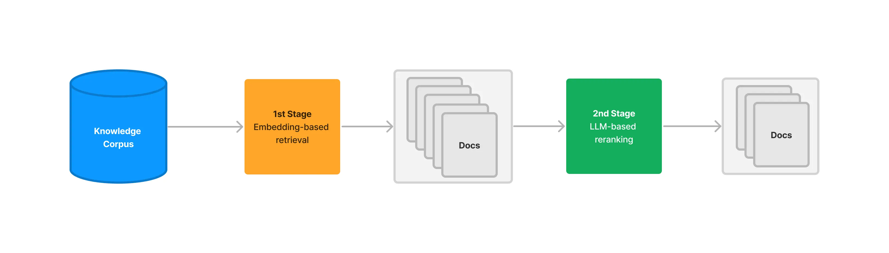
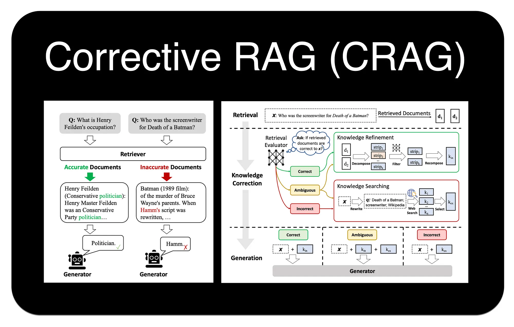

# Section 5 Search Advanced

In the basic RAG process, information is retrieved from the knowledge base relying on vector similarity. However, this method has some inherent limitations, such as the most relevant documents not always being at the top of the search results, and biases in semantic understanding. In order to build more powerful and accurate production-level RAG applications, more advanced retrieval technology needs to be introduced.



## 1. Re-ranking

### 1.1 RRF (Reciprocal Rank Fusion)

We have already touched upon RRF in [**Hybrid Search Chapter**](./11_hybrid_search.md). It is a simple and effective zero-shot rearrangement method that does not rely on any model training, but calculates the final score purely based on the document's ranking in the result list of multiple different retrievers (for example, a sparse retriever and a dense retriever).

A document is likely to be more important if it ranks high in multiple search results. RRF scores documents by calculating the reciprocal of ranking, effectively integrating the advantages of different retrieval strategies. However, if only ranking information is considered, the original similarity score will be ignored, and some useful information may be lost.

### 1.2 RankLLM / LLM-based Reranker



RankLLM represents a class of methods that directly utilize large language models themselves for rearrangement [^1]. The basic logic is very intuitive: since the LLM is ultimately responsible for generating answers based on context, why not just let it decide which contexts are most relevant?

This method is implemented through a carefully designed prompt word. The prompt will contain the user's query and a list of candidate documents (usually a summary or key section of the document), and then ask the LLM to output a sorted list of documents in a specific format (such as JSON), giving each document a relevance score.

An example prompt word is as follows:

```text
以下是一个文档列表，每个文档都有一个编号和摘要。同时提供一个问题。请根据问题，按相关性顺序列出您认为需要查阅的文档编号，并给出相关性分数（1-10分）。请不要包含与问题无关的文档。

示例格式:
文档 1: <文档1的摘要>
文档 2: <文档2的摘要>
...
文档 10: <文档10的摘要>

问题: <用户的问题>

回答:
Doc: 9, Relevance: 7
Doc: 3, Relevance: 4
Doc: 7, Relevance: 3
```

### 1.3 Cross-Encoder rearrangement

Cross-Encoder provides excellent rearrangement accuracy[^2]. It works by concatenating the query (Query) and each candidate document (Document) into a single input (for example, `[CLS] query [SEP] document [SEP]`), and then inputting this whole into a pre-trained Transformer model (such as BERT). The model will eventually output a single score (usually between 0 and 1), which directly represents the **relevance** of the document to the query.

> Note: **[SEP]** is a special tag used to separate different text fragments (such as queries and documents) in models based on the Transformer architecture such as BERT.

<div align="center">

</div>

The figure above clearly shows the workflow of Cross-Encoder:
1. **Initial Retrieval**: The search engine first recalls an initial list of documents (for example, the first 50) from the knowledge base.
2. **Scoring one by one**: For **each** document in the list, the system pairs it with the original query and then sends it to the Cross-Encoder model.
3. **Independent inference**: The model performs a complete and independent inference calculation on each "query-document" pair to obtain an accurate relevance score.
4. **Return rearranged results**: The system reorders the document list based on these new scores and returns the final results to the user.

This process highlights the source of its high accuracy (analyzing queries and documents simultaneously) and also explains the reason for its high latency (requiring N independent model inferences).

Common Cross-Encoder models include `ms-marco-MiniLM-L-12-v2`, `ms-marco-TinyBERT-L-2-v2`, etc.

### 1.4 ColBERT rearrangement

ColBERT (Contextualized Late Interaction over BERT) is an innovative rearrangement model that strikes a balance between the high accuracy of Cross-Encoder and the high efficiency of Bi-Encoder [^3]. A "**late interaction**" mechanism is adopted.

The workflow is as follows:

1. **Independent encoding**: ColBERT generates context-sensitive embedding vectors for each Token in the query and document respectively. This step is done independently and can pre-compute and store the document's vectors, thus speeding up queries.
2. **Later interaction**: When querying, the model will calculate the maximum similarity (MaxSim) between the vector of each Token in the query and the vector of each Token in the document.
3. **Score aggregation**: Finally, add the maximum similarity scores obtained by all Tokens in the query to obtain the final total relevance score.

In this way, ColBERT avoids the expensive joint encoding of splicing queries and documents together, while capturing more fine-grained word-level interaction information than dual-encoder models that simply compare individual `[CLS]` vectors.

### 1.5 Comparison of rearrangement methods

In order to more intuitively understand the characteristics and applicable scenarios of different rearrangement methods, the following table summarizes several mainstream methods discussed:

| Features | RRF | RankLLM | Cross-Encoder | ColBERT |
| :--- | :--- | :--- | :--- | :--- |
| **Core Mechanism** | Fusion of multiple rankings | LLM inference, generate sorted list | Joint encoding query and document, calculate a single correlation score | Independent encoding, later interaction |
| **Computational Cost** | Low (simple math calculations) | Medium (API fees and latency) | High (N times model inference) | Medium (vector dot product calculations) |
| **Interaction Granularity** | None (ranking only) | Concept/Semantic Level | Sentence Level (Query-Doc Pair) | Token Level |
| **Applicable scenarios** | Multi-channel recall result fusion | High-value semantic understanding scenarios | Top-K fine ranking | Top-K rearrangement |

## 2. Compression (Compression)

"Compression" technology is designed to solve a common problem: initially retrieved document chunks (Chunks), although relevant to the query as a whole, may contain a large amount of irrelevant "noise" text. Providing these unprocessed, lengthy contexts directly to LLM not only increases the cost and latency of API calls, but may also reduce the quality of the final generated answer due to information overload.

The goal of compression is to "compress" and "refine" the retrieved content, retaining only the information most directly related to the user's query. This can be achieved in two main ways:
1. **Content Extraction**: Extract only sentences or paragraphs related to the query from the document.
2. **Document filtering**: Completely discard the entire documents that, although initially recalled, are deemed irrelevant after more detailed judgment.

### 2.1 LangChain’s ContextualCompressionRetriever

LangChain provides a powerful component `ContextualCompressionRetriever` to implement context compression [^4]. It acts like a wrapper around a basic retriever (such as `FAISS.as_retriever()`). When the underlying retriever returns documents, `ContextualCompressionRetriever` processes the documents using a specified `DocumentCompressor` before returning them to the caller.

LangChain has a variety of built-in `DocumentCompressor`:

* `LLMChainExtractor`: This is the most direct compression method. It goes through each document and uses an LLM Chain to determine and extract the parts of it that are relevant to the query. This is a kind of "content extraction".
* `LLMChainFilter`: This compressor also uses LLM, but it does "document filtering". It determines whether the entire document is relevant to the query. If it is relevant, the entire document is retained; if it is not relevant, it is discarded directly.
* `EmbeddingsFilter`: This is a faster and less expensive filtration method. It calculates the similarity between the query and each document's embedding vector, retaining only those documents whose similarity exceeds a preset threshold.

### 2.2 Custom rearranger and compression pipeline

We mentioned earlier that depending on the actual application, you need to implement some functions yourself. Here we take ColBERT as an example to show how to integrate functions that are not officially supported.

The entire exploration and implementation process is as follows:

1. **Start from the official documentation**: First, through the LangChain official documentation, we learned that multiple compressors and document converters can be combined through `DocumentCompressorPipeline`.
2. **Requirement gap**: I hope to use the ColBERT model for rearrangement, but found that LangChain does not have a built-in `ColBERT` rearranger.
3. **Analysis examples and source code**: Go back and analyze the usage and source code of `ContextualCompressionRetriever`. We found that the processing logic is divided into two steps: first use `base_retriever` to obtain the original documents, and then hand these documents to `base_compressor` for compression or rearrangement. This shows that the key to implementing custom post-processing (such as rearrangement) functions lies in `base_compressor`.
4. **Locate the core base class**: View the source code through f12 and determine that the `base_compressor` parameter receives an object of type `BaseDocumentCompressor`. This is the core entry point for implementing custom functions.
5. **Reference and Implementation**: Finally, refer to the implementation of other reorderers in LangChain, and create your own `ColBERTReranker` class by inheriting the `BaseDocumentCompressor` base class and implementing its key methods.

> PS: If you have a weak code base and want to use a large model to help you complete `ColBERTReranker`, you need to provide key information to the large model: the source code of `BaseDocumentCompressor` and the source code of `ContextualCompressionRetriever` and their usage examples, your clear goal (implementing ColBERT rearrangement logic), and the codes of other rearrangers in LangChain as reference. The more information there is, the more accurate the code generated by the model will be.

#### Code Example

Custom code implementation of `ColBERTReranker`:

```python
class ColBERTReranker(BaseDocumentCompressor):
    """ColBERT重排器"""

    def __init__(self, **kwargs):
        super().__init__(**kwargs)

        model_name = "bert-base-uncased"

        # 加载模型和分词器
        object.__setattr__(self, 'tokenizer', AutoTokenizer.from_pretrained(model_name))
        object.__setattr__(self, 'model', AutoModel.from_pretrained(model_name))
        self.model.eval()
        print(f"ColBERT模型加载完成")

    def encode_text(self, texts):
        """ColBERT文本编码"""
        inputs = self.tokenizer(
            texts,
            return_tensors="pt",
            padding=True,
            truncation=True,
            max_length=128
        )

        with torch.no_grad():
            outputs = self.model(**inputs)

        embeddings = outputs.last_hidden_state
        embeddings = F.normalize(embeddings, p=2, dim=-1)

        return embeddings

    def calculate_colbert_similarity(self, query_emb, doc_embs, query_mask, doc_masks):
        """ColBERT相似度计算（MaxSim操作）"""
        scores = []

        for i, doc_emb in enumerate(doc_embs):
            doc_mask = doc_masks[i:i+1]

            # 计算相似度矩阵
            similarity_matrix = torch.matmul(query_emb, doc_emb.unsqueeze(0).transpose(-2, -1))

            # 应用文档mask
            doc_mask_expanded = doc_mask.unsqueeze(1)
            similarity_matrix = similarity_matrix.masked_fill(~doc_mask_expanded.bool(), -1e9)

            # MaxSim操作
            max_sim_per_query_token = similarity_matrix.max(dim=-1)[0]

            # 应用查询mask
            query_mask_expanded = query_mask.unsqueeze(0)
            max_sim_per_query_token = max_sim_per_query_token.masked_fill(~query_mask_expanded.bool(), 0)

            # 求和得到最终分数
            colbert_score = max_sim_per_query_token.sum(dim=-1).item()
            scores.append(colbert_score)

        return scores

    def compress_documents(
        self,
        documents: Sequence[Document],
        query: str,
        callbacks=None,
    ) -> Sequence[Document]:
        """对文档进行ColBERT重排序"""
        if len(documents) == 0:
            return documents

        # 编码查询
        query_inputs = self.tokenizer(
            [query],
            return_tensors="pt",
            padding=True,
            truncation=True,
            max_length=128
        )

        with torch.no_grad():
            query_outputs = self.model(**query_inputs)
            query_embeddings = F.normalize(query_outputs.last_hidden_state, p=2, dim=-1)

        # 编码文档
        doc_texts = [doc.page_content for doc in documents]
        doc_inputs = self.tokenizer(
            doc_texts,
            return_tensors="pt",
            padding=True,
            truncation=True,
            max_length=128
        )

        with torch.no_grad():
            doc_outputs = self.model(**doc_inputs)
            doc_embeddings = F.normalize(doc_outputs.last_hidden_state, p=2, dim=-1)

        # 计算ColBERT相似度
        scores = self.calculate_colbert_similarity(
            query_embeddings,
            doc_embeddings,
            query_inputs['attention_mask'],
            doc_inputs['attention_mask']
        )

        # 排序并返回前5个
        scored_docs = list(zip(documents, scores))
        scored_docs.sort(key=lambda x: x[1], reverse=True)
        reranked_docs = [doc for doc, _ in scored_docs[:5]]

        return reranked_docs
```

1. **Inheritance and Implementation**: The `ColBERTReranker` class inherits from `BaseDocumentCompressor` and implements its core abstract method `compress_documents`. This method receives as input the list of documents `documents` returned by the underlying retriever and the original query `query`.

2. **Implementing ColBERT logic**: The internal logic of the `compress_documents` method follows the "late interaction" principle described in "1.4 ColBERT rearrangement".
* **Independent encoding**: In the `_colbert_score` auxiliary function, the query and the document are independently encoded, and the embedding vectors of all Tokens (`query_embeddings` and `doc_embeddings`) are obtained through `self.model`.
* **Later interaction**: Code `similarity_matrix.max(dim=1).values` implements maximum similarity (MaxSim) calculation. For each Token vector in the query, find the most similar one among all Token vectors in the document, and record the maximum similarity value.
* **Score aggregation**: The final `.sum()` operation adds the maximum similarity values ​​calculated by all Tokens in the query to obtain the final total relevance score of the document and the query.

3. **Sort and Return**: The `compress_documents` method traverses all documents, calculates their respective scores, reorders the documents from high to low according to the scores, and returns the sorted document list.

Next, this customized `ColBERTReranker` is combined with other components of LangChain (such as `LLMChainExtractor`) into a powerful "rearrangement + compression" pipeline and applied in actual retrieval tasks.

```python
# 初始化配置...(略)

# 1. 加载和处理文档
loader = TextLoader("../../data/C4/txt/ai.txt", encoding="utf-8")
documents = loader.load()
text_splitter = RecursiveCharacterTextSplitter(chunk_size=500, chunk_overlap=100)
docs = text_splitter.split_documents(documents)

# 2. 创建向量存储和基础检索器
vectorstore = FAISS.from_documents(docs, hf_bge_embeddings)
base_retriever = vectorstore.as_retriever(search_kwargs={"k": 20})

# 3. 设置ColBERT重排序器
reranker = ColBERTReranker()

# 4. 设置LLM压缩器
compressor = LLMChainExtractor.from_llm(llm)

# 5. 使用DocumentCompressorPipeline组装压缩管道
# 流程: ColBERT重排 -> LLM压缩
pipeline_compressor = DocumentCompressorPipeline(
    transformers=[reranker, compressor]
)

# 6. 创建最终的压缩检索器
final_retriever = ContextualCompressionRetriever(
    base_compressor=pipeline_compressor,
    base_retriever=base_retriever
)

# 7. 执行查询并展示结果
query = "AI还有哪些缺陷需要克服？"
print(f"\n{'='*20} 开始执行查询 {'='*20}")
print(f"查询: {query}\n")

# 7.1 基础检索结果
print(f"--- (1) 基础检索结果 (Top 20) ---")
base_results = base_retriever.get_relevant_documents(query)
for i, doc in enumerate(base_results):
    print(f"  [{i+1}] {doc.page_content[:100]}...\n")

# 7.2 使用管道压缩器的最终结果
print(f"\n--- (2) 管道压缩后结果 (ColBERT重排 + LLM压缩) ---")
final_results = final_retriever.get_relevant_documents(query)
for i, doc in enumerate(final_results):
    print(f"  [{i+1}] {doc.page_content}\n")
```

This code shows how to connect various components together to form a complete retrieval process:

1. **Create basic components**: First create a standard `FAISS` vector storage and a basic retriever `base_retriever`, responsible for initially recalling 20 potentially relevant documents from the vector library.
2. **Prepare processing unit**: Instantiate two key processing units:
* `reranker`: Customized `ColBERTReranker` instance.
* `compressor`: LangChain's built-in `LLMChainExtractor` is used to extract query-related sentences from documents.
3. **Build Processing Pipeline (`DocumentCompressorPipeline`)**: This is the core of the entire process. Create a `DocumentCompressorPipeline` instance and put `reranker` and `compressor` in order into the `transformers` list. According to the source code of `DocumentCompressorPipeline`, it calls each processor in the list in sequence. Therefore, the document will first be rearranged by `ColBERTReranker`, and the rearranged result will then be sent to `LLMChainExtractor` for compression.
4. **Assembling the final retriever**: Finally, wrap `base_retriever` with `ContextualCompressionRetriever` and the `pipeline_compressor` we created. When `final_retriever` is called, it automatically performs the complete process of "Basic Retrieval -> Pipeline Processing (Rearrangement -> Compression)".

> [Full Code](https://github.com/datawhalechina/all-in-rag/blob/main/code/C4/07_rerank_and_refine.py)

### 2.3 Search compression in LlamaIndex

LlamaIndex also provides packaged compression functions, represented by `SentenceEmbeddingOptimizer`[^5]. It is also a post-processor (Node Postprocessor) that works after retrieval.

It works by, for each retrieved document, break it into sentences. Then the embedding similarity of each sentence to the user query is calculated, and finally only those sentences with the highest similarity are retained, thereby "optimizing" the document and removing irrelevant information.

## 3. Correction (Correcting)

The traditional RAG process has an implicit assumption that retrieved documents are always relevant to the question and contain the correct answer. In the real world, however, retrieval systems can fail, returning documents that are irrelevant, outdated, or even outright wrong. If these "toxic" contexts are fed directly to LLM, it may cause hallucination or produce incorrect answers.

**Corrective-RAG, C-RAG)** is a strategy proposed to solve this problem[^6]. The idea is to introduce a "self-reflection" or "self-correction" cycle, where the quality of the retrieved documents is evaluated before generating an answer, and different actions are taken based on the evaluation results.

The workflow of C-RAG can be summarized as **"Retrieval-Assessment-Action"** three stages:



1. **Retrieve**: Like standard RAG, first retrieve a set of documents from the knowledge base based on the user query.

2. **Assess**: This is the key step of C-RAG. As shown in the figure, a "Retrieval Evaluator" determines the relevance of each document to the query and gives a "Correct", "Incorrect" or "Ambiguous" label.

3. **Action (Act)**: Based on the evaluation results, the system will enter different knowledge correction and acquisition processes:
* **If the evaluation is "correct"**: The system will enter the "Knowledge Refinement" link. As shown in the figure, it will decompose the original document into smaller knowledge fragments (strips), filter out the irrelevant parts, and then reassemble it into a more precise and focused context, and then send it to the large model to generate answers.
* **If evaluated as "Incorrect"**: The system believes that the internal knowledge base cannot answer the question, and "Knowledge Searching" will be triggered. It first performs "Query Rewriting" on the original query to generate a query more suitable for search engines, and then conducts a web search to use external information to answer the question.
* **If evaluated as "fuzzy"**: A "knowledge search" is also triggered, but typically a web search is performed directly using the original query to obtain additional information to assist in generating the answer.

In this way, C-RAG greatly enhances the robustness of RAG systems. Instead of blindly trusting the search results, a "fact-checking" layer has been added, which can actively seek external help when the search fails, thereby effectively reducing hallucinations and improving the accuracy and reliability of answers.

In LangChain's `langgraph` library, its graph structure can be used to flexibly build such complex RAG processes with conditional judgments and loops[^7].

## practise

- The output of the code in the "Customized Rearranger and Compression Pipeline" section of this section will be repeated after running. Think about why this problem occurs and try to modify the code to solve it. ([Reference Code](https://github.com/datawhalechina/all-in-rag/blob/main/code/C4/work_rerank_and_refine.py))

## References

[^1]: [*Using LLM’s for Retrieval and Reranking*](https://www.llamaindex.ai/blog/using-llms-for-retrieval-and-reranking-23cf2d3a14b6).

[^2]: [Nogueira, R., & Cho, K. (2019). *Passage Re-ranking with BERT*](https://arxiv.org/abs/1901.04085).

[^3]: [*Advanced RAG: ColBERT Reranker*](https://www.pondhouse-data.com/blog/advanced-rag-colbert-reranker).

[^4]: [*How to do retrieval with contextual compression*](https://python.langchain.com/docs/how_to/contextual_compression/).

[^5]: [*Sentence Embedding Optimizer*](https://docs.llamaindex.ai/en/stable/examples/node_postprocessor/OptimizerDemo/).

[^6]: [Jiang, Z. et al. (2024). *Corrective Retrieval Augmented Generation*](https://arxiv.org/pdf/2401.15884.pdf).

[^7]: [*Corrective-RAG (CRAG)*](https://langchain-ai.github.io/langgraph/tutorials/rag/langgraph_crag/).


