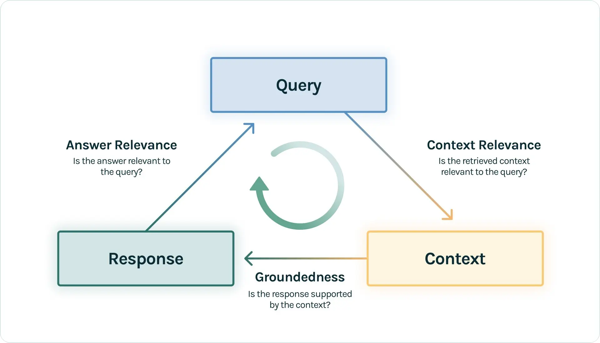

# Section 1 Introduction to Assessment

> After building a RAG system, the next key question is: how to scientifically evaluate its performance?

Evaluation is critical because it answers a series of core questions in RAG development and application:

- **For developers:** How to quantitatively track, iterate and improve the performance of RAG applications? When the system has "hallucinations" or answers questions that are not what it is asked, how to quickly locate the source of the problem?
- **For users or decision-makers:** Faced with two different RAG applications, how to objectively judge which one is better?

This section will explore the concepts and methods of RAG evaluation, and focus on **"RAG Triad"**.

## 1. RAG evaluation triplet

The architecture contains the following three dimensions and is deeply used in tools such as **TruLens** [^1]:

(1) **Context Relevance**
- **Evaluation Goal:** Retriever performance.
- **Core question:** Is the retrieved contextual content highly relevant to the user's query?
- **Importance:** Retrieval is the first step in a RAG application responding to a user query. If the retrieved context is full of noise or irrelevant information, then no matter how powerful the subsequent generative model is, it will not be able to give the correct answer.

(2)**Faithfulness / Groundedness**
- **Evaluation Objective:** Reliability of the generator.
- **Core Question:** Are the answers generated based entirely on the contextual information provided?
- **Importance:** This dimension is mainly used to quantify the degree of "illusion" of LLM. A high-fidelity answer means that the model adheres strictly to the context and does not fabricate or distort facts. If the fidelity score is low, it means that the LLM "plays freely" too much when answering and introduces external knowledge or false information.

(3) **Answer Relevance**
- **Evaluation Objective:** End-to-End performance of the system.
- **Core Question:** Does the resulting answer directly, completely, and effectively answer the user's original question?
- **Importance:** This is the most intuitive feeling for users. An answer may be entirely context-based (high fidelity), but if it does not answer the question, or answers only part of the question, then the answer has low relevance. For example, when a user asks "Where is France and where is its capital?", if the answer is just "France is in Western Europe", then although the fidelity is high, the answer relevance is very low.

> You may think that fidelity and answer relevance are similar, but their focus is different. Fidelity is more concerned with whether the model strictly follows the context, while answer relevance is more concerned with whether the model answers the question directly, completely, and effectively.

By evaluating these three dimensions, we can have a comprehensive and detailed understanding of the performance of the RAG system and accurately locate the problem: whether there is a problem with the retrieval, or the generation process needs to be improved.

## 2. Evaluation workflow

Although the evaluation is divided into three parts above, the evaluation process can actually be broken down into two main links: **retrieval evaluation** and **response evaluation**.

### 2.1 Search evaluation

The retrieval evaluation focuses on the **Context Relevance** in the RAG triplet, which is essentially a **white box test** [^2]. Evaluation at this stage requires an annotated dataset containing a sequence of queries and real relevant documents corresponding to each query.

This assessment draws on several classic metrics from the field of information retrieval:
- **Context Precision:** Measures the accuracy of search results. Calculate the proportion of relevant documents among the first **k** retrieved documents, where **k** is a preset number (for example, k=3 or k=5) representing the range of evaluation. High accuracy means the search results are less noisy.

$$\text{Precision}@k = \frac{\text{number of relevant documents in retrieved}k\text{results}}{k}$$

- **Context Recall:** Measures the completeness of retrieval results. Calculate the proportion of relevant documents found among the first **k** documents retrieved to the total number of all true relevant documents. A high recall rate means that the system can successfully retrieve most of the key information.

$$\text{Recall}@k = \frac{\text{Number of relevant documents in retrieved}k\text{results}}{\text{Total number of relevant documents in the dataset}}$$

- **F1 score (F1-Score):** The F1 score is the harmonic average of precision and recall. It takes into account both indicators and seeks a balance between them. When both precision and recall are high, the F1 score is also high.

    $$F_1 = 2 \cdot \frac{\text{Precision} \times \text{Recall}}{\text{Precision} + \text{Recall}}$$

- **Mean Reciprocal Rank (MRR - Mean Reciprocal Rank):** Evaluates the system's ability to rank the first relevant document higher. For a query, the reciprocal rank is the reciprocal of the rank of the first relevant document. MRR is the average of the reciprocal rankings of all queries. This metric is suitable for scenarios where users typically only care about the first correct answer.

    $$\text{MRR} = \frac{1}{|Q|} \sum_{q=1}^{|Q|} \frac{1}{\text{rank}_q}$$

where`|Q|`is the total number of queries and`rank_q`is the rank of the first relevant document for the`q`th query.

- **Mean Average Precision (MAP - Mean Average Precision):** MAP is a comprehensive indicator that simultaneously evaluates the accuracy of search results and the ranking of related documents. It first calculates the average precision (AP) for each query and then averages the AP across all queries. AP itself is calculated based on the accuracy with which each relevant document is retrieved.

    $$\text{MAP} = \frac{1}{|Q|} \sum_{q=1}^{|Q|} \text{AP}(q)$$

Among them,`|Q|`is the total number of queries, and`AP(q)`is the average precision (Average Precision) of the`q`th query.

Calculating all of the above metrics requires a high-quality annotated dataset containing queries and “real” relevant documents for each query.

### 2.2 Response evaluation

Response evaluation covers **fidelity** and **answer relevance** in RAG triples. This link usually adopts the **end-to-end** evaluation paradigm because it directly measures the final output quality perceived by the user. No matter which evaluation method is adopted, it mainly focuses on the following two core dimensions.

#### 2.2.1 Evaluation Dimensions

(1) **Fidelity/Believability**: Measures the extent to which the generated answers can be substantiated by the given context. For a completely faithful answer, all its content must be justified in context to avoid "hallucinations" in the model.

(2) **Answer Relevance**: Measures how well the generated answer aligns with the user’s original query. A highly relevant answer must be direct, to the point, and contain no redundant information that is irrelevant to the question.

#### 2.2.2 Main evaluation methods

For the above dimensions, there are currently two main types of evaluation methods:

(1) **Evaluation based on large language model**

This is a powerful evaluation method that provides deeper semantic evaluation and is becoming a mainstream choice. A high-performance, neutral LLM is used as the "evaluator" to conduct in-depth semantic understanding and scoring of the above dimensions.

- **Fidelity Assessment:** First, the generated answer is decomposed into a series of independent claims or assertions (Claims). Then, for each assertion, verify it against the provided context to determine its truth or falsity. The final fidelity score is the proportion of all assertions that are corroborated by context.
- **Answer Relevance Assessment:** Evaluators need to analyze both user queries and generated answers. Grading will penalize answers that do not answer the question, have incomplete information, or contain too much irrelevant detail.

(2) **Classic indicators based on vocabulary overlap**

Such indicators need to contain one or more "standard answers" in the data set. They evaluate quality by calculating the degree of n-gram (n consecutive words) overlap between the generated answer and the standard answer.

- **ROUGE (Recall-Oriented Understudy for Gisting Evaluation):** ROUGE focuses on the **recall rate**, that is, how many words in the standard answer are covered by the generated answer, so it is often used to evaluate the **completeness** of the content. Common variants include`ROUGE-N`, which computes n-grams, and`ROUGE-L`, which computes the longest common subsequence.

$$\text{ROUGE-N} = \frac{\text{Number of matching } n\text{-grams}}{\text{Total number of } n\text{-grams in the reference answer}}$$

- **BLEU (Bilingual Evaluation Understudy):** BLEU focuses on evaluating **precision**, which measures how many words in the generated answers are valid (that is, have appeared in standard answers). It also introduces a length penalty mechanism to prevent the model from generating sentences that are too short, so it is more suitable for evaluating the **fluency and accuracy** of the answer.

    $$\text{BLEU} = \text{BP} \times \exp\left(\sum_{n=1}^{N} w_n \log p_n\right)$$

Among them,`BP`is the length penalty factor, and`p_n`is the corrected n-gram accuracy.

- **METEOR (Metric for Evaluation of Translation with Explicit ORdering):** As an improved version of BLEU, METEOR simultaneously considers the harmonic average of **precision and recall**, and better captures semantic similarity through stem and synonym matching (such as treating 'boat' and 'ship' as related). Its evaluation results are generally considered to be more relevant to human judgment.

    $$F_{\text{mean}} = \frac{P \times R}{\alpha P + (1-\alpha)R}$$

    $$\text{METEOR} = F_{\text{mean}} \times (1 - \text{Penalty})$$

Among them,`P`is the precision rate,`R`is the recall rate, and`Penalty`is the penalty term based on word order.

> In order to understand the difference between the three more intuitively, let’s look at a simple example.
> 
> **Assumption:**
> - **Reference answer:**`狗 在 床 上面`(5 words in total)
> - **Generate answer:**`狗 在 床 上`(4 words in total)
> 
> **Evaluation Analysis:**
> - **ROUGE (recall-oriented):** From the perspective of recall: "Referring to the 5 words in the answer, how many of the generated answers are covered?" - 4 are covered. Therefore, it has a high recall (ROUGE-1 of 4/5) and will score well. ROUGE is more concerned about "whether everything is said".
> 
> - **BLEU (Accuracy Oriented):** Judged from the perspective of accuracy: "How many of the 4 words in the generated answers are valid (in the reference answers)?" - All are valid, and the accuracy rate is very high. But it will find that the generated answer is shorter than the reference answer, so it will deduct points through **length penalty (Brevity Penalty)**. BLEU is more concerned about "whether it is said correctly and whether the length is appropriate."
> 
> - **METEOR (comprehensive balance):** Calculate precision and recall at the same time, and take a harmonic average. In this example, the word order is completely correct and the penalty is 0. METEOR will find an optimal balance between "telling the truth" and "telling the truth".

#### 2.2.3 Comparison and summary of methods

Evaluation based on LLM pays more attention to **semantics and logic** and has high evaluation quality, but it is also more expensive and suffers from evaluator bias. Indicators based on vocabulary overlap are **objective, fast to calculate, and low-cost**, but cannot understand semantics and may misjudge synonyms or interpretations. In practice, the two can be combined, using classic indicators for rapid and large-scale preliminary screening, and then using LLM for more refined evaluation.

## References

[^1]: [*The RAG Triad of Metrics*](https://www.trulens.org/getting_started/core_concepts/rag_triad/).

[^2]: [*How to evaluate RAG applications? *](https://zilliz.com.cn/blog/how-to-evaluate-rag-zilliz)
