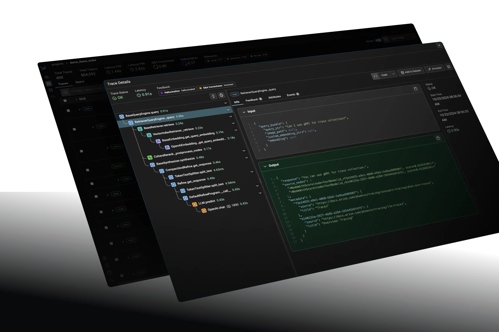

# Section 2 Common tools for evaluation

After understanding the basic principles of evaluation, let's introduce several RAG evaluation tools, each of which represents different design philosophies and application scenarios.

## 1. LlamaIndex Evaluation

`LlamaIndex Evaluation` is an evaluation module that is deeply integrated into the LlamaIndex framework and is designed to provide seamless evaluation capabilities for RAG applications built using the framework. As a native component of the RAG development framework, its core positioning is to provide developers with fast and flexible embedded evaluation solutions in the development, debugging and iteration cycles. It emphasizes close integration with the development process, allowing developers to instantly verify and compare the performance of different RAG strategies during the build process[^1].

> **Applicable scenarios**: For developers who deeply use the `LlamaIndex` framework to build RAG applications, its built-in evaluation module is the first choice for seamless integration, providing a one-stop development and evaluation experience.

### 1.1 Core Concepts and Workflow

The evaluation concept of `LlamaIndex` is to use LLM as a "referee" to score each link of the RAG system in an automated way. This method eliminates the need to prepare “standard answers” ​​in advance in many scenarios, greatly lowering the assessment threshold. Its typical workflow is as follows:

1. **Prepare the evaluation data set**: Automatically generate question-answer pairs (`QueryResponseDataset`) from the document via `DatasetGenerator`, or load an existing data set. For efficiency, the generated data set is usually saved locally to avoid repeated generation.
2. **Build Query Engine**: Build one or more RAG query engines (`QueryEngine`) that need to be evaluated. This is the basis for comparative experiments.
3. **Initialize evaluator**: Select and initialize one or more evaluators according to the evaluation dimensions, such as `FaithfulnessEvaluator` (fidelity) and `RelevancyEvaluator` (relevance).
4. **Perform batch evaluation**: Use `BatchEvalRunner` to manage the entire evaluation process. It efficiently (parallelizable) applies the query engine to all questions in the dataset and calls all evaluators for scoring.
5. **Analysis results**: From the results returned by the evaluation runner, calculate the average score of each indicator to quantitatively compare the advantages and disadvantages of different RAG strategies.

### 1.2 Application examples: Comparing different search strategies

The following example is based on the "sentence window retrieval" technology we learned in Chapter 3. Through evaluation, we compare the difference in response quality between it and "conventional chunked retrieval".

**Code Example:**


```python
# ... (省略数据加载、文档解析、查询引擎构建等步骤)

# 1. 初始化评估器
# 定义需要评估的指标：忠实度和相关性
faithfulness_evaluator = FaithfulnessEvaluator(llm=Settings.llm)
relevancy_evaluator = RelevancyEvaluator(llm=Settings.llm)
evaluators = {"faithfulness": faithfulness_evaluator, "relevancy": relevancy_evaluator}

# 2. 使用BatchEvalRunner执行批量评估
# 从数据集中获取查询列表
queries = response_eval_dataset.queries

# 评估“句子窗口检索”引擎
print("\n=== 评估句子窗口检索 ===")
sentence_runner = BatchEvalRunner(evaluators, workers=2, show_progress=True)
sentence_response_results = await sentence_runner.aevaluate_queries(
    queries=queries, query_engine=sentence_query_engine
)

# 评估“常规分块检索”引擎
print("\n=== 评估常规分块检索 ===")
base_runner = BatchEvalRunner(evaluators, workers=2, show_progress=True)
base_response_results = await base_runner.aevaluate_queries(
    queries=queries, query_engine=base_query_engine
)

# 3. 分析并打印结果
# ... (省略结果计算与打印的辅助函数)
print(f"句子窗口检索: 忠实度={sentence_faith:.1%}, 相关性={sentence_rel:.1%}")
print(f"常规分块检索: 忠实度={base_faith:.1%}, 相关性={base_rel:.1%}")
```

**The output is as follows:**

```bash
============================================================
响应评估结果对比
============================================================

句子窗口检索:
  忠实度: 53.3%
  相关性: 66.7%

常规分块检索:
  忠实度: 0.0%
  相关性: 6.7%
```

It can be seen from this result that in this experiment, the fidelity and correlation of "sentence window retrieval" are significantly better than "conventional block retrieval".

### 1.3 Core evaluation dimensions

LlamaIndex provides a rich set of evaluators, covering all aspects from retrieval to response. The **response evaluation** dimension is mainly used in the above example:

- `Faithfulness` (Fidelity): Evaluates whether the generated answer is completely based on the retrieved context and is a key metric for detecting "hallucination" phenomena. The higher the score, the more reliable the answer.
- `Relevancy` (Relevance): Evaluates whether the generated answer is directly related to the original question asked by the user to ensure that the answer is relevant.

Additionally, it supports specialized **retrieval evaluation** dimensions such as:

- `Hit Rate` (hit rate): Evaluates whether the retrieved context contains the correct answer.
- `MRR` (average reciprocal ranking): measures the efficiency of finding the correct answer. The higher the ranking, the higher the score.

## 2. RAGAS

RAGAS (RAG Assessment) is an independent, RAG-focused open source assessment framework**. Provides a comprehensive set of metrics to quantify the performance of the two core aspects of the RAG pipeline, retrieval and generation. Its most notable feature is that it supports **no-reference assessment**, that is, it can be assessed in many scenarios without manual annotation of "standard answers", which greatly reduces the cost of assessment. There is ongoing monitoring and improvement of the RAG pipeline. If you need a lightweight tool that is decoupled from specific RAG implementations and can quickly quantitatively evaluate core indicators, `RAGAS` is an ideal choice.

### 2.1 Design Concept

The core idea of ​​`RAGAS` is to comprehensively evaluate the performance of the RAG system by analyzing the relationship between the question (`question`), the generated answer (`answer`) and the retrieved context (`context`). It breaks down complex assessment problems into a few simple, quantifiable dimensions.

### 2.2 Workflow and core indicators

The RAGAS assessment process is very simple and generally follows the following steps:

(1) **Prepare the data set**: According to the official documentation, a standard evaluation data set should contain four columns: `question` (question), `answer` (answer generated by the RAG system), `contexts` (retrieved context) and `ground_truth` (standard reference answer). However, `ground_truth` is required for calculating indicators such as `context_recall`, but is optional for indicators such as `faithfulness`.

(2) **Run evaluation**: Call the `ragas.evaluate()` function and pass in the prepared data set and the list of indicators that need to be evaluated.

(3) **Analysis results**: Obtain an evaluation report containing quantitative scores for various indicators.

Its core evaluation indicators include:

- `faithfulness`: Measures what proportion of the information in the generated answer is supported by the retrieved context.
- `context_recall`: Measures the alignment degree of the retrieved context with the standard answer (`ground_truth`), that is, whether the information in the standard answer is completely "recalled" by the context.
- `context_precision`: Measures the signal-to-noise ratio of the retrieved context, that is, how much is actually relevant to answering the question.
- `answer_relevancy`: Evaluate how relevant the answer is to the question. This metric does not assess factual accuracy, only whether the answer is relevant.

## 3. Phoenix (Arize Phoenix)

Phoenix (now maintained by Arize) is an **open source LLM observability and evaluation platform**. In the RAG evaluation ecosystem, it mainly plays the role of a visual analysis and fault diagnosis engine in the production environment. It captures the traces of LLM applications and provides powerful visualization, slicing and clustering analysis capabilities to help developers understand the performance of online real data. The core value of Phoenix lies in **finding problems from massive production data, monitoring performance drift and conducting in-depth diagnosis**. It is the key bridge between offline evaluation and online operation and maintenance. It not only provides evaluation indicators, but also emphasizes tracing and visual analysis of LLM applications to quickly locate problems [^3].



### 3.1 Core Concept

The core of `Phoenix` is "AI observability", which visualizes the entire process by tracking every step of calls within the RAG system (such as retrieval, generation, etc.). This allows developers to intuitively see the input, output and time consumption of each link, and conduct in-depth evaluation and debugging on this basis.

### 3.2 Working principle

The workflow of `Phoenix` is to first integrate the tracking function in the RAG application through **code instrumentation (`Instrumentation`)** based on the open standard **OpenTelemetry** to automatically capture LLM calls, function execution and other events; then continuously generate **tracking data (`Traces`)** during the application running process to record the complete execution link; then start the Web of `Phoenix` locally UI, load and visualize these tracking data; finally, filter and drill on failed cases or poorly performing queries in the UI, and use the built-in evaluator (`Evals`) to complete in-depth evaluation and debugging.

Special features:

- **Visual Tracking**: Visually displays RAG's execution process, data and evaluation results, which greatly facilitates problem location.
- **Root Cause Analysis**: A visual interface that makes it easy to slice and drill into poorly performing queries.
- **Security Guardrail (`Guardrails`)**: Allows you to add a protective layer to your application to prevent malicious or erroneous input and output and ensure the safety of the production environment.
- **Data Exploration and Annotation**: Provides data exploration, cleaning and annotation tools to help developers use production data to feed back models and system optimization.
- **Integration with Arize platform**: `Phoenix` can be seamlessly connected with Arize's business platform to achieve continuous monitoring of the RAG system in the production environment.

## 4. Comparison suggestions

| **Tools** | **Core Mechanism** | **Unique Technology** | **Typical Application Scenarios** |
| ---------- | -------- | ----------------------- | --- |
| RAGAS | LLM-driven evaluation | Synthetic data generation, reference-free evaluation architecture | Comparison of different RAG strategies, performance regression testing after version iterations |
| LlamaIndex | Embedded evaluation | Asynchronous evaluation engine, modular BaseEvaluator | Quickly verify the effect of individual components or complete pipelines during development |
| Phoenix | Tracing analysis type | Distributed tracing, vector clustering analysis algorithm | Production environment monitoring, Bad Case analysis, data drift detection |

> In practice, these tools are not mutually exclusive and can be used in combination to obtain a more comprehensive and multi-dimensional insight into the RAG system.

## References

[^1]: [*LlamaIndex Evaluating*](https://docs.llamaindex.ai/en/stable/module_guides/evaluating/)

[^2]: [*Ragas Docs*](https://docs.ragas.io/en/stable/)

[^3]: [*Arize AI Phoenix*](https://arize.com/docs/phoenix)
