# Section 1 Environment Configuration and Project Architecture

> After the previous ten days of fierce battle, we finally came to the actual combat stage of the project. Next, through a complete practical project, we will connect the previously learned knowledge to build a truly usable RAG system.

## 1. Project background

The inspiration for this project came from when I was watching videos some time ago and accidentally saw an interesting open source project introduction - [Programmer's Guide to Cooking] (https://github.com/Anduin2017/HowToCook). This is a recipe project that uses Markdown format to record the preparation methods of various dishes, from simple home-cooked dishes to complex banquet dishes. What's even more perfect is that the Markdown files of each dish in this project strictly use unified subtitles.

When I saw this project, I immediately thought: Can I build an intelligent question and answer system to solve my difficulty in choosing? Faced with the century-old problem of "what to eat today" every day, it would be great if there was an AI assistant that could recommend dishes based on my needs and tell me how to cook them! So I came up with the idea of ​​building this **Taste the Salty RAG System**.

## 2. Environment configuration

### 2.1 Create a virtual environment

```bash
# 使用conda创建环境
conda create -n cook-rag-1 python=3.12.7
conda activate cook-rag-1
```

### 2.2 Install core dependencies

The old rule is to enter the corresponding project directory of this chapter to install the dependency package.

```bash
cd code/C8
pip install -r requirements.txt
```

If the API Key has been configured, you can directly use the following command to run the project

```bash
python main.py
```

### 2.3 Apply for Kimi API Key

Kimi2 is released on the eighth day to have a taste. Application address: [Kimi API official website] (https://platform.moonshot.cn/console/api-keys). Currently, registration will give you a credit of 15 yuan, which is more than enough.

### 2.4 API configuration

Refer to the previous chapter [**Environment Preparation**](../chapter1/02_preparation.md) for the configuration method of api_key. Under Windows, the configuration should be as shown below:


## 3. Project structure

### 3.1 Project Goals

We will build an intelligent recipe question and answer system based on the recipe data from the HowToCook project. Users can:

- Ask about the preparation method of specific dishes: "How to make Kung Pao Chicken?"
- Looking for dish recommendations: "Recommend a few simple vegetarian dishes"
- Get ingredient information: "What ingredients are needed for braised pork?"

### 3.2 Data Analysis

#### 3.2.1 Document Analysis

The HowToCook project contains about 300 recipe files in Markdown format. These recipes have two key characteristics: first, the structure is highly regular, and each file strictly organizes the content in a unified format; second, the content is short, with a single recipe usually being about 700 words.

Open any recipe file and you will find that they all follow a similar structural pattern. Usually the recipe is used as the first-level title. There is an introduction and difficulty rating at the beginning, and then it is divided into several main parts such as "Essential Ingredients and Tools", "Calculation", "Operation", and "Additional Content". For example, this dish of scrambled eggs with tomatoes:

```markdown
# 西红柿炒鸡蛋的做法

西红柿炒蛋是中国家常几乎最常见的一道菜肴...
预估烹饪难度：★★

## 必备原料和工具
* 西红柿
* 鸡蛋
* 食用油...

## 计算
每次制作前需要确定计划做几份...
* 西红柿 = 1 个（约 180g） * 份数
* 鸡蛋 = 1.5 个 * 份数，向上取整...

## 操作
- 西红柿洗净
- 可选：去掉西红柿的外表皮...

## 附加内容
这道菜根据不同的口味偏好，存在诸多版本...
```

From a data point of view, this highly structured data can be directly used for RAG system construction without excessive processing. Do you still remember the [**Markdown structure chunking**] (../chapter2/05_text_chunking.md#34-chunking based on document structure) we learned in Chapter 2? This data fits perfectly into the idea of ​​segmenting by title level. More importantly, the content of each recipe file is not too long, and the content of a single chapter is usually about a few hundred words, which means that it can be divided directly according to the title without worrying about the problem mentioned in Chapter 2 - the content of a certain chapter is too long and exceeds the model context window, and needs to be used in combination with conventional blocking methods (such as`RecursiveCharacterTextSplitter`).

#### 3.2.2 Limitations of structural blocking

Although the Markdown structure block seems ideal, you may encounter a problem in actual use: strictly dividing the content according to the title will cut the content too finely, resulting in incomplete contextual information. For example, if a user asks "How to make Kung Pao Chicken", if it is divided strictly by title, only the "Operation" chapter may be retrieved. However, without the information of "Essential Ingredients and Tools", LLM cannot give complete production guidance. Sometimes what is retrieved is a variation in the "Additional Content". Without basic production steps, the answer will be incomprehensible. If you try to directly treat the entire recipe document as a block, you can find that the effect is better than structural blocking because the contextual information is complete.

In order to resolve this contradiction, the strategy of parent-child text blocks can be adopted: use small child blocks for precise retrieval, but pass the complete parent document to LLM when generating. Although this method is not specifically introduced in the index optimization in Chapter 3, it is essentially an application of context expansion. In this way, we ensure both the accuracy of the retrieval and the integrity of the context during generation.

> Anyway, the entire document is passed to LLM. Why don’t I just use the entire document to chunk it?

This is a good question. The key is that when a user asks "What seasonings are needed for Kung Pao Chicken?", if the entire document is directly used for vector retrieval, this specific question will account for a very small proportion of the entire document, and it is likely that it will not be retrieved or will be ranked very low. But if you search in small pieces, the "Essential Ingredients and Tools" section can accurately match the user's needs.

To put it simply, this design is "small block retrieval, large block generation" - using the accuracy of small blocks to find relevant content, and using the completeness of large blocks to ensure the quality of answers. If you directly divide the entire document into chunks, you will lose the accuracy advantage of retrieval.

### 3.3 Overall architecture

After the data is processed, the remaining part is a combination of four main processes. After each process filters and optimizes the tools, a simple rag system can be built. The current project architecture is shown in the figure below:

```mermaid
flowchart TD
    %% 系统初始化
    START[🚀 系统启动] --> CONFIG[⚙️ 加载配置<br/>RAGConfig]
    CONFIG --> INIT[🔧 初始化模块]
    
    %% 索引加载/构建
    INIT --> INDEX_CHECK{📂 检查索引缓存}
    INDEX_CHECK -->|存在| LOAD_INDEX[⚡ 加载已保存索引<br/>秒级启动]
    INDEX_CHECK -->|不存在| BUILD_NEW[🔨 构建新索引]
    
    %% 构建新索引的顺序流程
    BUILD_NEW --> DataPrep
    DataPrep --> IndexBuild
    IndexBuild --> SAVE_INDEX[💾 保存索引到配置路径]
    
    %% 加载已有索引也需要数据准备（用于检索模块）
    LOAD_INDEX --> DataPrepForRetrieval[📚 加载文档和分块<br/>用于检索模块]
    DataPrepForRetrieval --> READY[✅ 系统就绪]
    SAVE_INDEX --> READY
    
    %% 用户交互开始
    READY --> A[👤 用户输入问题]
    A --> B{🎯 查询路由}
    
    %% 查询路由分支
    B -->|list| C[📋 推荐查询]
    B -->|detail| D[📖 详细查询] 
    B -->|general| E[ℹ️ 一般查询]
    
    %% 查询重写逻辑 - 合并相同处理
    C --> KEEP[📝 保持原查询]
    D --> KEEP
    E --> REWRITE[🔄 查询重写]
    
    %% 所有查询都进入统一的检索流程
    KEEP --> F[🔍 混合检索<br/>top_k=config.top_k]
    REWRITE --> F
    
    %% 检索阶段
    F --> G[📊 向量检索<br/>config.embedding_model]
    F --> H[🔤 BM25检索<br/>关键词匹配]
    
    %% RRF重排
    G --> I[⚡ RRF重排融合]
    H --> I
    I --> J[📖 检索到子块]
    
    %% 父子文档处理
    J --> K[🧠 智能去重<br/>按相关性排序]
    K --> L[📚 获取父文档]
    
    %% 生成阶段 - 根据路由类型选择不同模式
    L --> M{🎨 生成模式路由}
    M -->|list查询| N[📋 生成菜品列表<br/>简洁输出]
    M -->|detail查询| O[📝 分步指导模式<br/>config.llm_model<br/>详细步骤]
    M -->|general查询| P[💬 基础回答模式<br/>config.temperature<br/>一般信息]
    
    %% 输出结果
    N --> Q[✨ 返回结果]
    O --> Q
    P --> Q
    
    %% 数据准备子流程
    subgraph DataPrep [📚 数据准备模块]
        R[📁 加载Markdown文件<br/>config.data_path] --> S[🔧 元数据增强]
        S --> T[✂️ 按标题分块]
        T --> U[🏷️ 父子关系建立]
        U --> CHUNKS[📦 输出文本块chunks]
    end
    
    %% 索引构建子流程  
    subgraph IndexBuild [🔍 索引构建模块]
        CHUNKS --> V[🤖 BGE嵌入模型<br/>config.embedding_model]
        V --> W[📊 FAISS向量索引]
        W --> X[💾 索引持久化<br/>config.index_save_path]
    end
    
    %% 配置管理子流程
    subgraph ConfigMgmt [⚙️ 配置管理]
        CFG1[🎛️ 默认配置<br/>DEFAULT_CONFIG]
        CFG2[🔧 自定义配置<br/>RAGConfig]
        CFG3[🌐 环境变量<br/>HF_ENDPOINT]
    end
    
    %% 连接配置到各模块
    ConfigMgmt --> DataPrep
    ConfigMgmt --> IndexBuild
    ConfigMgmt --> F
    ConfigMgmt --> O
    ConfigMgmt --> P
    
    %% 样式定义
    classDef startup fill:#e3f2fd,stroke:#0277bd,stroke-width:2px
    classDef config fill:#f1f8e9,stroke:#388e3c,stroke-width:2px
    classDef userInput fill:#e1f5fe,stroke:#01579b,stroke-width:2px
    classDef routing fill:#f3e5f5,stroke:#4a148c,stroke-width:2px
    classDef rewrite fill:#e8eaf6,stroke:#3f51b5,stroke-width:2px
    classDef retrieval fill:#e8f5e8,stroke:#1b5e20,stroke-width:2px
    classDef generation fill:#fff3e0,stroke:#e65100,stroke-width:2px
    classDef output fill:#fce4ec,stroke:#880e4f,stroke-width:2px
    classDef module fill:#f1f8e9,stroke:#33691e,stroke-width:2px
    classDef cache fill:#fff8e1,stroke:#f57c00,stroke-width:2px
    classDef dataflow fill:#e1f5fe,stroke:#0277bd,stroke-width:2px
    
    %% 应用样式
    class START,INIT startup
    class CONFIG,ConfigMgmt,CFG1,CFG2,CFG3 config
    class INDEX_CHECK,LOAD_INDEX,SAVE_INDEX cache
    class A userInput
    class B,C,D,E,M routing
    class KEEP,REWRITE rewrite
    class F,G,H,I,J,K,L retrieval
    class N,O,P generation
    class Q output
    class DataPrep,IndexBuild module
    class BUILD_NEW,READY,DataPrepForRetrieval startup
    class CHUNKS dataflow
```



### 3.4 Project structure

Based on the above architecture, the following project structure can be constructed:

```text
code/C8/
├── config.py                   # 配置管理
├── main.py                     # 主程序入口
├── requirements.txt            # 依赖列表
├── rag_modules/               # 核心模块
│   ├── __init__.py
│   ├── data_preparation.py    # 数据准备模块
│   ├── index_construction.py  # 索引构建模块
│   ├── retrieval_optimization.py # 检索优化模块
│   └── generation_integration.py # 生成集成模块
└── vector_index/              # 向量索引缓存（自动生成）
```

## Summary

This section starts from the project background and completes the environment configuration and overall architecture design of the RAG system. Starting from the next section, we will delve into the specific implementation of each module and see how to transform these design ideas into runnable code.
