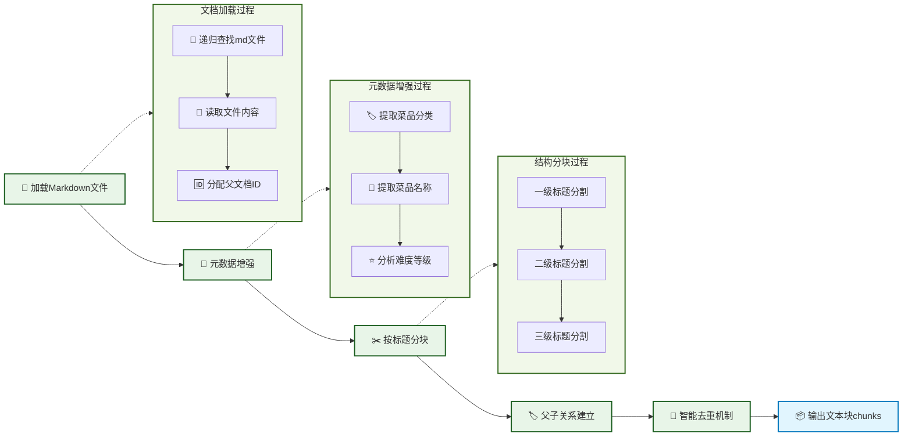

# Section 2 Data preparation module implementation

The effectiveness of a RAG system depends largely on the quality of data preparation. In the previous section, we clarified the parent-child text block strategy of "small block retrieval, large block generation". Next, learn how to translate the architectural ideas in the data preparation part into runnable code.



## 1. Core design

The core of the data preparation module is the parent-child text block architecture that implements "small block retrieval, large block generation".

**Parent-child text block mapping relationship**:
```
父文档（完整菜谱）
├── 子块1：菜品介绍 + 难度评级
├── 子块2：必备原料和工具
├── 子块3：计算（用量配比）
├── 子块4：操作（制作步骤）
└── 子块5：附加内容（变化做法）
```

**Basic process**:
- **Retrieval Phase**: Use small sub-blocks for exact matching to improve retrieval accuracy
- **Generation phase**: Pass the complete parent document to LLM to ensure context integrity
- **Intelligent deduplication**: When multiple sub-chunks of the same dish are retrieved, merge them into one complete recipe

**Metadata Enhancements**:
- **Dish classification**: Inferred from the file path (meat dishes, vegetarian dishes, soups, etc.)
- **Difficulty Level**: Extracted from star marks in content
- **Dish Name**: Extracted from file name
- **Document Relationship**: Establish ID mapping relationship between parent and child documents

## 2. Detailed explanation of module implementation

> [data_preparation.py complete code](https://github.com/datawhalechina/all-in-rag/blob/main/code/C8/rag_modules/data_preparation.py)

### 2.1 Class structure design

```python
class DataPreparationModule:
    """数据准备模块 - 负责数据加载、清洗和预处理"""

    def __init__(self, data_path: str):
        self.data_path = data_path
        self.documents: List[Document] = []  # 父文档（完整食谱）
        self.chunks: List[Document] = []     # 子文档（按标题分割的小块）
        self.parent_child_map: Dict[str, str] = {}  # 子块ID -> 父文档ID的映射
```

-`documents`: Stores the complete recipe document (parent document)
-`chunks`: Stores small chunks (subdocuments) split by title
-`parent_child_map`: Maintain parent-child relationship mapping

### 2.2 Document loading implementation

#### 2.2.1 Batch loading of Markdown files

```python
def load_documents(self) -> List[Document]:
    """加载文档数据"""
    documents = []
    data_path_obj = Path(self.data_path)

    for md_file in data_path_obj.rglob("*.md"):
        # 读取文件内容，保持Markdown格式
        with open(md_file, 'r', encoding='utf-8') as f:
            content = f.read()

        # 为每个父文档分配唯一ID
        parent_id = str(uuid.uuid4())

        # 创建Document对象
        doc = Document(
            page_content=content,
            metadata={
                "source": str(md_file),
                "parent_id": parent_id,
                "doc_type": "parent"  # 标记为父文档
            }
        )
        documents.append(doc)

    # 增强文档元数据
    for doc in documents:
        self._enhance_metadata(doc)

    self.documents = documents
    return documents
```

-`rglob("*.md")`: Recursively search all Markdown files
-`parent_id`: Assign a unique ID to each parent document, the key to establishing a parent-child relationship
-`doc_type`: Marked as "parent" to facilitate the distinction between parent and child documents

#### 2.2.2 Metadata enhancement

```python
def _enhance_metadata(self, doc: Document):
    """增强文档元数据"""
    file_path = Path(doc.metadata.get('source', ''))
    path_parts = file_path.parts

    # 提取菜品分类
    category_mapping = {
        'meat_dish': '荤菜', 'vegetable_dish': '素菜', 'soup': '汤品',
        'dessert': '甜品', 'breakfast': '早餐', 'staple': '主食',
        'aquatic': '水产', 'condiment': '调料', 'drink': '饮品'
    }

    # 从文件路径推断分类
    doc.metadata['category'] = '其他'
    for key, value in category_mapping.items():
        if key in file_path.parts:
            doc.metadata['category'] = value
            break

    # 提取菜品名称
    doc.metadata['dish_name'] = file_path.stem

    # 分析难度等级
    content = doc.page_content
    if '★★★★★' in content:
        doc.metadata['difficulty'] = '非常困难'
    elif '★★★★' in content:
        doc.metadata['difficulty'] = '困难'
    # ... (其他难度等级判断)

```

- **Category Inference**: Infer dish classification from the directory structure of the HowToCook project
- **Difficulty Extraction**: Automatically extract the difficulty level from the star rating in the content
- **Name extraction**: directly use the file name as the dish name

### 2.3 Markdown structure block

Divide the complete recipe document into blocks according to the Markdown title structure to implement a parent-child text block structure.

#### 2.3.1 Block strategy

```python
def chunk_documents(self) -> List[Document]:
    """Markdown结构感知分块"""
    if not self.documents:
        raise ValueError("请先加载文档")

    # 使用Markdown标题分割器
    chunks = self._markdown_header_split()

    # 为每个chunk添加基础元数据
    for i, chunk in enumerate(chunks):
        if 'chunk_id' not in chunk.metadata:
            # 如果没有chunk_id（比如分割失败的情况），则生成一个
            chunk.metadata['chunk_id'] = str(uuid.uuid4())
        chunk.metadata['batch_index'] = i  # 在当前批次中的索引
        chunk.metadata['chunk_size'] = len(chunk.page_content)

    self.chunks = chunks
    return chunks
```

#### 2.3.2 Markdown title splitter

```python
def _markdown_header_split(self) -> List[Document]:
    """使用Markdown标题分割器进行结构化分割"""
    # 定义要分割的标题层级
    headers_to_split_on = [
        ("#", "主标题"),      # 菜品名称
        ("##", "二级标题"),   # 必备原料、计算、操作等
        ("###", "三级标题")   # 简易版本、复杂版本等
    ]

    # 创建Markdown分割器
    markdown_splitter = MarkdownHeaderTextSplitter(
        headers_to_split_on=headers_to_split_on,
        strip_headers=False  # 保留标题，便于理解上下文
    )

    all_chunks = []
    for doc in self.documents:
        # 对每个文档进行Markdown分割
        md_chunks = markdown_splitter.split_text(doc.page_content)

        # 为每个子块建立与父文档的关系
        parent_id = doc.metadata["parent_id"]

        for i, chunk in enumerate(md_chunks):
            # 为子块分配唯一ID并建立父子关系
            child_id = str(uuid.uuid4())
            chunk.metadata.update(doc.metadata)
            chunk.metadata.update({
                "chunk_id": child_id,
                "parent_id": parent_id,
                "doc_type": "child",  # 标记为子文档
                "chunk_index": i      # 在父文档中的位置
            })

            # 建立父子映射关系
            self.parent_child_map[child_id] = parent_id

        all_chunks.extend(md_chunks)

    return all_chunks
```

- **Third-level title segmentation**: Split levels according to`#`,`##`,`###`
- **Keep title**: Set`strip_headers=False`to retain title information for easy understanding of context.
- **Parent-child relationship**: Each child block records the`parent_id`of its parent document
- **Unique identification**: Each sub-block has an independent`child_id`

#### 2.3.3 Blocking effect example

Take "Tomato Scrambled Eggs" as an example, the effect after dividing into blocks:

```
原文档：西红柿炒鸡蛋的做法.md (父文档)
├── 子块1：# 西红柿炒鸡蛋的做法 + 简介 + 难度评级
├── 子块2：## 必备原料和工具 + 食材清单
├── 子块3：## 计算 + 用量配比公式
├── 子块4：## 操作 + 详细制作步骤
└── 子块5：## 附加内容
```

**Blocking logic**:
- **Sub-block 1**: Contains the first-level heading and everything below it (introduction, difficulty rating) until the next second-level heading is encountered
- **Sub-block 2-5**: Each second-level heading and the content below form an independent sub-block
- **Exact search**: When the user asks "What ingredients are needed", sub-block 2 can be accurately matched.
- **Contextual Complete**: Pass the complete parent document when generating, including all necessary information

### 2.4 Intelligent deduplication

When a user asks "How to make Kung Pao Chicken", multiple sub-chunks of the same dish may be retrieved. We need intelligent deduplication to avoid duplication of information.

```python
def get_parent_documents(self, child_chunks: List[Document]) -> List[Document]:
    """根据子块获取对应的父文档（智能去重）"""
    # 统计每个父文档被匹配的次数（相关性指标）
    parent_relevance = {}
    parent_docs_map = {}

    # 收集所有相关的父文档ID和相关性分数
    for chunk in child_chunks:
        parent_id = chunk.metadata.get("parent_id")
        if parent_id:
            # 增加相关性计数
            parent_relevance[parent_id] = parent_relevance.get(parent_id, 0) + 1

            # 缓存父文档（避免重复查找）
            if parent_id not in parent_docs_map:
                for doc in self.documents:
                    if doc.metadata.get("parent_id") == parent_id:
                        parent_docs_map[parent_id] = doc
                        break

    # 按相关性排序并构建去重后的父文档列表
    sorted_parent_ids = sorted(parent_relevance.keys(),
                             key=lambda x: parent_relevance[x], reverse=True)

    # 构建去重后的父文档列表
    parent_docs = []
    for parent_id in sorted_parent_ids:
        if parent_id in parent_docs_map:
            parent_docs.append(parent_docs_map[parent_id])

    return parent_docs
```

**Duplicate removal logic**:
1. **Statistical Correlation**: Calculate the number of matched sub-blocks for each parent document
2. **Sort by relevance**: Recipes with more matching sub-blocks are ranked higher.
3. **Duplicate output**: Each recipe only outputs the complete document once