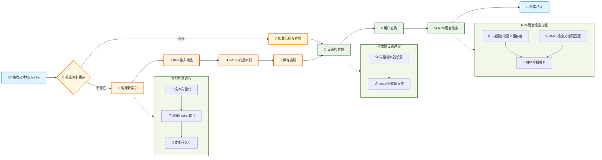

# Section 3 Index Construction and Retrieval Optimization



## 1. Core design

### 1.1 Index construction

The core task of the index building module is to convert text blocks into vector representations and build efficient retrieval indexes. Here, BGE-small-zh-v1.5, which has been used before, is selected as the embedding model, and FAISS is used as the vector database to store and retrieve vectors. In order to improve the system startup speed, an index caching mechanism is implemented. After the first build, the FAISS index will be saved locally, and the existing index will be directly loaded during subsequent startups, which can shorten the startup time from minutes to seconds.

### 1.2 Mixed search

The retrieval optimization module implements a combination of multiple retrieval strategies. A dual-path retrieval method is adopted: vector retrieval is based on semantic similarity and is good at understanding query intent; BM25 retrieval is based on keyword matching and is good at exact matching. In order to combine the advantages of the two retrieval methods, we use the RRF (Reciprocal Rank Fusion) algorithm to fuse the retrieval results. This algorithm will comprehensively consider the ranking information of both search results to avoid over-reliance on a single search method.

> RRF may not be the most effective rearrangement method, but it is sufficient🫠. If you want to use more advanced rearrangement methods such as ColBERT and RankLLM, you can try it yourself.

In addition, the system also supports intelligent filtering based on metadata, which can filter and retrieve based on dish classification, difficulty level and other conditions.

## 2. Index building module

> [index_construction.py complete code](https://github.com/datawhalechina/all-in-rag/blob/main/code/C8/rag_modules/index_construction.py)

### 2.1 Class structure design

```python
class IndexConstructionModule:
    """索引构建模块 - 负责向量化和索引构建"""

    def __init__(self, model_name: str = "BAAI/bge-small-zh-v1.5",
                 index_save_path: str = "./vector_index"):
        self.model_name = model_name
        self.index_save_path = index_save_path
        self.embeddings = None
        self.vectorstore = None
        self.setup_embeddings()
```

-`index_save_path`: Index saving path
-`embeddings`: HuggingFace embedding model example
-`vectorstore`: FAISS vector storage example


### 2.2 Embedding model initialization

```python
def setup_embeddings(self):
    """初始化嵌入模型"""
    self.embeddings = HuggingFaceEmbeddings(
        model_name=self.model_name,
        model_kwargs={'device': 'cpu'},
        encode_kwargs={'normalize_embeddings': True}
    )
```

### 2.3 Vector index construction

```python
def build_vector_index(self, chunks: List[Document]) -> FAISS:
    """构建向量索引"""
    if not chunks:
        raise ValueError("文档块列表不能为空")
    
    # 提取文本内容
    texts = [chunk.page_content for chunk in chunks]
    metadatas = [chunk.metadata for chunk in chunks]
    
    # 构建FAISS向量索引
    self.vectorstore = FAISS.from_texts(
        texts=texts,
        embedding=self.embeddings,
        metadatas=metadatas
    )
    
    return self.vectorstore
```

Using FAISS as a vector database, its retrieval speed is very fast, while saving text content and metadata information, supporting efficient retrieval of large-scale vectors.

### 2.4 Index caching mechanism

```python
def save_index(self):
    """保存向量索引到配置的路径"""
    if not self.vectorstore:
        raise ValueError("请先构建向量索引")
    
    # 确保保存目录存在
    Path(self.index_save_path).mkdir(parents=True, exist_ok=True)
    
    self.vectorstore.save_local(self.index_save_path)

def load_index(self):
    """从配置的路径加载向量索引"""
    if not self.embeddings:
        self.setup_embeddings()
    
    if not Path(self.index_save_path).exists():
        return None
    
    self.vectorstore = FAISS.load_local(
        self.index_save_path, 
        self.embeddings,
        allow_dangerous_deserialization=True
    )
    return self.vectorstore
```

The effect of index caching is obvious: building the index takes minutes on the first run, but loading the index on subsequent runs takes only seconds. Index files are usually only a few tens of MB, making storage efficient.

## 3. Search optimization module

> [retrieval_optimization.py complete code](https://github.com/datawhalechina/all-in-rag/blob/main/code/C8/rag_modules/retrieval_optimization.py)

### 3.1 Class structure design

```python
class RetrievalOptimizationModule:
    """检索优化模块 - 负责混合检索和过滤"""

    def __init__(self, vectorstore: FAISS, chunks: List[Document]):
        self.vectorstore = vectorstore
        self.chunks = chunks
        self.setup_retrievers()
```

-`vectorstore`: FAISS vector storage example
-`chunks`: Document block list for BM25 retrieval

### 3.2 Retrieval settings

```python
def setup_retrievers(self):
    """设置向量检索器和BM25检索器"""
    # 向量检索器
    self.vector_retriever = self.vectorstore.as_retriever(
        search_type="similarity",
        search_kwargs={"k": 5}
    )

    # BM25检索器
    self.bm25_retriever = BM25Retriever.from_documents(
        self.chunks,
        k=5
    )
```

### 3.3 RRF hybrid retrieval

```python
def hybrid_search(self, query: str, top_k: int = 3) -> List[Document]:
    """混合检索 - 结合向量检索和BM25检索，使用RRF重排"""
    # 分别获取向量检索和BM25检索结果
    vector_docs = self.vector_retriever.get_relevant_documents(query)
    bm25_docs = self.bm25_retriever.get_relevant_documents(query)

    # 使用RRF重排
    reranked_docs = self._rrf_rerank(vector_docs, bm25_docs)
    return reranked_docs[:top_k]

def _rrf_rerank(self, vector_results: List[Document], bm25_results: List[Document]) -> List[Document]:
    """RRF (Reciprocal Rank Fusion) 重排"""
    
    # RRF融合算法
    rrf_scores = {}
    k = 60  # RRF参数
    
    # 计算向量检索的RRF分数
    for rank, doc in enumerate(vector_results):
        doc_id = id(doc)
        rrf_scores[doc_id] = rrf_scores.get(doc_id, 0) + 1 / (k + rank + 1)

    # 计算BM25检索的RRF分数
    for rank, doc in enumerate(bm25_results):
        doc_id = id(doc)
        rrf_scores[doc_id] = rrf_scores.get(doc_id, 0) + 1 / (k + rank + 1)

    # 合并所有文档并按RRF分数排序
    all_docs = {id(doc): doc for doc in vector_results + bm25_results}
    sorted_docs = sorted(all_docs.items(),
                        key=lambda x: rrf_scores.get(x[0], 0),
                        reverse=True)

    return [doc for _, doc in sorted_docs]
```

In the current system, two search methods have their own advantages:

**Advantages of vector retrieval**:
- Understand semantic similarities, such as "simple and easy-to-make dishes" can be matched to recipes marked as "simple"
- Handle synonyms and synonyms, such as "preparation method" and "practice", "cooking steps"
- Understand user intent, such as "suitable for novices" to find recipes with lower difficulty

**Advantages of BM25 Search**:
- Accurately match dish names, such as "Kung Pao Chicken" to accurately find the corresponding recipe
- Match specific ingredients, such as "shredded potatoes", "tomatoes" and other keywords
- Deal with professional terms, such as "stir-fry", "braised" and other cooking techniques

The RRF algorithm can combine the ranking information of the two retrieval methods, ensuring both the accuracy of semantic understanding and the accuracy of keyword matching. Of course, you can also use routing to intelligently choose whether to use vector retrieval or BM25 retrieval according to the query type. This method is highly targeted and can select the optimal retrieval method for different types of queries. The disadvantage is that the design and maintenance of routing rules are complex, boundary conditions are difficult to handle, and LLM is usually called to determine the query type, which increases delay and cost.

### 3.4 Metadata filtering and retrieval

```python
def metadata_filtered_search(self, query: str, filters: Dict[str, Any],
                           top_k: int = 5) -> List[Document]:
    """基于元数据过滤的检索"""
    # 先进行向量检索
    vector_retriever = self.vectorstore.as_retriever(
        search_type="similarity",
        search_kwargs={"k": top_k * 3, "filter": filters}  # 扩大检索范围
    )

    results = vector_retriever.invoke(query)
    return results[:top_k]
```

**Filter retrieval application scenarios**:
- When users ask "recommended vegetarian dishes", they can filter by dish category and only search for content related to vegetarian dishes.
- When novice users ask "What are some easy recipes?", they can filter by difficulty level and only return recipes marked "Easy"
- When you want to make soup, ask "What soup to drink today" and you can filter out all soup recipes by category.
