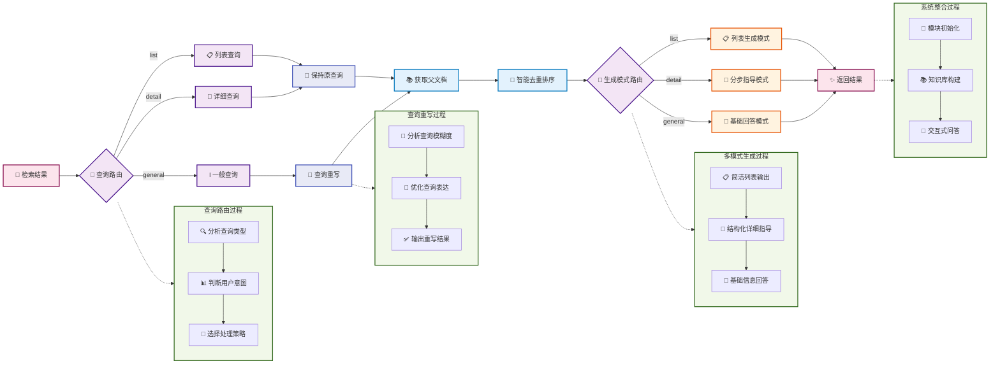

# Section 4 Generation Integration and System Integration

The boss is about to be defeated! In the last section, learn how to implement intelligent generation integration modules and integrate all modules into a complete RAG system.



## 1. Generate integrated module

The generation integration module is the "brain" of the entire RAG system, responsible for understanding user intent, routing query types, and generating high-quality answers.

> [generation_integration.py complete code](https://github.com/datawhalechina/all-in-rag/blob/main/code/C8/rag_modules/generation_integration.py)

### 1.1 Design ideas

**Intelligent query routing**: Automatically determine whether the user query is a list query, detailed query or general query, and select the most suitable generation strategy.

**Query rewriting optimization**: Intelligent rewriting of ambiguous queries to improve retrieval results. For example, rewrite "cooking" as "simple and easy home-cooked recipes".

**Multi-mode generation**:
- **List Mode**: Suitable for recommendation queries, returning a concise list of dishes
- **Detailed Mode**: Suitable for production queries, providing step-by-step detailed guidance
- **Basic Mode**: Suitable for general questions and provides general answers

> The two main methods mentioned above can be reviewed [**Query Reconstruction and Distribution**](https://github.com/datawhalechina/all-in-rag/blob/main/docs/chapter4/14_query_rewriting.md)

### 1.2 Class structure design

```python
class GenerationIntegrationModule:
    """生成集成模块 - 负责LLM集成和回答生成"""
    
    def __init__(self, model_name: str = "kimi-k2-0711-preview", 
                 temperature: float = 0.1, max_tokens: int = 2048):
        self.model_name = model_name
        self.temperature = temperature
        self.max_tokens = max_tokens
        self.llm = None
        self.setup_llm()
```

-`temperature`: Generate temperature, control the creativity of answers
-`max_tokens`: Maximum generated length
-`llm`: Moonshot Chat model example

### 1.3 Query routing implementation

```python
def query_router(self, query: str) -> str:
    """查询路由 - 根据查询类型选择不同的处理方式"""
    prompt = ChatPromptTemplate.from_template("""
根据用户的问题，将其分类为以下三种类型之一：

1. 'list' - 用户想要获取菜品列表或推荐，只需要菜名
   例如：推荐几个素菜、有什么川菜、给我3个简单的菜

2. 'detail' - 用户想要具体的制作方法或详细信息
   例如：宫保鸡丁怎么做、制作步骤、需要什么食材

3. 'general' - 其他一般性问题
   例如：什么是川菜、制作技巧、营养价值

请只返回分类结果：list、detail 或 general

用户问题: {query}

分类结果:""")
    
    # ... (LCEL链式调用)
    return result
```

Query routing is the key to the entire system and determines the subsequent processing flow. LLM automatically determines query intent, which is more accurate than simple keyword matching.

### 1.4 Query rewriting optimization

```python
def query_rewrite(self, query: str) -> str:
    """智能查询重写 - 让大模型判断是否需要重写查询"""
    # 使用LLM分析查询是否需要重写
    # 具体明确的查询（如"宫保鸡丁怎么做"）保持原样
    # 模糊查询（如"做菜"、"推荐个菜"）进行重写优化

    # ... (提示词设计和LCEL链式调用)
    return response
```

Query rewriting can convert ambiguous user input into queries more suitable for retrieval, significantly improving the usability of the system. The rewriting rules include: keeping the original meaning unchanged, adding relevant cooking terms, and giving priority to simple and easy-to-make dishes.

### 1.5 Multi-mode generation

**List mode generation**:
```python
def generate_list_answer(self, query: str, context_docs: List[Document]) -> str:
    """生成列表式回答 - 适用于推荐类查询"""
    # 提取菜品名称
    dish_names = []
    for doc in context_docs:
        dish_name = doc.metadata.get('dish_name', '未知菜品')
        if dish_name not in dish_names:
            dish_names.append(dish_name)
    
    # 构建简洁的列表回答
    if len(dish_names) <= 3:
        return f"为您推荐以下菜品：\n" + "\n".join([f"{i+1}. {name}" for i, name in enumerate(dish_names)])
    # ... (其他情况处理)
```

**Detailed pattern generation**:
```python
def generate_step_by_step_answer(self, query: str, context_docs: List[Document]) -> str:
    """生成分步骤回答"""
    # 使用结构化提示词，包含：
    # - 🥘 菜品介绍
    # - 🛒 所需食材
    # - 👨‍🍳 制作步骤
    # - 💡 制作技巧

    # ... (提示词设计和LCEL链式调用)
    return response
```

Detailed mode uses structured prompt word design, allowing LLM to generate step-by-step guidance with standardized formats and rich content, focusing on practicality and operability.

## 2. System integration

The main program is responsible for coordinating each module to implement the complete RAG process: data preparation → index construction → retrieval optimization → generation integration. It also provides practical functions such as index caching and interactive question and answer.

> [main.py complete code](https://github.com/datawhalechina/all-in-rag/blob/main/code/C8/main.py)

### 2.1 Main system class design

```python
class RecipeRAGSystem:
    """食谱RAG系统主类"""
    
    def __init__(self, config: RAGConfig = None):
        self.config = config or DEFAULT_CONFIG
        self.data_module = None
        self.index_module = None
        self.retrieval_module = None
        self.generation_module = None
        
        # 检查数据路径和API密钥
        if not Path(self.config.data_path).exists():
            raise FileNotFoundError(f"数据路径不存在: {self.config.data_path}")
        if not os.getenv("MOONSHOT_API_KEY"):
            raise ValueError("请设置 MOONSHOT_API_KEY 环境变量")
```

The main system class is responsible for coordinating all modules and ensuring the integrity and consistency of the system.

### 2.2 System initialization process

```python
def initialize_system(self):
    """初始化所有模块"""
    # 1. 初始化数据准备模块
    self.data_module = DataPreparationModule(self.config.data_path)
    
    # 2. 初始化索引构建模块
    self.index_module = IndexConstructionModule(
        model_name=self.config.embedding_model,
        index_save_path=self.config.index_save_path
    )
    
    # 3. 初始化生成集成模块
    self.generation_module = GenerationIntegrationModule(
        model_name=self.config.llm_model,
        temperature=self.config.temperature,
        max_tokens=self.config.max_tokens
    )
```

The initialization process is carried out in an orderly manner according to dependencies to ensure that each module can be set up correctly.

### 2.3 Knowledge base construction process

```python
def build_knowledge_base(self):
    """构建知识库"""
    # 1. 尝试加载已保存的索引
    vectorstore = self.index_module.load_index()
    
    if vectorstore is not None:
        # 加载已有索引，但仍需要文档和分块用于检索模块
        self.data_module.load_documents()
        chunks = self.data_module.chunk_documents()
    else:
        # 构建新索引的完整流程
        self.data_module.load_documents()
        chunks = self.data_module.chunk_documents()
        vectorstore = self.index_module.build_vector_index(chunks)
        self.index_module.save_index()
    
    # 初始化检索优化模块
    self.retrieval_module = RetrievalOptimizationModule(vectorstore, chunks)
```

This process uses the previously designed index caching mechanism, which can greatly improve the system startup speed.

### 2.4 Intelligent question and answer process

```python
def ask_question(self, question: str, stream: bool = False):
    """回答用户问题"""
    # 1. 查询路由
    route_type = self.generation_module.query_router(question)

    # 2. 智能查询重写（根据路由类型）
    if route_type == 'list':
        rewritten_query = question  # 列表查询保持原样
    else:
        rewritten_query = self.generation_module.query_rewrite(question)

    # 3. 检索相关子块
    relevant_chunks = self.retrieval_module.hybrid_search(rewritten_query, top_k=self.config.top_k)

    # 4. 根据路由类型选择回答方式
    if route_type == 'list':
        # 列表查询：返回菜品名称列表
        relevant_docs = self.data_module.get_parent_documents(relevant_chunks)
        return self.generation_module.generate_list_answer(question, relevant_docs)
    else:
        # 详细查询：获取完整文档并生成详细回答
        relevant_docs = self.data_module.get_parent_documents(relevant_chunks)

        if route_type == "detail":
            # 详细查询使用分步指导模式
            return self.generation_module.generate_step_by_step_answer(question, relevant_docs)
        else:
            # 一般查询使用基础回答模式
            return self.generation_module.generate_basic_answer(question, relevant_docs)
```

This part shows the program execution flow: intelligent routing → query optimization → hybrid retrieval → parent-child document processing → multi-mode generation.

### 2.5 Practical usage examples

#### 2.5.1 Effects of different query types

**List query example**:
```
用户问题: "推荐几道简单的素菜"
查询类型: list
生成结果:
为您推荐以下菜品：
1. 西红柿炒鸡蛋
2. 土豆丝
3. 青椒炒豆腐
```

**Detailed query example**:
```
用户问题: "宫保鸡丁怎么做？"
查询类型: detail
生成结果:
## 🥘 菜品介绍
宫保鸡丁是一道经典川菜，口感麻辣鲜香...

## 🛒 所需食材
- 鸡胸肉 300g
- 花生米 100g
- 干辣椒 10个
...

## 👨‍🍳 制作步骤
1. 鸡肉切丁，用料酒和生抽腌制15分钟
2. 热锅下油，爆炒花生米至微黄盛起
...
```

#### 2.5.2 Interactive Q&A

The system provides a complete command line interactive interface, and a welcome message of "Have a taste of the salty RAG system" will be displayed when starting:

```python
def run_interactive(self):
    """运行交互式问答"""
    print("=" * 60)
    print("🍽️  尝尝咸淡RAG系统 - 交互式问答  🍽️")
    print("=" * 60)
    print("💡 解决您的选择困难症，告别'今天吃什么'的世纪难题！")

    # 初始化系统和构建知识库
    self.initialize_system()
    self.build_knowledge_base()

    while True:
        user_input = input("\n您的问题: ").strip()
        if user_input.lower() in ['退出', 'quit', 'exit']:
            break

        # 询问是否使用流式输出
        stream_choice = input("是否使用流式输出? (y/n, 默认y): ").strip().lower()
        use_stream = stream_choice != 'n'

        if use_stream:
            # 流式输出，实时显示生成过程
            for chunk in self.ask_question(user_input, stream=True):
                print(chunk, end="", flush=True)
        else:
            # 普通输出
            answer = self.ask_question(user_input, stream=False)
            print(answer)
```

**Example of running effect**:
```
============================================================
🍽️  尝尝咸淡RAG系统 - 交互式问答  🍽️
============================================================
💡 解决您的选择困难症，告别'今天吃什么'的世纪难题！

✅ 成功加载已保存的向量索引！
✅ 系统初始化完成！

您的问题: 推荐几道简单的素菜
是否使用流式输出? (y/n, 默认y): y

为您推荐以下素菜：
1. 西红柿炒鸡蛋 - 经典家常菜，简单易做
2. 土豆丝 - 爽脆可口，适合新手
3. 青椒炒豆腐 - 营养丰富，制作简单
```

Streaming output is implemented through LangChain's`chain.stream()`method, which returns a generator that yields one text fragment each time. In the interactive interface, each segment is output in real time via`print(chunk, end="", flush=True)`,`end=""`avoids line breaks, and`flush=True`ensures immediate display, achieving a word-for-word streaming effect.

## 3. Optimization direction

Although the current system already has complete RAG functions, there is still a lot of room for optimization. Future optimization can focus on the integration and deepening of several key directions: Recipe data can be built into a knowledge graph through **Integrated Graph Database** to reveal the complex relationships between ingredients, dishes and cooking methods, thereby supporting complex relationship queries (such as "What are the ingredients that go with chicken"), exploring potential ingredient combinations and implementing graph-based intelligent recommendations. It can also **integrate multi-modal data**, combine visual information such as pictures of dishes, and use multi-modal models to perform joint image and text retrieval. It can not only support the visual search of "what dish is this", but also recommend relevant recipes through image recognition of ingredients. Or through **Enhanced Professional Knowledge**, integrating external knowledge sources such as nutritional ingredient database, cooking skills knowledge map, and ingredient substitution rule library, the system will be able to provide accurate nutritional analysis, professional cooking guidance, and flexibly adapt to the user's dietary allergies or personal preferences.