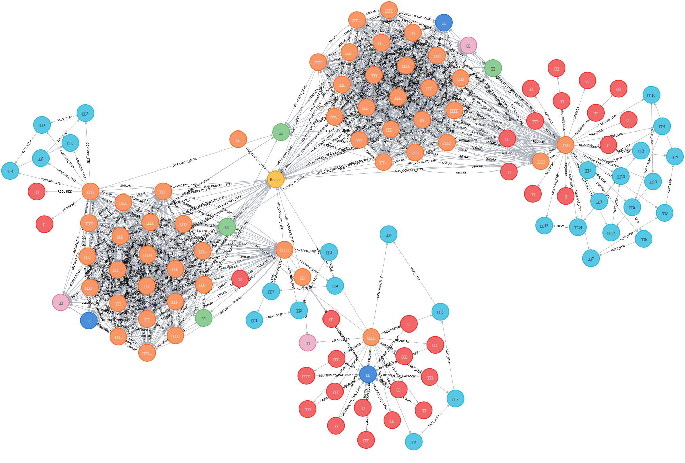

# Section 1 Figure RAG system architecture and environment configuration

> Based on the previous chapters, let’s build a more advanced graph RAG system. By introducing the Neo4j graph database and intelligent query routing mechanism, real knowledge graph enhanced retrieval is achieved, solving the limitations of traditional RAG in complex queries and relational reasoning.



## 1. Project background and goals

### 1.1 Evolution from traditional RAG to graph RAG

In the previous chapter, we built a traditional RAG system based on vector retrieval, using the blocking strategy of parent-child text blocks, which can effectively answer simple recipe queries. However, there are still obvious limitations when dealing with complex relational reasoning and multi-hop queries:

- **Missing relationship understanding**: Although parent-child chunking maintains the document structure, it cannot explicitly model the semantic relationships between ingredients, recipes, and cooking methods.
- **Difficulty in cross-document association**: It is difficult to find implicit connections such as similarities and substitution relationships between different recipes
- **Limited reasoning ability**: Lack of multi-hop reasoning capabilities based on knowledge graphs, making it difficult to answer questions that require complex logical reasoning

### 1.2 Core advantages of graph RAG system

By introducing knowledge graphs, our new system will have:

- **Structured Knowledge Representation**: Explicitly encode semantic relationships between entities in the form of graphs
- **Enhanced reasoning capabilities**: Supports multi-hop reasoning and complex relationship queries
- **Intelligent query routing**: Automatically select the most suitable retrieval strategy based on query complexity
- **Factuality and Interpretability**: Reasoning paths based on graph structures provide traceable answers

## 2. Environment configuration

> If external access is required, the local or server environment needs to be changed

### 2.1 Create a virtual environment

```bash
# 使用conda创建环境
conda create -n graph-rag python=3.12.7
conda activate graph-rag
```

### 2.2 Install core dependencies

```bash
cd code/C9
pip install -r requirements.txt
```

### 2.3 Neo4j database configuration

Use Docker Compose to install Neo4j. The configuration file is located at [`data/C9/docker-compose.yml`](https://github.com/datawhalechina/all-in-rag/blob/main/data/C9/docker-compose.yml):

#### 2.3.1 Start Neo4j service

```bash
# 进入docker-compose.yml所在目录
cd data/C9

# 启动Neo4j服务
docker-compose up -d

# 检查服务状态
docker-compose ps
```

#### 2.3.2 Access the Neo4j web interface

After successful startup, you can access through the following methods:
- **Web Interface**: http://localhost:7474
- **Username**: neo4j
- **Password**: all-in-rag

> The current URL is for local access. If you deploy it on a remote server, you need to change`localhost`to your server IP address.

#### 2.3.3 Data import

Docker Compose configuration includes automatic data import function. The following steps are automatically performed when starting the service:

1. **Waiting for Neo4j service to be ready**: Ensure the database is available through health check
2. **Execute import script**: Automatically run`data/C9/cypher/neo4j_import.cypher`
3. **Import recipe data**: including nodes and relationships such as recipes, ingredients, cooking steps, etc.

Imported data includes:
- **Recipe Node**: Contains information such as dish name, difficulty, cooking time, cuisine, etc.
- **Food Node**: Contains food name, classification, nutritional information, etc.
- **Cooking Step Node**: Contains step descriptions, cooking methods, required tools, etc.
- **Relationship Network**: The complex relationship between recipes, ingredients, and steps

If you need to re-import the data manually:

```bash
# 进入容器执行导入脚本
docker exec -it neo4j-db cypher-shell -u neo4j -p all-in-rag -f /import/cypher/neo4j_import.cypher
```

### 2.4 Milvus vector database configuration

#### 2.4.1 Install Milvus using Docker

> If you have already installed it before, you can skip this step and confirm that the Milvus service is running through`docker-compose ps`.

```bash
# 下载Milvus standalone配置文件
wget https://github.com/milvus-io/milvus/releases/download/v2.5.11/milvus-standalone-docker-compose.yml -O docker-compose.yml

# 启动Milvus
docker-compose up -d
```

#### 2.4.2 Verify installation

```bash
# 检查Milvus服务状态
docker-compose ps
```

### 2.5 Configure connection parameters

Create the`.env`file in the project root directory:

```env
# Neo4j配置
NEO4J_URI=bolt://localhost:7687
NEO4J_USER=neo4j
NEO4J_PASSWORD=all-in-rag
NEO4J_DATABASE=neo4j

# Milvus配置
MILVUS_HOST=localhost
MILVUS_PORT=19530

# LLM API配置
MOONSHOT_API_KEY=your_api_key_here
```

## 3. System architecture design

### 3.1 Overall architecture

Our graph RAG system adopts a modular design and contains the following core components:

```mermaid
flowchart TD
    %% 系统启动和初始化
    START["🚀 启动高级图RAG系统"] --> CONFIG["⚙️ 加载配置<br/>GraphRAGConfig"]
    CONFIG --> INIT_CHECK{"🔍 检查系统依赖"}
    
    %% 依赖检查
    INIT_CHECK -->|Neo4j连接失败| NEO4J_ERROR["❌ Neo4j连接错误<br/>检查图数据库状态"]
    INIT_CHECK -->|Milvus连接失败| MILVUS_ERROR["❌ Milvus连接错误<br/>检查向量数据库"]
    INIT_CHECK -->|LLM API失败| LLM_ERROR["❌ LLM API错误<br/>检查API密钥"]
    INIT_CHECK -->|依赖正常| INIT_MODULES["✅ 初始化核心模块"]
    
    %% 知识库状态检查
    INIT_MODULES --> KB_CHECK{"📚 检查知识库状态"}
    KB_CHECK -->|Milvus集合存在| LOAD_KB["⚡ 加载已存在知识库"]
    KB_CHECK -->|集合不存在| BUILD_KB["🔨 构建新知识库"]
    
    %% 加载已有知识库
    LOAD_KB --> LOAD_SUCCESS{"加载成功？"}
    LOAD_SUCCESS -->|成功| SYSTEM_READY["✅ 系统就绪<br/>显示统计信息"]
    LOAD_SUCCESS -->|失败| REBUILD_KB["🔄 重建知识库"]
    
    %% 构建新知识库流程
    BUILD_KB --> NEO4J_LOAD["🔗 从Neo4j加载图数据<br/>菜谱、食材、烹饪步骤节点"]
    REBUILD_KB --> NEO4J_LOAD
    NEO4J_LOAD --> BUILD_DOCS["📝 构建结构化菜谱文档<br/>组合图数据为完整文档"]
    BUILD_DOCS --> CHUNK_DOCS["✂️ 智能文档分块<br/>按章节或长度分块"]
    CHUNK_DOCS --> BUILD_VECTOR["🎯 构建Milvus向量索引"]
    BUILD_VECTOR --> SYSTEM_READY
    
    %% 用户交互循环
    SYSTEM_READY --> USER_INPUT["👤 用户输入查询"]
    USER_INPUT --> SPECIAL_CMD{"🔍 特殊命令检查"}
    
    %% 特殊命令处理
    SPECIAL_CMD -->|stats| STATS["📊 显示系统统计<br/>路由统计、知识库状态"]
    SPECIAL_CMD -->|rebuild| REBUILD_CMD["🔄 重建知识库命令"]
    SPECIAL_CMD -->|quit| EXIT["👋 退出系统"]
    
    %% 普通查询处理 - 智能路由核心
    SPECIAL_CMD -->|普通查询| QUERY_ANALYSIS["🧠 深度查询分析"]
    
    %% 查询分析的四个维度
    QUERY_ANALYSIS --> COMPLEXITY_ANALYSIS["📊 复杂度分析<br/>0.0-0.3: 简单查找<br/>0.4-0.7: 中等复杂<br/>0.8-1.0: 高复杂推理"]
    QUERY_ANALYSIS --> RELATION_ANALYSIS["🔗 关系密集度分析<br/>0.0-0.3: 单一实体<br/>0.4-0.7: 实体关系<br/>0.8-1.0: 复杂关系网络"]
    QUERY_ANALYSIS --> REASONING_ANALYSIS["🤔 推理需求判断<br/>多跳推理？因果分析？<br/>对比分析？"]
    QUERY_ANALYSIS --> ENTITY_ANALYSIS["🏷️ 实体识别统计<br/>实体数量和类型"]
    
    %% LLM智能分析
    COMPLEXITY_ANALYSIS --> LLM_ANALYSIS["🤖 LLM智能分析<br/>综合评估查询特征"]
    RELATION_ANALYSIS --> LLM_ANALYSIS
    REASONING_ANALYSIS --> LLM_ANALYSIS
    ENTITY_ANALYSIS --> LLM_ANALYSIS
    
    %% 分析结果和降级处理
    LLM_ANALYSIS --> ANALYSIS_SUCCESS{"分析成功？"}
    ANALYSIS_SUCCESS -->|成功| ROUTE_DECISION["🎯 智能路由决策"]
    ANALYSIS_SUCCESS -->|失败| RULE_FALLBACK["📋 降级到规则分析<br/>基于关键词匹配"]
    RULE_FALLBACK --> ROUTE_DECISION
    
    %% 三种检索策略路由
    ROUTE_DECISION -->|简单查询<br/>复杂度<0.4| HYBRID_SEARCH["🔍 传统混合检索<br/>保底策略"]
    ROUTE_DECISION -->|复杂推理<br/>关系密集>0.7| GRAPH_RAG_SEARCH["🕸️ 图RAG检索<br/>高级复杂策略"]
    ROUTE_DECISION -->|中等复杂<br/>需要组合| COMBINED_SEARCH["🔄 组合检索策略<br/>融合两种方法"]
    
    %% 检索执行和错误处理
    HYBRID_SEARCH --> HYBRID_SUCCESS{"检索成功？"}
    GRAPH_RAG_SEARCH --> GRAPH_SUCCESS{"检索成功？"}
    COMBINED_SEARCH --> COMBINED_SUCCESS{"检索成功？"}
    
    %% 高级策略失败时降级到传统混合检索
    GRAPH_SUCCESS -->|失败| FALLBACK_TO_HYBRID["⬇️ 降级到传统混合检索<br/>保底方案"]
    COMBINED_SUCCESS -->|失败| FALLBACK_TO_HYBRID
    
    %% 传统混合检索失败时直接异常
    HYBRID_SUCCESS -->|失败| SYSTEM_ERROR["❌ 系统检索异常<br/>传统混合检索失败<br/>无更低级降级"]
    FALLBACK_TO_HYBRID --> FALLBACK_SUCCESS{"降级检索成功？"}
    FALLBACK_SUCCESS -->|失败| SYSTEM_ERROR
    
    %% 成功路径
    HYBRID_SUCCESS -->|成功| GENERATE["🎨 生成回答"]
    GRAPH_SUCCESS -->|成功| GENERATE
    COMBINED_SUCCESS -->|成功| GENERATE
    FALLBACK_SUCCESS -->|成功| GENERATE
    
    %% 固定的流式输出
    GENERATE --> STREAM_OUTPUT["📺 流式输出回答<br/>use_stream = True<br/>逐字符实时显示"]
    
    %% 统计更新和循环
    STREAM_OUTPUT --> UPDATE_STATS["📈 更新路由统计"]
    UPDATE_STATS --> USER_INPUT
    
    %% 特殊命令返回循环
    STATS --> USER_INPUT
    REBUILD_CMD --> BUILD_KB
    
    %% 错误处理返回
    NEO4J_ERROR --> EXIT
    MILVUS_ERROR --> EXIT
    LLM_ERROR --> EXIT
    SYSTEM_ERROR --> USER_INPUT
    
    %% 详细子流程
    subgraph DataFlow ["📊 图数据处理流程"]
        NEO4J_DB["🗄️ Neo4j图数据库<br/>存储菜谱、食材、烹饪步骤<br/>以及它们之间的关系网络"]
        RECIPE_BUILD["📝 结构化菜谱文档构建<br/>菜谱名称 + 分类 + 难度<br/>+ 食材列表 + 制作步骤<br/>+ 时间信息 + 标签"]
        DOC_CHUNK["✂️ 智能文档分块<br/>按章节分块：## 所需食材、## 制作步骤<br/>或按长度分块：chunk_size=500<br/>重叠处理：chunk_overlap=50"]
        MILVUS_INDEX["🎯 Milvus向量索引<br/>BGE-small-zh-v1.5<br/>512维向量空间"]
        
        NEO4J_DB --> RECIPE_BUILD
        RECIPE_BUILD --> DOC_CHUNK
        DOC_CHUNK --> MILVUS_INDEX
    end

    subgraph HybridFlow ["🔍 传统混合检索流程（保底）"]
        DUAL_RETRIEVAL["🎯 双层检索<br/>实体级+主题级"]
        VECTOR_SEARCH["📊 增强向量检索<br/>语义相似度匹配"]
        BM25_SEARCH["🔤 BM25关键词检索<br/>jieba分词+停用词过滤"]
        RRF_MERGE["⚖️ RRF融合<br/>Reciprocal Rank Fusion<br/>三路排名加权求和"]
        PARENT_DOC["📄 父文档回填（可选）<br/>chunk→整篇父菜谱<br/>保证上下文完整性"]
        INTERNAL_FALLBACK["🔧 内部降级机制<br/>关键词提取失败→简单分词<br/>图索引不足→Neo4j补充<br/>Neo4j失败→静默失败"]
        
        DUAL_RETRIEVAL --> RRF_MERGE
        VECTOR_SEARCH --> RRF_MERGE
        BM25_SEARCH --> RRF_MERGE
        INTERNAL_FALLBACK --> RRF_MERGE
        RRF_MERGE --> PARENT_DOC
    end
    
    subgraph GraphRAGFlow ["🕸️ 图RAG检索流程（高级复杂）"]
        GRAPH_UNDERSTAND["🧠 图查询理解<br/>entity_relation/multi_hop<br/>subgraph/path_finding"]
        MULTI_HOP["🔄 多跳图遍历<br/>最大深度3跳<br/>发现隐含关联"]
        SUBGRAPH_EXTRACT["🕸️ 知识子图提取<br/>完整知识网络<br/>最大100节点"]
        GRAPH_REASONING["🤔 图结构推理<br/>推理链构建<br/>可信度验证"]
        
        GRAPH_UNDERSTAND --> MULTI_HOP
        GRAPH_UNDERSTAND --> SUBGRAPH_EXTRACT
        MULTI_HOP --> GRAPH_REASONING
        SUBGRAPH_EXTRACT --> GRAPH_REASONING
    end
    
    subgraph CombinedFlow ["🔄 组合检索流程"]
        SPLIT_QUOTA["📊 分配检索配额<br/>traditional_k = top_k // 2<br/>graph_k = top_k - traditional_k"]
        PARALLEL_SEARCH["⚡ 并行执行检索<br/>传统检索 + 图RAG检索"]
        ROUND_ROBIN["🔄 Round-robin合并<br/>交替添加结果<br/>图RAG优先"]
        DEDUP["🧹 去重和排序<br/>基于内容哈希"]
        
        SPLIT_QUOTA --> PARALLEL_SEARCH
        PARALLEL_SEARCH --> ROUND_ROBIN
        ROUND_ROBIN --> DEDUP
    end
    
    subgraph FallbackStrategy ["⬇️ 降级策略（有限降级）"]
        LEVEL3["🕸️ 图RAG检索<br/>最高级：多跳推理+子图提取"]
        LEVEL2["🔄 组合检索<br/>中级：融合两种方法"]
        LEVEL1["🔍 传统混合检索<br/>保底：无更低级降级"]
        ERROR_LEVEL["❌ 系统异常<br/>传统混合检索失败"]
        
        LEVEL3 -->|失败| LEVEL1
        LEVEL2 -->|失败| LEVEL1
        LEVEL1 -->|失败| ERROR_LEVEL
    end
    
    %% 样式定义
    classDef startup fill:#e3f2fd,stroke:#0277bd,stroke-width:2px
    classDef config fill:#f1f8e9,stroke:#388e3c,stroke-width:2px
    classDef basic fill:#fff3e0,stroke:#f57c00,stroke-width:2px
    classDef advanced fill:#e8eaf6,stroke:#3f51b5,stroke-width:2px
    classDef knowledge fill:#e8f5e8,stroke:#1b5e20,stroke-width:2px
    classDef analysis fill:#f3e5f5,stroke:#4a148c,stroke-width:2px
    classDef routing fill:#e1f5fe,stroke:#01579b,stroke-width:2px
    classDef generation fill:#fce4ec,stroke:#880e4f,stroke-width:2px
    classDef userflow fill:#fff8e1,stroke:#f57c00,stroke-width:2px
    classDef error fill:#ffebee,stroke:#c62828,stroke-width:2px
    classDef success fill:#e8f5e8,stroke:#2e7d32,stroke-width:2px
    classDef fallback fill:#fff3e0,stroke:#ff6f00,stroke-width:2px
    classDef stream fill:#e1f5fe,stroke:#0288d1,stroke-width:2px
    classDef combined fill:#f3e5f5,stroke:#7b1fa2,stroke-width:2px
    classDef graphdata fill:#e8f5e8,stroke:#2e7d32,stroke-width:2px
    
    %% 应用样式
    class START,INIT_MODULES,SYSTEM_READY startup
    class CONFIG config
    class HYBRID_SEARCH,HybridFlow,LEVEL1 basic
    class GRAPH_RAG_SEARCH,GraphRAGFlow,LEVEL3 advanced
    class KB_CHECK,LOAD_KB,BUILD_KB,NEO4J_LOAD,BUILD_DOCS,CHUNK_DOCS,BUILD_VECTOR knowledge
    class QUERY_ANALYSIS,COMPLEXITY_ANALYSIS,RELATION_ANALYSIS,REASONING_ANALYSIS,ENTITY_ANALYSIS,LLM_ANALYSIS analysis
    class ROUTE_DECISION,ANALYSIS_SUCCESS,RULE_FALLBACK routing
    class GENERATE generation
    class USER_INPUT,SPECIAL_CMD,STATS,REBUILD_CMD,EXIT userflow
    class NEO4J_ERROR,MILVUS_ERROR,LLM_ERROR,SYSTEM_ERROR,ERROR_LEVEL error
    class LOAD_SUCCESS,INIT_CHECK,HYBRID_SUCCESS,GRAPH_SUCCESS,COMBINED_SUCCESS,FALLBACK_SUCCESS success
    class FALLBACK_TO_HYBRID,FallbackStrategy fallback
    class STREAM_OUTPUT,UPDATE_STATS stream
    class COMBINED_SEARCH,CombinedFlow,LEVEL2 combined
    class DataFlow,NEO4J_DB graphdata
```



### 3.2 Core module description

#### GraphDataPreparationModule
- **Function**: Connect to Neo4j database, load graph data, and build structured recipe documents
- **Features**: Supports intelligent conversion of graph data into documents, maintaining the integrity of the knowledge structure

#### Vector index module (MilvusIndexConstructionModule)
- **Function**: Build and manage Milvus vector index, support semantic similarity retrieval
- **Features**: Using BGE-small-zh-v1.5 model, 512-dimensional vector space

#### Hybrid Retrieval Module (HybridRetrievalModule)
- **Function**: Traditional hybrid retrieval strategy, three-way recall (double-layer retrieval + vector retrieval + BM25) fused by RRF
- **Features**: Double-layer retrieval (entity level + topic level), BM25 keyword retrieval (jieba word segmentation), RRF ranking fusion, optional parent document backfill

#### Graph RAG retrieval module (GraphRAGRetrieval)
- **Function**: Advanced retrieval based on graph structure, supporting multi-hop reasoning and subgraph extraction
- **Features**: Graph query understanding, multi-hop traversal, knowledge subgraph extraction

#### Intelligent Query Router (IntelligentQueryRouter)
- **Function**: Analyze query characteristics and automatically select the most suitable search strategy
- **Features**: LLM-driven query analysis, dynamic strategy selection

#### Generate integration module (GenerationIntegrationModule)
- **Function**: Generate final answer based on search results, support streaming output
- **Features**: Adaptive generation strategy, error handling and retry mechanism

### 3.3 Data flow

1. **Data preparation phase**:
- Load graph data (recipes, ingredients, step nodes and their relationships) from Neo4j
- Build structured recipe documents to maintain knowledge integrity
- Intelligent document chunking, supporting dual chunking strategies for chapters and lengths
- Build Milvus vector index to support semantic retrieval

2. **Query processing phase**:
- User input query
- Intelligent query router analyzes query characteristics (complexity, relationship density, reasoning requirements)
- Select a search strategy based on the analysis results:
- Simple query → traditional hybrid search
- Complex reasoning → Graph RAG retrieval
- Moderately complex → combined search strategies
- Perform corresponding retrieval operations
- The generation module generates answers based on the search results

3. **Error handling and downgrade**:
- Automatically downgrade to traditional hybrid retrieval when advanced strategies fail
- System exception is returned when traditional hybrid retrieval fails
- Support automatic retry mechanism when streaming output is interrupted

## 4. Project file structure

```
code/C9/
├── main.py                          # 主程序入口
├── config.py                        # 配置文件
├── requirements.txt                 # 依赖包列表
└── rag_modules/                     # RAG模块包
    ├── __init__.py
    ├── graph_data_preparation.py    # 图数据准备模块
    ├── milvus_index_construction.py # Milvus索引构建模块
    ├── hybrid_retrieval.py          # 混合检索模块
    ├── graph_rag_retrieval.py       # 图RAG检索模块
    ├── intelligent_query_router.py  # 智能查询路由器
    └── generation_integration.py    # 生成集成模块
```

## 5. Quick start

### 5.1 Start the system

```bash
# 确保Neo4j和Milvus服务已启动
python main.py
```

### 5.2 System initialization

When running for the first time, the system will automatically:
1. Check and connect Neo4j and Milvus databases
2. Load graph data and build recipe document
3. Create vector index
4. Initialize each search module
5. Display system statistics

### 5.3 Interactive Q&A

After the system is started, interactive Q&A can be conducted:

```
您的问题: 川菜有哪些特色菜？
您的问题: 如何制作宫保鸡丁？
您的问题: 减肥期间适合吃什么菜？
您的问题: stats  # 查看系统统计
您的问题: quit   # 退出系统
```
