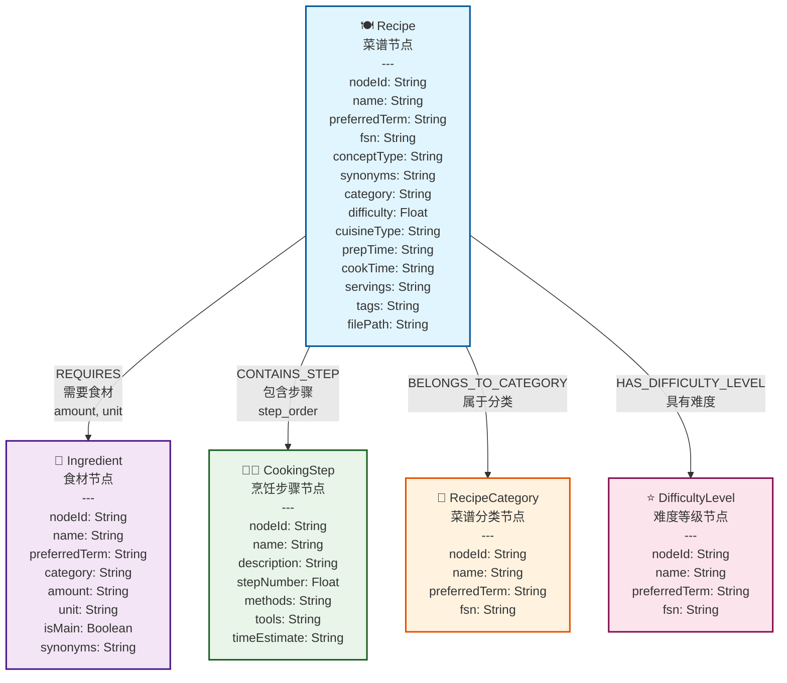
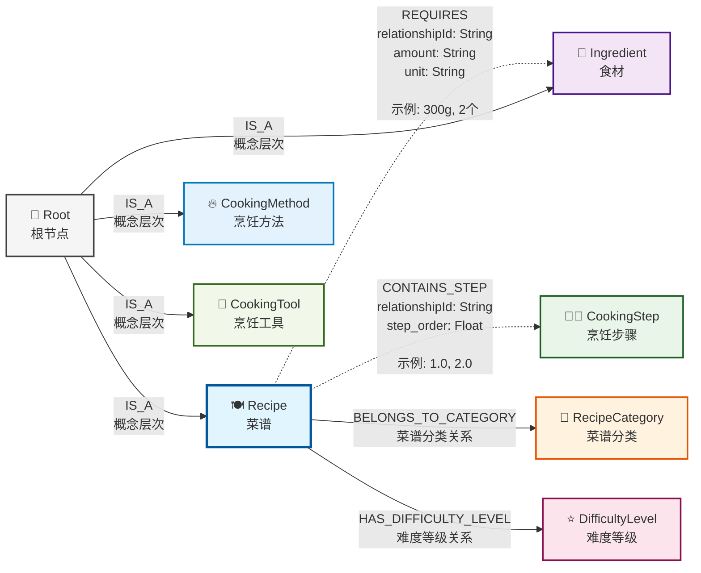

# Section 2 Graph data modeling and Neo4j integration

> [Complete code of this section](https://github.com/datawhalechina/all-in-rag/blob/main/code/C9/rag_modules/graph_data_preparation.py)

## 1. Data source and conversion

### 1.1 Conversion from Markdown to graph data

The graph data in this chapter comes from the Markdown format recipe data used in Chapter 8. In order to build a knowledge graph, the author used AI to develop a simple [Agent](https://github.com/datawhalechina/all-in-rag/tree/main/code/C9/agent(%E4%BB%A3%E7%A0%81%E7%B3%BBai%E7%94%9F%E6%88%90)), which converted the structured Markdown recipe data into CSV format graph data through LLM.

**Conversion process**:
1. **Read Markdown recipes**: Load recipe files from the data source in Chapter 8
2. **LLM parsing and extraction**: Use large language models to identify and extract entities and relationships
3. **Structured output**: Generate nodes.csv and relationships.csv files
4. **Graph data import**: Import Neo4j database through Cypher script

### 1.2 Graph data file structure

The converted graph data contains two core files:

```
data/C9/cypher/
├── nodes.csv          # 节点数据（菜谱、食材、步骤等）
├── relationships.csv  # 关系数据（菜谱-食材、菜谱-步骤等）
└── neo4j_import.cypher # 数据导入脚本
```

## 2. Graph data model design

### 2.1 Actual data structure analysis

Based on the actual graph data converted by LLM, the knowledge graph contains the following core entity types. If you have game reverse engineering experience, you can think of these entity types as object classes in the Unreal Engine cooking game. The relationship between nodes is like pointer references between objects:

**Core Entity Types**:
- **Recipe**: specific dish, including attributes such as difficulty, cuisine, time, etc.
- **Ingredient**: Ingredients needed to make dishes, including classification, dosage, unit, etc.
- **CookingStep**: Detailed cooking steps, including methods, tools, and time estimates
- **CookingMethod**: cooking techniques such as stir-frying, boiling, steaming, and frying
- **CookingTool**: such as woks, steamers, knives, etc.
- **DifficultyLevel**: Difficulty rating from one to five stars
- **RecipeCategory**: Vegetarian dishes, meat dishes, aquatic products, breakfast, etc.

**Actual data features**:
- **Unified Coding System**: Use nodeId for unique identification (such as 201000001)
- **Multi-language support**: including preferredTerm, fsn and other multi-language fields
- **Rich Attributes**: Each entity contains detailed attribute information
- **Hierarchical structure**: hierarchical organization from abstract concepts to concrete examples

### 2.2 Actual node model

Graph data model based on real data:



**Node type description**:

- **🍽️ Recipe (recipe node)**: core entity, containing complete information of the recipe
- **🥬 Ingredient**: Ingredient information required to make recipes
- **👨‍🍳 CookingStep (cooking step node)**: Detailed production steps and methods
- **📂 RecipeCategory (recipe classification node)**: Dishes classification (vegetarian dishes, meat dishes, aquatic products, etc.)
- **⭐ DifficultyLevel (difficulty level node)**: Production difficulty level (one star to five stars)

### 2.3 Actual relationship model

Relational structure based on actual data:



**Relationship type description**:

| Relationship encoding | Relationship type | Description | Properties |
|---------|---------|------|------|
| **801000001** | REQUIRES | Recipe-ingredient relationship | relationshipId, amount, unit |
| **801000003** | CONTAINS_STEP | Recipe-step relationship | relationshipId, step_order |
| **801000004** | HAS_DIFFICULTY_LEVEL | Recipe-difficulty relationship | relationshipId |
| **801000005** | BELONGS_TO_CATEGORY | Recipe-category relationship | relationshipId |

**Relationship Features**:
- **Dotted Arrow**: Indicates relationships with rich attributes (such as REQUIRES, CONTAINS_STEP)
- **Solid arrow**: indicates a simple classification relationship
- **Hierarchical structure**: Root node serves as the top node of the concept hierarchy

## 3. Neo4j data import

### 3.1 Data preparation script

The system handles the loading and management of graph data through`GraphDataPreparationModule`:

```python
class GraphDataPreparationModule:
    def __init__(self, neo4j_config: dict):
        """
        初始化图数据准备模块
        
        Args:
            neo4j_config: Neo4j连接配置
        """
        self.driver = GraphDatabase.driver(
            neo4j_config['uri'],
            auth=(neo4j_config['user'], neo4j_config['password'])
        )
        
    def load_graph_data(self) -> List[Dict]:
        """
        从Neo4j加载图数据
        
        Returns:
            包含菜谱信息的字典列表
        """
        query = """
        MATCH (r:Recipe)
        OPTIONAL MATCH (r)-[:REQUIRES]->(i:Ingredient)
        OPTIONAL MATCH (r)-[:HAS_STEP]->(s:Step)
        OPTIONAL MATCH (r)-[:BELONGS_TO]->(c:Category)
        RETURN r, collect(DISTINCT i) as ingredients, 
               collect(DISTINCT s) as steps,
               collect(DISTINCT c) as categories
        ORDER BY r.name
        """
        
        with self.driver.session() as session:
            result = session.run(query)
            return [record for record in result]
```

### 3.2 Actual CSV data format

Converted CSV file format (based on actual data):

**nodes.csv structure**:
```csv
nodeId,labels,name,preferredTerm,fsn,conceptType,synonyms,category,difficulty,cuisineType,prepTime,cookTime,servings,tags,filePath,amount,unit,isMain,description,stepNumber,methods,tools,timeEstimate
```

**Actual Data Example**:
```csv
201000184,Recipe,干煎阿根廷红虾,干煎阿根廷红虾,,Recipe,"[{'term': '干pan-fried阿根廷红虾', 'language': 'zh'}]",水产,3.0,,提前1天冷藏解冻+10分钟,约5分钟,1人,"趁热吃,柠檬可增酸提味",dishes\aquatic\干煎阿根廷红虾\干煎阿根廷红虾.md,,,,,,,,
201000185,Ingredient,阿根廷红虾,阿根廷红虾,,Ingredient,,蛋白质,,,,,,,,2-3,只,True,,,,,
201000196,CookingStep,步骤1,步骤1,,CookingStep,,,,,,,,,,,,,阿根廷红虾提前1天从速冻取出放到冷藏里自然解冻,1.0,解冻,冰箱,24小时
```

**relationships.csv structure**:
```csv
startNodeId,endNodeId,relationshipType,relationshipId,amount,unit,step_order
```

**Actual relationship example**:
```csv
201000184,201000185,801000001,R_000001,2-3,只,
201000184,201000196,801000003,R_000010,,,1.0
201000184,720000000,801000002,R_000020,,,
```

## 4. Graph data query and retrieval

### 4.1 Basic query mode

#### Simple entity query
```cypher
// 查找所有水产类菜谱
MATCH (r:Recipe)
WHERE r.category = "水产"
RETURN r.name, r.difficulty, r.prepTime, r.cookTime

// 查找包含特定食材的菜谱
MATCH (r:Recipe)-[:REQUIRES]->(i:Ingredient)
WHERE i.name CONTAINS "虾"
RETURN r.name, r.difficulty, i.name, i.amount, i.unit

// 使用全文搜索查找菜谱
CALL db.index.fulltext.queryNodes("recipe_fulltext_index", "川菜 OR 辣椒")
YIELD node, score
RETURN node.name, node.category, score
ORDER BY score DESC
```

#### Multi-hop relationship query
```cypher
// 查找某个难度等级的所有菜谱（基于属性查询）
MATCH (r:Recipe)
WHERE r.difficulty = 3.0
RETURN r.name, r.category, r.prepTime, r.cookTime, r.difficulty

// 查找菜谱的完整制作流程
MATCH (r:Recipe {name: "干煎阿根廷红虾"})-[:CONTAINS_STEP]->(s:CookingStep)
RETURN r.name, s.stepNumber, s.description, s.methods, s.tools
ORDER BY s.stepNumber
```

### 4.2 Complex reasoning query

#### Recipe recommendation based on constraints
```cypher
// 查找适合新手的简单菜谱（低难度、步骤少）
MATCH (r:Recipe)
WHERE r.difficulty <= 2.0
  AND r.stepCount <= 5
RETURN r.name, r.difficulty, r.stepCount, r.category
ORDER BY r.difficulty, r.stepCount

// 查找制作时间短的菜谱
MATCH (r:Recipe)
WHERE r.prepTime IS NOT NULL AND r.cookTime IS NOT NULL
  AND r.prepTime CONTAINS "分钟" AND r.cookTime CONTAINS "分钟"
RETURN r.name, r.prepTime, r.cookTime, r.category
ORDER BY r.name
```

#### Recipe combination recommendations
```cypher
// 查找同一分类下的不同菜谱
MATCH (r1:Recipe), (r2:Recipe)
WHERE r1.category = r2.category
  AND r1.category = "水产"
  AND r1.nodeId <> r2.nodeId
RETURN r1.name, r2.name, r1.category
LIMIT 5

// 查找包含相同食材的不同菜谱
MATCH (r1:Recipe)-[:REQUIRES]->(i:Ingredient)<-[:REQUIRES]-(r2:Recipe)
WHERE r1.nodeId <> r2.nodeId
  AND i.name = "阿根廷红虾"
RETURN r1.name, r2.name, i.name
```

## 5. Conversion of graph data to documents

### 5.1 Structured document construction

```python
def build_recipe_documents(self, graph_data: List[Dict]) -> List[Document]:
    """将图数据转换为结构化文档"""

    documents = []
    for record in graph_data:
        recipe = record['r']
        ingredients = record['ingredients']
        steps = record['steps']
        categories = record['categories']

        # 构建结构化文档内容
        content_parts = [
            f"# {recipe['name']}",
            f"分类: {', '.join([c['name'] for c in categories])}",
            f"难度: {recipe['difficulty']}星",
            # ... 时间、份量等基本信息
            "",
            "## 所需食材"
        ]

        # 添加食材列表
        for i, ingredient in enumerate(ingredients, 1):
            content_parts.append(f"{i}. {ingredient['name']}")

        content_parts.extend(["", "## 制作步骤"])

        # 添加制作步骤（按顺序排序）
        sorted_steps = sorted(steps, key=lambda x: x.get('order', 0))
        for step in sorted_steps:
            content_parts.extend([
                f"### 第{step['order']}步",
                step['description'],
                ""
            ])

        # 创建Document对象
        document = Document(
            page_content="\n".join(content_parts),
            metadata={
                'recipe_name': recipe['name'],
                'node_id': recipe.get('nodeId'),  # 关键：保持与图节点的关联
                'difficulty': recipe.get('difficulty', 0),
                'categories': [c['name'] for c in categories],
                'ingredients': [i['name'] for i in ingredients]
                # ... 其他元数据
            }
        )
        documents.append(document)

    return documents
```

> **Why not read the original Markdown file directly? **
>
> Although the Markdown format of the HowToCook project in Chapter 8 is unified, the value of the diagram RAG lies in providing richer information:
>
> **Features of Original Markdown**:
> - **Uniform format**: The HowToCook project has a good Markdown structure (`#`,`##`,`###`levels)
> - **Complete information**: Contains basic information such as dish name, ingredients, production steps, etc.
> - **Metadata Inference**: Classification can be inferred from the file path and difficulty from the`★★★★★`symbol
>
> **Additional value of graph data construction documentation**:
> 1. **Rich relationship information**: including substitution relationships between ingredients, similarities between recipes, etc.
> 2. **Structured Query**: Relevant information can be quickly obtained through graph relationships (such as "all recipes containing chicken")
> 3. **Dynamic content generation**: Dynamically generate recommended content (such as "similar recipes", "alternative ingredients") based on graph relationships
> 4. **Semantic enhancement**: Graph database can store richer semantic information and calculation results
> 5. **Query Optimization**: Graph query is more efficient than text search in complex relationship retrieval

### 5.2 Blocking strategy in graph RAG

In the graph RAG system, the blocking strategy is different from the previous project, mainly reflected in the differences in data sources and context acquisition methods:

**Graph RAG vs traditional RAG block comparison**:

| Features | Chapter 8 Traditional RAG | Chapter 9 Picture RAG |
|------|-----------------|----------------|
| **Data source** | Read Markdown files directly | Build documents from graph database |
| **Context acquisition** | Parent-child document mapping | Graph relationship traversal |
| **Relationship information** | Limited (only parent-child relationships) | Rich (multiple graph relationships) |
| **Chunking strategy** | Chunking by Markdown title | Smart chunking by semantics + length |
| **Metadata source** | File path + content inference | Graph node structured data |

**Characteristics of graph RAG block**:
1. **Keep graph association**: Each chunk is associated with the graph node through`parent_id`
2. **Semantic priority chunking**: Prioritize chunking by chapters to maintain semantic integrity
3. **Rich metadata**: Obtain structured information directly from graph nodes
4. **Dual context**: There is both text block relationship and picture relationship information.

### 5.3 Actual block implementation

In the graph RAG system, the actual blocking strategy adopted:

```python
def chunk_documents(self, chunk_size: int = 500, chunk_overlap: int = 50) -> List[Document]:
    """图RAG文档分块：结合图结构优势的智能分块策略"""

    chunks = []
    for doc in self.documents:
        content = doc.page_content

        if len(content) <= chunk_size:
            # 短文档：保持完整，避免破坏语义
            chunk = Document(
                page_content=content,
                metadata={
                    **doc.metadata,
                    "parent_id": doc.metadata["node_id"],  # 关键：保持与图节点的关联
                    "chunk_index": 0,
                    "doc_type": "chunk"
                }
            )
            chunks.append(chunk)
        else:
            # 长文档：智能分块策略
            sections = content.split('\n## ')

            if len(sections) <= 1:
                # 无章节结构：按长度分块（带重叠）
                total_chunks = (len(content) - 1) // (chunk_size - chunk_overlap) + 1
                for i in range(total_chunks):
                    start = i * (chunk_size - chunk_overlap)
                    end = min(start + chunk_size, len(content))
                    # ... 创建chunk，保持parent_id关联
            else:
                # 有章节结构：按语义分块（推荐）
                for i, section in enumerate(sections):
                    chunk_content = section if i == 0 else f"## {section}"
                    # ... 创建chunk，包含section_title信息

    return chunks
```

The blocking strategy of graph RAG takes full advantage of the structural advantages of the graph database while maintaining semantic integrity. Different from reading the Markdown file directly in Chapter 8, a standardized document is constructed from the graph database here. Each chunk remains associated with the original Recipe node through`parent_id`, which not only inherits the traditional parent-child document mapping relationship, but also obtains richer contextual information through graph relationship traversal. In terms of specific implementation, an intelligent chunking strategy is adopted: short documents are kept intact to avoid damaging semantics, long documents are divided into chapters according to`##`titles first, and length chunking is performed only when necessary. At the same time, rich metadata (such as chunk_id, chunk_index, total_chunks, etc.) is provided for each chunk to ensure the flexibility and traceability of subsequent processing.

