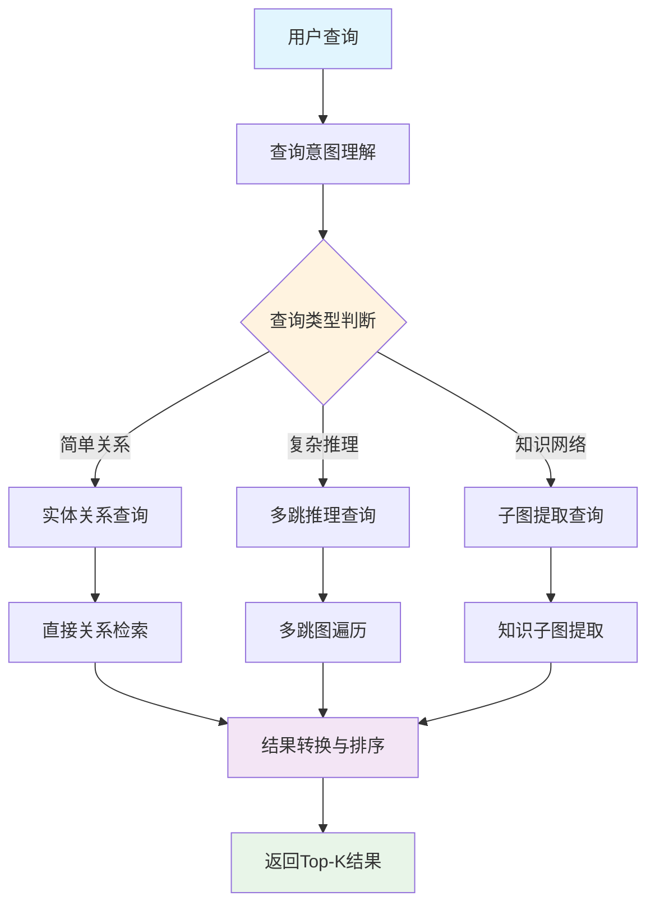

# Section 4 Intelligent Query Routing and Retrieval Strategy

> Different types of queries require different search strategies. This section will introduce in detail how to build an intelligent query router to realize query complexity analysis and automatic selection of retrieval strategies, as well as the design and implementation of three core retrieval strategies.

## 1. Intelligent query router design

### 1.1 The necessity of querying routes

In a graph RAG system, more diverse query types can be implemented:

**Simple query**:
- "What are the Sichuan dishes?"
- "How to make Kung Pao Chicken?"
- "Recommended diet dishes"

**Complex reasoning query**:
- "What are some low-sugar Sichuan dishes suitable for diabetics that take no more than 30 minutes to prepare?"
- "If I only have chicken and vegetables, what can I cook, preferably from a different cuisine?"
- "In which dishes can tofu be used as a substitute for meat and still have a similar texture?"

**Medium Complex Query**:
- "Which home-cooked dishes are suitable for novices to make?"
- "What dishes can I use leftover potatoes and carrots for?"

Queries of different complexity require different retrieval strategies to obtain the best results.

### 1.2 Query analysis framework

The intelligent query router analyzes query characteristics through four dimensions:

```python
class IntelligentQueryRouter:
    def __init__(self, traditional_retrieval, graph_rag_retrieval, llm_client, config):
        self.traditional_retrieval = traditional_retrieval
        self.graph_rag_retrieval = graph_rag_retrieval
        self.llm_client = llm_client
        self.config = config

        # 路由统计
        self.route_stats = {
            "traditional_count": 0,
            "graph_rag_count": 0,
            "combined_count": 0,
            "total_queries": 0
        }

    def analyze_query(self, query: str) -> QueryAnalysis:
        """深度分析查询特征，决定最佳检索策略"""

        analysis_prompt = f"""
        作为RAG系统的查询分析专家，请深度分析以下查询的特征：

        查询：{query}

        请从以下维度分析：

        1. 查询复杂度 (0-1)：
           - 0.0-0.3: 简单信息查找（如：红烧肉怎么做？）
           - 0.4-0.7: 中等复杂度（如：川菜有哪些特色菜？）
           - 0.8-1.0: 高复杂度推理（如：为什么川菜用花椒而不是胡椒？）

        2. 关系密集度 (0-1)：
           - 0.0-0.3: 单一实体信息（如：西红柿的营养价值）
           - 0.4-0.7: 实体间关系（如：鸡肉配什么蔬菜？）
           - 0.8-1.0: 复杂关系网络（如：川菜的形成与地理、历史的关系）

        3. 推理需求：是否需要多跳推理、因果分析、对比分析？
        4. 实体识别：查询中包含多少个明确实体？

        基于分析推荐检索策略：
        - hybrid_traditional: 适合简单直接的信息查找
        - graph_rag: 适合复杂关系推理和知识发现
        - combined: 需要两种策略结合

        返回JSON格式：
        {{
            "query_complexity": 0.6,
            "relationship_intensity": 0.8,
            "reasoning_required": true,
            "entity_count": 3,
            "recommended_strategy": "graph_rag",
            "confidence": 0.85,
            "reasoning": "该查询涉及多个实体间的复杂关系，需要图结构推理"
        }}
        """

        try:
            response = self.llm_client.chat.completions.create(
                model=self.config.llm_model,
                messages=[{"role": "user", "content": analysis_prompt}],
                temperature=0.1,
                max_tokens=800
            )

            result = json.loads(response.choices[0].message.content.strip())

            # 构建QueryAnalysis对象
            analysis = QueryAnalysis(
                query_complexity=result.get("query_complexity", 0.5),
                relationship_intensity=result.get("relationship_intensity", 0.5),
                reasoning_required=result.get("reasoning_required", False),
                entity_count=result.get("entity_count", 1),
                recommended_strategy=SearchStrategy(result.get("recommended_strategy", "hybrid_traditional")),
                confidence=result.get("confidence", 0.5),
                reasoning=result.get("reasoning", "默认分析")
            )

            return analysis

        except Exception as e:
            logger.error(f"查询分析失败: {e}")
            # 降级方案：基于规则的简单分析
            return self._rule_based_analysis(query)
```

### 1.3 Rule-based degradation analysis

When LLM analysis fails, rule-based degradation analysis is used:

```python
def _rule_based_analysis(self, query: str) -> QueryAnalysis:
    """基于规则的降级分析"""
    # 简单的规则判断
    complexity_keywords = ["为什么", "如何", "关系", "影响", "原因", "比较", "区别"]
    relation_keywords = ["配", "搭配", "组合", "相关", "联系", "连接"]

    complexity = sum(1 for kw in complexity_keywords if kw in query) / len(complexity_keywords)
    relation_intensity = sum(1 for kw in relation_keywords if kw in query) / len(relation_keywords)

    # 策略选择
    if complexity > 0.3 or relation_intensity > 0.3:
        strategy = SearchStrategy.GRAPH_RAG
    else:
        strategy = SearchStrategy.HYBRID_TRADITIONAL

    return QueryAnalysis(
        query_complexity=complexity,
        relationship_intensity=relation_intensity,
        reasoning_required=complexity > 0.3,
        entity_count=len(query.split()),  # 简单估算
        recommended_strategy=strategy,
        confidence=0.6,
        reasoning="基于规则的简单分析"
    )
```

### 1.4 Intelligent routing execution

Based on the analysis results, route to the most suitable search strategy:

```python
def route_query(self, query: str, top_k: int = 5) -> Tuple[List[Document], QueryAnalysis]:
    """智能路由查询到最适合的检索引擎"""
    logger.info(f"开始智能路由: {query}")

    # 1. 分析查询特征
    analysis = self.analyze_query(query)

    # 2. 更新统计
    self._update_route_stats(analysis.recommended_strategy)

    # 3. 根据策略执行检索
    try:
        if analysis.recommended_strategy == SearchStrategy.HYBRID_TRADITIONAL:
            logger.info("使用传统混合检索")
            documents = self.traditional_retrieval.hybrid_search(query, top_k)

        elif analysis.recommended_strategy == SearchStrategy.GRAPH_RAG:
            logger.info("🕸️ 使用图RAG检索")
            documents = self.graph_rag_retrieval.graph_rag_search(query, top_k)

        elif analysis.recommended_strategy == SearchStrategy.COMBINED:
            logger.info("🔄 使用组合检索策略")
            documents = self._combined_search(query, top_k)

        # 4. 结果后处理
        documents = self._post_process_results(documents, analysis)

        return documents, analysis

    except Exception as e:
        logger.error(f"查询路由失败: {e}")
        # 降级到传统检索
        documents = self.traditional_retrieval.hybrid_search(query, top_k)
        return documents, analysis

def _combined_search(self, query: str, top_k: int) -> List[Document]:
    """组合搜索策略：结合传统检索和图RAG的优势"""
    # 分配结果数量
    traditional_k = max(1, top_k // 2)
    graph_k = top_k - traditional_k

    # 执行两种检索
    traditional_docs = self.traditional_retrieval.hybrid_search(query, traditional_k)
    graph_docs = self.graph_rag_retrieval.graph_rag_search(query, graph_k)

    # 合并和去重（简化实现）
    # ... 具体的合并逻辑

    return combined_docs
```

## 2. Detailed explanation of three search strategies

### 2.1 Traditional hybrid search strategy

> [Hybrid retrieval module code](https://github.com/datawhalechina/all-in-rag/blob/main/code/C9/rag_modules/hybrid_retrieval.py)

Suitable for simple queries, combining double-layer retrieval, vector retrieval and BM25 keyword retrieval, and integrating three-way results through RRF:

```python
class HybridRetrievalModule:
    def hybrid_search(self, query: str, top_k: int = 5) -> List[Document]:
        """
        混合检索：三路召回（图键值双层 + 向量 + BM25）→ RRF 融合
        """
        logger.info(f"开始混合检索（dual + vector + bm25, RRF k={_RRF_K}）: {query}")

        # 每路给 RRF 留够候选空间，否则三路各自前 top_k 容易没交集，融合退化
        candidate_k = max(top_k * 2, 10)

        # 1. 双层检索（实体+主题检索）
        dual_docs = self.dual_level_retrieval(query, candidate_k)

        # 2. 增强向量检索
        vector_docs = self.vector_search_enhanced(query, candidate_k)

        # 3. BM25 关键词检索（jieba 分词 + 停用词过滤）
        bm25_docs = self.bm25_search(query, candidate_k)

        # 标记每路来源
        for d in dual_docs:
            d.metadata.setdefault("search_method", "dual_level")
        for d in vector_docs:
            d.metadata["search_method"] = "vector"

        # 4. RRF 融合三路结果
        final_docs = self._rrf_merge(
            ranked_lists=[
                ("dual_level", dual_docs),
                ("vector", vector_docs),
                ("bm25", bm25_docs),
            ],
            top_k=top_k,
        )

        # 5. 可选：父文档回填（命中 chunk → 整篇父菜谱，保证上下文完整性）
        if getattr(self.config, "enable_parent_doc_retrieval", False):
            final_docs = self._attach_parent_documents(final_docs)

        return final_docs
```

**RRF (Reciprocal Rank Fusion) fusion principle**: RRF is a classic multi-channel search result fusion algorithm (Cormack et al. 2009). Its core formula is`score(d) = Σ 1/(k + rank_i(d))`, where`k`is a smoothing constant (default 60). The ranking of each document in each search channel is converted into a score and then summed. Documents with higher rankings in the three-way retrieval will be significantly improved to achieve "three-way consensus" priority. RRF uses`node_id`to deduplicate multiple chunks of the same recipe, and only retains the best-ranked chunk as a representative.

**Parent Document Retrieval**: Since the document is split according to the`\n##`secondary heading, the step segment of the long recipe (`### 第i步`) may be divided into non-first chunks, and after RRF is deduplicated according to`node_id`, only one winning chunk will be retained for each dish - this leads to the possibility that key information is missing from the context of step-type problems. After`enable_parent_doc_retrieval`is turned on, the first N results after RRF deduplication will be replaced with the complete parent recipe document (extremely long truncated bottom), changing from "chunk hit" to "whole recipe into context" to ensure the completeness of the answer. This feature is turned off by default and does not affect the original behavior.

### 2.2 Graph RAG retrieval strategy

>[Picture RAG retrieval module code](https://github.com/datawhalechina/all-in-rag/blob/main/code/C9/rag_modules/graph_rag_retrieval.py)

Suitable for complex reasoning queries and multi-hop reasoning based on graph structure:

```python
class GraphRAGRetrieval:
    def graph_rag_search(self, query: str, top_k: int = 5) -> List[Document]:
        """
        图RAG主搜索接口：整合所有图RAG能力
        """
        logger.info(f"开始图RAG检索: {query}")

        # 1. 查询意图理解
        graph_query = self.understand_graph_query(query)
        logger.info(f"查询类型: {graph_query.query_type.value}")

        results = []

        try:
            # 2. 根据查询类型执行不同策略
            if graph_query.query_type in [QueryType.MULTI_HOP, QueryType.PATH_FINDING]:
                # 多跳遍历
                paths = self.multi_hop_traversal(graph_query)
                results.extend(self._paths_to_documents(paths, query))

            elif graph_query.query_type == QueryType.SUBGRAPH:
                # 子图提取
                subgraph = self.extract_knowledge_subgraph(graph_query)

                # 图结构推理
                reasoning_chains = self.graph_structure_reasoning(subgraph, query)

                results.extend(self._subgraph_to_documents(subgraph, reasoning_chains, query))

            elif graph_query.query_type == QueryType.ENTITY_RELATION:
                # 实体关系查询
                paths = self.multi_hop_traversal(graph_query)
                results.extend(self._paths_to_documents(paths, query))

            # 3. 图结构相关性排序
            results = self._rank_by_graph_relevance(results, query)

            return results[:top_k]

        except Exception as e:
            logger.error(f"图RAG检索失败: {e}")
            return []
```

**Graph RAG retrieval process**:



**Multi-hop reasoning**:

Multi-hop reasoning refers to indirect reasoning through multiple nodes and relationships in the graph, which is the core advantage of graph RAG compared to traditional RAG. Traditional retrieval can only find directly matching information, while multi-hop reasoning can discover implicit associations in the data.

- **How ​​it works**:
1. **Path Discovery**: Find the path connecting the starting entity and the target entity in the knowledge graph
2. **Relationship transfer**: transfer semantic relationships through intermediate nodes
3. **Implicit reasoning**: Discovering knowledge connections that are not explicitly expressed in the original data

- **Specific example**: User asked "What vegetables are good with chicken?"

  ```
  传统检索：只能找到直接提到"鸡肉+蔬菜"的文档（可能很少）

  多跳推理：
  1跳：鸡肉 → 宫保鸡丁、口水鸡、白切鸡...
  2跳：宫保鸡丁 → 胡萝卜、青椒、花生米...
  3跳：胡萝卜 → 蔬菜类别

  推理结果：鸡肉经常与胡萝卜、青椒等蔬菜搭配
  ```

- **The value of multi-hop reasoning**:
- **Knowledge Discovery**: Mining implicit relationships in data
- **Recommendation Enhancement**: Provide richer matching suggestions
- **Semantic Understanding**: Simulate human associative thinking process
- **Data Utilization**: Make full use of the relationship information of the graph structure

Through this multi-hop traversal, the system can discover the implicit relationship between "chicken" and "carrot": they often appear in the same dish, even if there is no direct "chicken-carrot" relationship in the original data.

### 2.3 Combined retrieval strategy

> [Intelligent query router code](https://github.com/datawhalechina/all-in-rag/blob/main/code/C9/rag_modules/intelligent_query_router.py)

Suitable for moderately complex queries, combining the advantages of traditional retrieval and graph RAG:

```python
def _combined_search(self, query: str, top_k: int) -> List[Document]:
    """组合搜索策略：结合传统检索和图RAG的优势"""
    # 分配结果数量
    traditional_k = max(1, top_k // 2)
    graph_k = top_k - traditional_k

    # 执行两种检索
    traditional_docs = self.traditional_retrieval.hybrid_search(query, traditional_k)
    graph_docs = self.graph_rag_retrieval.graph_rag_search(query, graph_k)

    # Round-robin轮询合并（参考LightRAG的融合策略）
    combined_docs = []
    seen_contents = set()

    # 交替添加结果，保持多样性（Round-robin策略）
    max_len = max(len(traditional_docs), len(graph_docs))
    for i in range(max_len):
        # 添加传统检索结果
        if i < len(traditional_docs):
            doc = traditional_docs[i]
            if doc.page_content not in seen_contents:
                seen_contents.add(doc.page_content)
                doc.metadata["search_strategy"] = "traditional"
                combined_docs.append(doc)

        # 添加图RAG结果
        if i < len(graph_docs):
            doc = graph_docs[i]
            if doc.page_content not in seen_contents:
                seen_contents.add(doc.page_content)
                doc.metadata["search_strategy"] = "graph_rag"
                combined_docs.append(doc)

    return combined_docs[:top_k]
```

**Round-robin polling merge mechanism**: In combined retrieval, the Round-robin algorithm alternately selects documents from the results of traditional retrieval and graph RAG retrieval in a fixed rotation order. The specific process is: select the first result of traditional search in the first position, select the first result of graph RAG in the second position, select the second result of traditional search in the third position, and so on. This mechanism avoids complex score fusion calculations and naturally achieves a balanced distribution of results of different retrieval strategies through position rotation. It is a simple and effective multi-source information fusion method.

## 3. Routing decision logic

The intelligent query router automatically selects the most suitable retrieval strategy by analyzing query characteristics:

**Decision Rule**:
- **Simple Query** (Complexity < 0.4) → Traditional Hybrid Search
- **Complex inference query** (complexity > 0.7 or relationship density > 0.7) → graph RAG retrieval
- **Medium complex query** (0.4 ≤ complexity ≤ 0.7) → combined search strategy

**Routing Statistics and Optimization**:

```python
def _update_route_stats(self, strategy: SearchStrategy):
    """更新路由统计信息"""
    self.route_stats["total_queries"] += 1
    if strategy == SearchStrategy.HYBRID_TRADITIONAL:
        self.route_stats["traditional_count"] += 1
    elif strategy == SearchStrategy.GRAPH_RAG:
        self.route_stats["graph_rag_count"] += 1
    elif strategy == SearchStrategy.COMBINED:
        self.route_stats["combined_count"] += 1
```

> The final generation part will not be described in detail. It is similar to Chapter 8. You can check the code by yourself. The project in this chapter is not complete and is only intended to provide an understanding of the GraphRAG process and architecture. You can optimize it yourself based on what you have learned previously.
>
> [What-to-eat-today added a front-end to the current project and made some optimizations, you can refer to it](https://github.com/FutureUnreal/What-to-eat-today)
